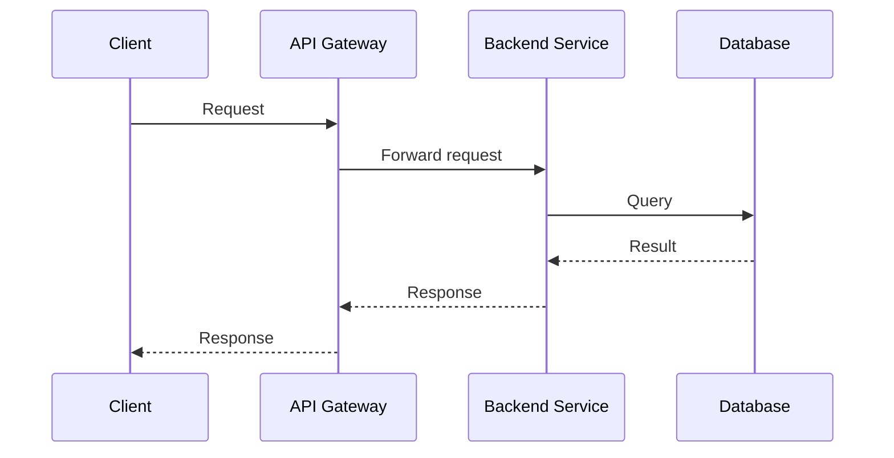

# Use Mermaid Diagrams in Markdown

When writing or editing Markdown files, use **Mermaid diagrams** wherever possible to visually represent:

- Architecture and system designs
- Workflows and processes
- Flowcharts and decision trees
- Sequence diagrams for interactions between components
- Class diagrams and relationships
- State diagrams
- Network topologies
- Deployment pipelines
- Any concept that benefits from a visual representation

## Guidelines

- Prefer Mermaid over ASCII art, static image links, or plain-text descriptions of flows.
- Use the appropriate Mermaid diagram type for the content (e.g., `graph TD` for flowcharts, `sequenceDiagram` for interactions, `classDiagram` for object relationships).
- Keep diagrams readable — break complex diagrams into smaller, focused ones rather than one massive diagram.
- Add a brief text description alongside the diagram for accessibility and context.
- Use consistent styling and naming conventions within diagrams.

## Example

Instead of describing a flow in plain text like:

> The client sends a request to the API gateway, which forwards it to the backend service, which queries the database and returns the result.

Use a Mermaid diagram:

