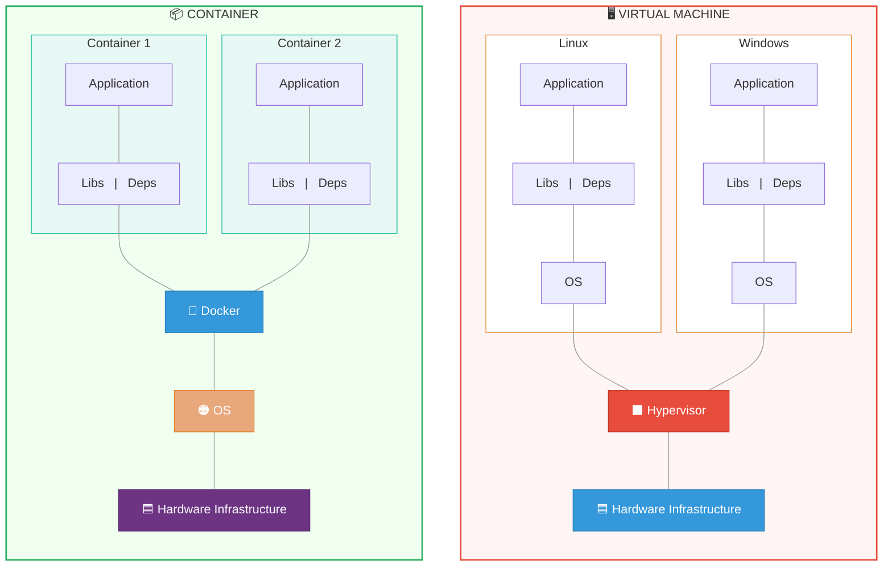
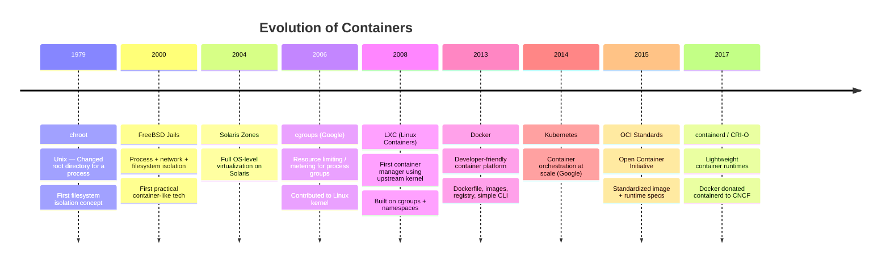
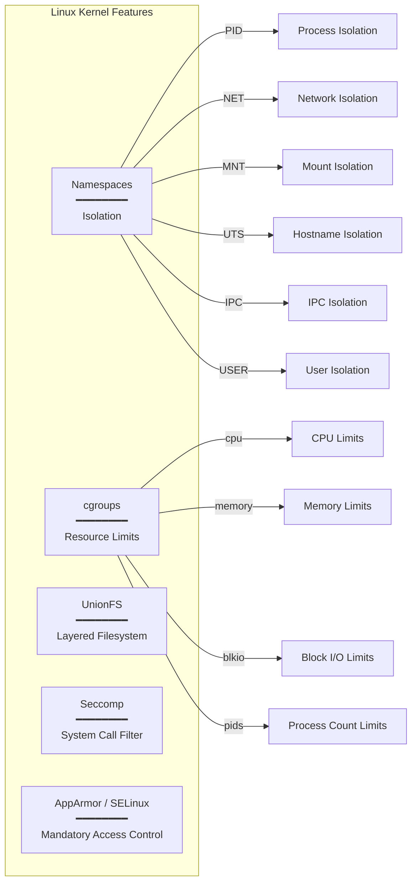
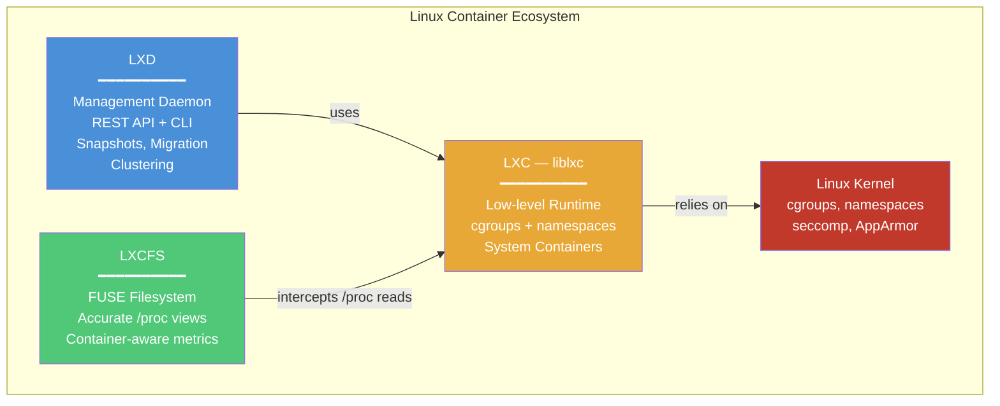
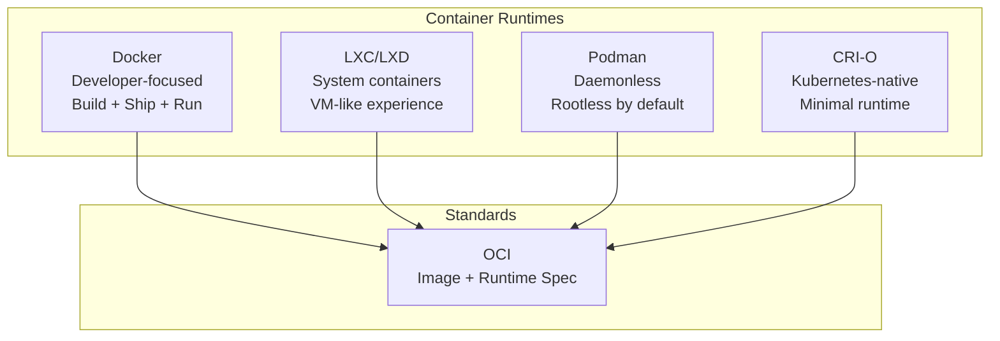

# Containers — Fundamentals & Evolution

[← Back to Index](./README.md)

---

## What Are Containers?

Containers are **OS-level virtualization** units that package an application with its dependencies into a standardized, isolated unit. They share the host OS kernel but are isolated using Linux kernel features (namespaces + cgroups).

---

## Containers vs Virtual Machines

> **Key Differences at a Glance**
>
> | | Virtual Machines | Containers |
> |---|---|---|
> | 📊 **Utilization** | Heavy (full OS per VM) | Lightweight (shared OS) |
> | 💾 **Size** | **GBs** | **MBs** |
> | ⏱️ **Boot up** | **Minutes** | **Seconds** |

| Feature | Containers | Virtual Machines |
|---------|-----------|-----------------|
| Boot Time | Seconds | Minutes |
| Size | MBs | GBs |
| Performance | Near native | Overhead from hypervisor |
| OS | Shares host kernel | Full guest OS |
| Isolation | Process-level (namespaces) | Hardware-level |
| Density | 1000s per host | Tens per host |
| Portability | Highly portable | Less portable |

---

## Evolution of Container Technology

---

## Linux Kernel Features Behind Containers

Containers are not a single kernel feature — they're built from **five core Linux kernel mechanisms** working together. Without any one of these, containers as we know them wouldn't work.

- **Namespaces** provide **isolation** — they make a container *think* it has its own OS. Each namespace type hides a specific system resource (processes, network, filesystems, etc.) so containers can't see or interfere with each other.
- **cgroups** (Control Groups) provide **resource control** — they set hard limits on how much CPU, memory, and I/O a container can consume, preventing a single container from starving others.
- **UnionFS** (OverlayFS, AUFS) provides the **layered filesystem** — this is what makes Docker images work. Multiple read-only layers are stacked with a thin writable layer on top, enabling efficient storage and fast image builds.
- **Seccomp** (Secure Computing Mode) provides **system call filtering** — it restricts which Linux syscalls a container can make. Docker's default seccomp profile blocks ~44 of the 300+ syscalls (e.g., `reboot`, `mount`, `kexec_load`), reducing the attack surface.
- **AppArmor / SELinux** provide **Mandatory Access Control (MAC)** — they enforce policies on what files, capabilities, and network resources a process can access, adding a security layer *beyond* what namespaces alone provide.

> **How they work together**: Namespaces isolate the view, cgroups limit the resources, UnionFS manages the filesystem, and Seccomp + AppArmor/SELinux lock down the security boundary. Together, they create a lightweight, portable, and secure sandbox — without needing a full guest OS.

### Namespaces — Isolation

Each container gets its own set of namespaces. When a process runs inside a container, namespaces make it appear as if the container is the entire machine — it has PID 1, its own network stack, its own hostname. The host and other containers remain invisible.

| Namespace | Isolates |
|-----------|----------|
| **PID** | Process IDs — container sees its own PID 1 |
| **NET** | Network interfaces, IPs, routes, ports |
| **MNT** | Filesystem mount points |
| **UTS** | Hostname and domain name |
| **IPC** | Inter-process communication (shared memory, semaphores) |
| **USER** | User and group IDs (UID/GID remapping) |

### cgroups — Resource Control

cgroups are organized in a tree hierarchy. Docker creates a cgroup for each container and sets limits on it. If a container exceeds its memory limit, the kernel's OOM (Out-Of-Memory) killer terminates it. CPU limits use a quota/period model — e.g., 50ms of CPU time per 100ms period = 0.5 CPU.

| cgroup subsystem | Controls |
|-----------------|----------|
| **cpu** | CPU shares, quota, period |
| **memory** | Memory limit, swap, OOM behavior |
| **blkio** | Block device I/O throttling |
| **pids** | Maximum number of processes |
| **cpuset** | Pin to specific CPU cores |

---

## LXC, LXD & LXCFS

| Technology | Role | Key Detail |
|------------|------|------------|
| **LXC** | Low-level container runtime | Creates *system containers* (full OS userspace) using cgroups + namespaces. Provides `liblxc` C library and CLI tools (`lxc-create`, `lxc-start`). |
| **LXD** | High-level management daemon | REST API on top of LXC. Handles images, snapshots, live migration, clustering. CLI: `lxc launch`, `lxc exec`. Can also manage QEMU/KVM VMs. |
| **LXCFS** | FUSE filesystem overlay | Makes `/proc/meminfo`, `/proc/cpuinfo`, `/proc/stat` reflect **container's cgroup limits** instead of host values. Fixes issues with JVM heap sizing, monitoring tools, etc. |

---

## Docker's Place in the Ecosystem

- **Docker** containers typically run a **single application process**
- **LXC** containers run a **full OS userspace** (init system, multiple processes)
- Both use the same kernel features under the hood

---

[← Back to Index](./README.md) · [Next: Docker Architecture →](./02-container-runtimes/01-docker-architecture.md)
