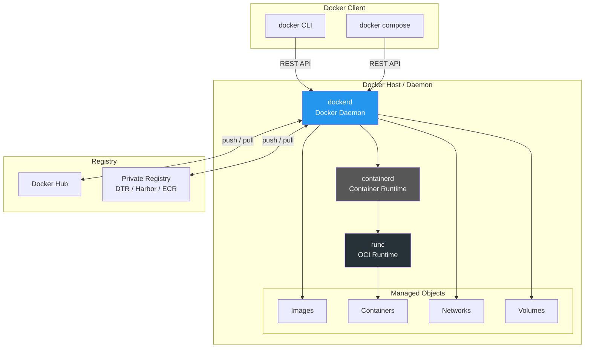
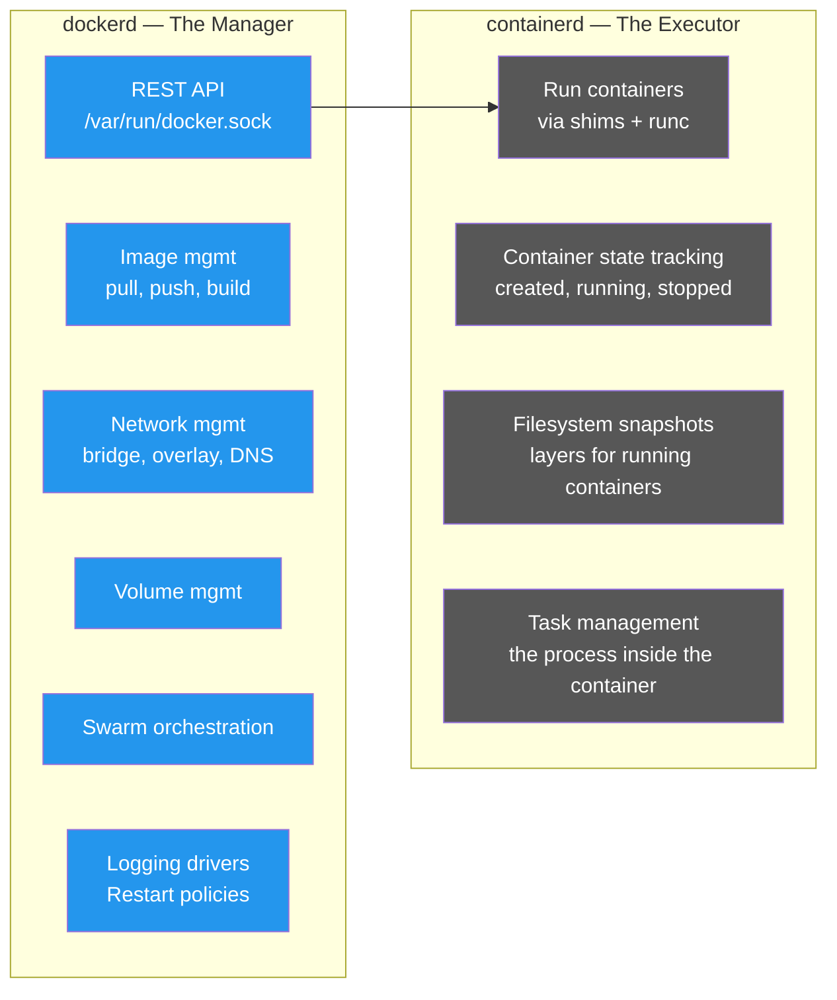
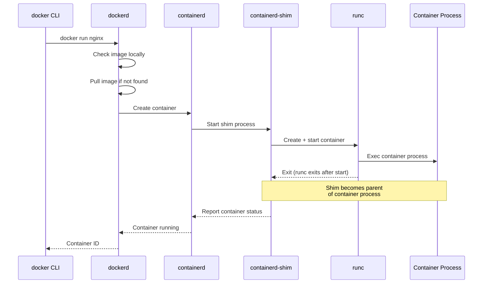
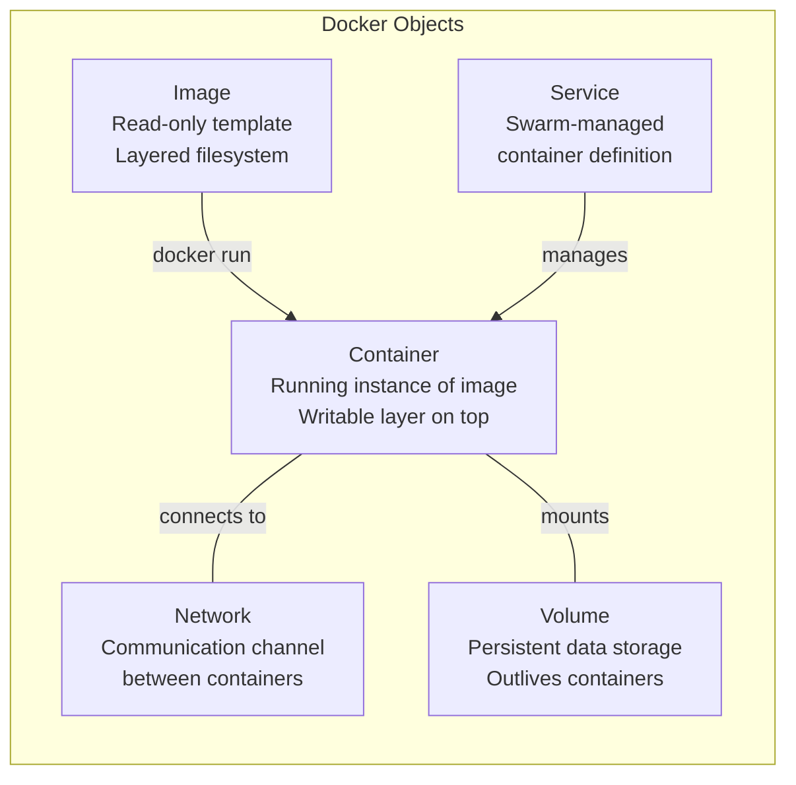
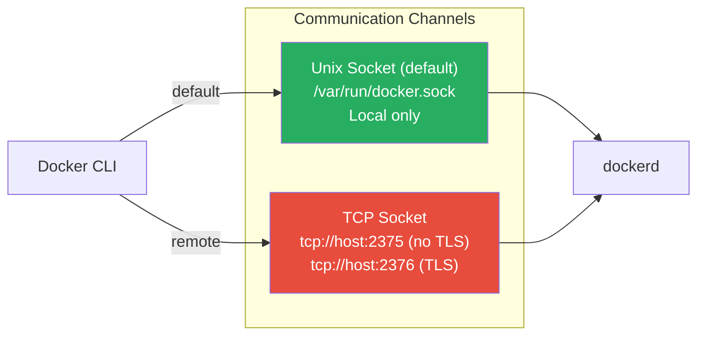
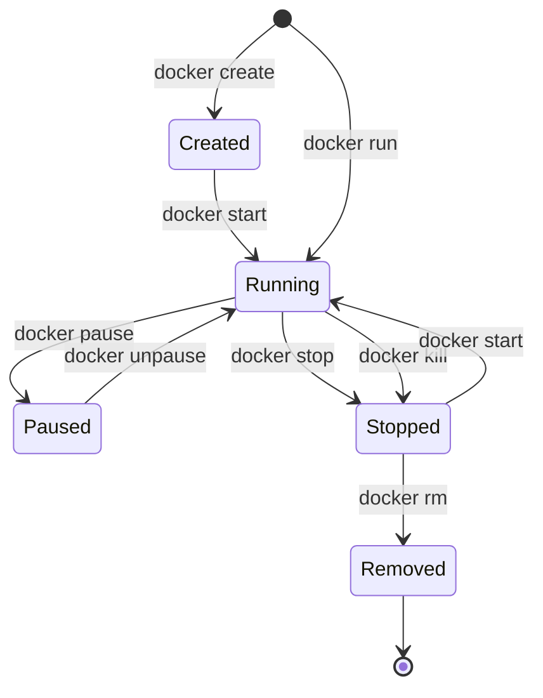

# Docker Architecture & Engine

[← Back to Section Index](./README.md) · [← Main Index](../README.md) · [Previous: Containers Fundamentals](../01-containers-fundamentals.md)

---

## Docker Platform Overview



---

## Engine Components

| Component | Role |
|-----------|------|
| **`dockerd`** | Main daemon. Exposes REST API, manages images, networks, volumes |
| **`containerd`** | Container lifecycle management — start, stop, pause, delete |
| **`runc`** | OCI-compliant low-level runtime. Creates containers using Linux kernel features |
| **`containerd-shim`** | Keeps STDIN/STDOUT open, reports exit status after runc exits. Allows daemonless containers |

---

## Process Hierarchy — Who Stays Alive and Why

A common misconception is that `runc` or `containerd` are short-lived like the CLI. In reality, here's what the process tree looks like on a running Docker host:

```
systemd
 ├── dockerd                    ← always running (management layer)
 │    └── containerd            ← always running (container lifecycle layer)
 │
 ├── containerd-shim            ← one per container (lives with the container)
 │    └── nginx                 ← actual container process
 │
 ├── containerd-shim            ← one per container
 │    └── redis-server
```

| Process | Lifetime | What It Does |
|---------|----------|-------------|
| **`dockerd`** | Always running | Management plane — REST API, images, networks, volumes, Swarm |
| **`containerd`** | Always running | Container lifecycle — tracks all containers, handles start/stop/pause |
| **`containerd-shim`** | Per container — lives as long as the container | Direct parent of the container process. Holds stdio, reports exit codes |
| **`runc`** | Ephemeral — exits immediately | Sets up namespaces + cgroups, exec's the process, then exits |

### dockerd vs containerd — Responsibility Split

The Docker engine was refactored post-2016 to cleanly separate concerns between `dockerd` and `containerd`. Think of it as:



> In plain terms:
> - **`dockerd`** = *"What should run and how should it be configured?"*
> - **`containerd`** = *"Actually run it and keep track of it."*
> - **`runc`** = *"Set up the Linux sandbox and launch the process."*
> - **`containerd-shim`** = *"Babysit the process after runc leaves."*

### Surviving Daemon Restarts — `live-restore`

This layered design gives Docker a critical property — **you can restart `dockerd` without killing running containers**.

The chain of survival works because:
1. `containerd-shim` is the direct parent of the container process — it doesn't depend on `dockerd`
2. `containerd` tracks shims, but shims survive `containerd` restarts too
3. With `live-restore` enabled, the entire daemon can restart and reconnect to running containers

```json
// /etc/docker/daemon.json
{
  "live-restore": true
}
```

```bash
# Restart Docker daemon — containers keep running
sudo systemctl restart docker

# Verify containers are still up
docker ps   # → containers still listed and running
```

> **Why Kubernetes dropped dockerd**: This separation is exactly why Kubernetes talks directly to `containerd` via the CRI (Container Runtime Interface) since v1.24. `dockerd` was unnecessary overhead — K8s handles its own scheduling, networking, and image management. It only needed the "executor" layer.

---

## What Happens When You Run `docker run`



### Key Takeaways

- **`runc` exits** after the container starts — it doesn't stay running
- **`containerd-shim`** becomes the parent process of the container
- This design means the Docker daemon can be restarted **without killing running containers** (when `live-restore` is enabled)

---

## Docker Objects



| Object | Description |
|--------|-------------|
| **Image** | Read-only template with app code, runtime, libraries, config. Built from Dockerfile. |
| **Container** | Runnable instance of an image. Has a writable layer on top of image layers. |
| **Network** | Provides communication between containers. Multiple drivers available. |
| **Volume** | Persistent storage that outlives containers. Managed by Docker. |
| **Service** | Definition of tasks to run in a Swarm. Manages desired state of replicas. |

---

## Docker Client-Server Communication



```bash
# Default: local unix socket
docker ps

# Remote: specify host
docker -H tcp://192.168.1.100:2376 ps

# Or via environment variable
export DOCKER_HOST=tcp://192.168.1.100:2376
docker ps
```

> **Security:** Never expose the TCP socket without TLS. Access to the Docker socket = root access to the host.

---

## Container Lifecycle



| Command | Signal | Behavior |
|---------|--------|----------|
| `docker stop` | SIGTERM → (10s) → SIGKILL | Graceful shutdown with timeout |
| `docker kill` | SIGKILL | Immediate force stop |
| `docker pause` | SIGSTOP (via cgroup freezer) | Freeze all processes |
| `docker unpause` | SIGCONT | Resume frozen processes |

---

[← Back to Section Index](./README.md) · [← Main Index](../README.md) · [Next: Podman Architecture →](./02-podman-architecture.md) · [Orchestration →](../03-orchestration/README.md)
