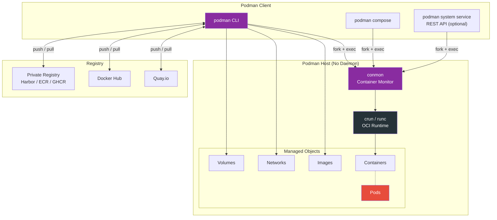
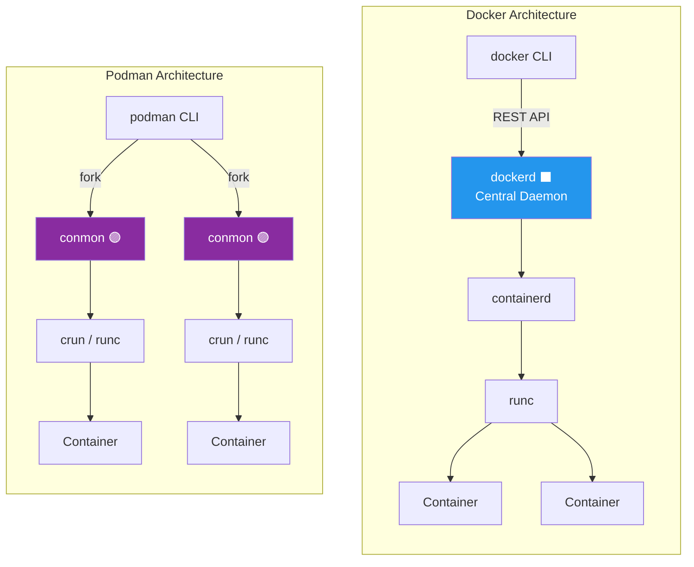
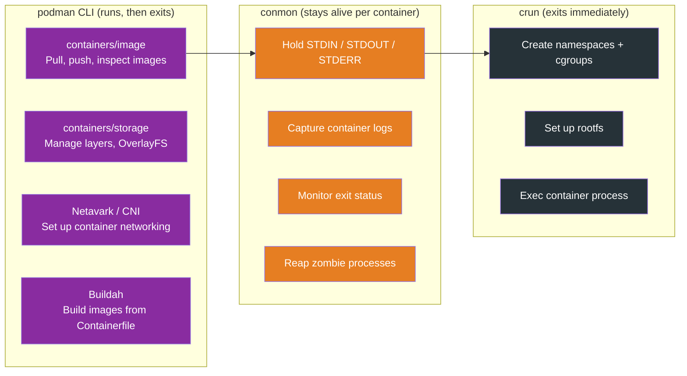
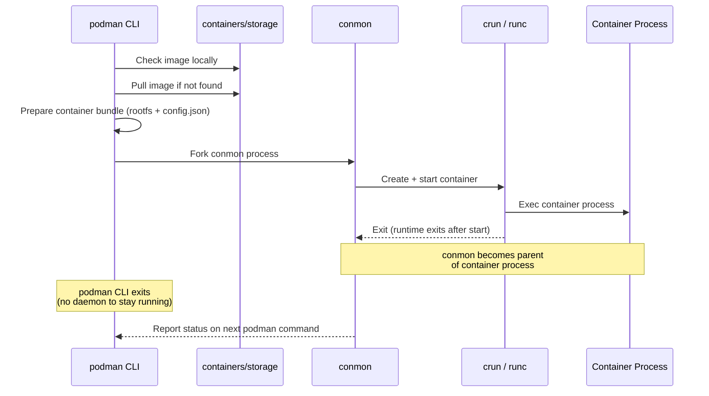
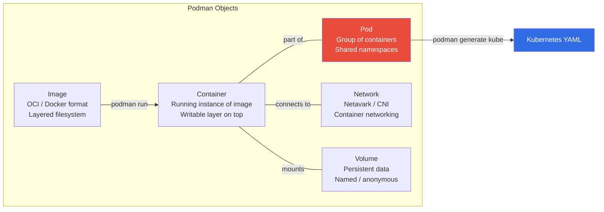
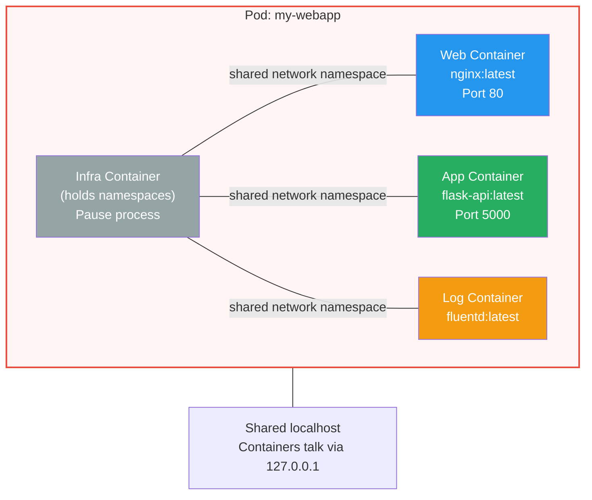
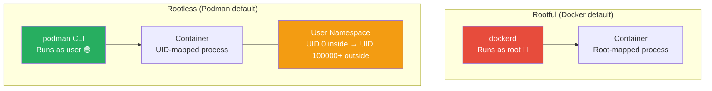
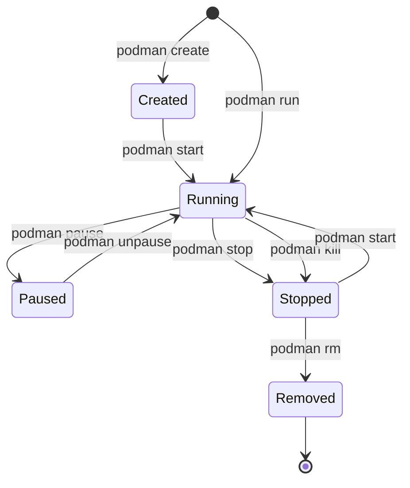
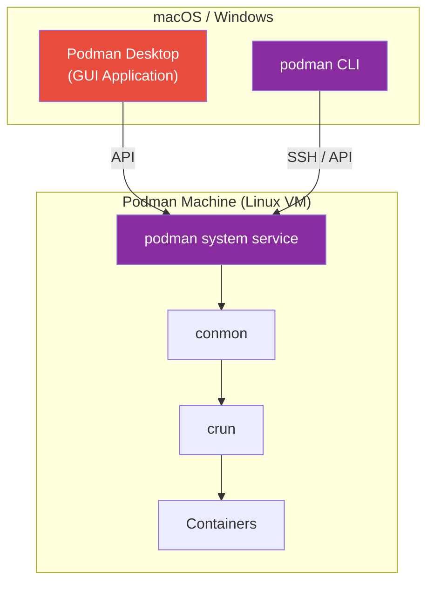

# Podman Architecture & Engine

[← Back to Section Index](./README.md) · [← Main Index](../README.md) · [Related: Docker Architecture](./01-docker-architecture.md)

---

## Podman Platform Overview

Podman (Pod Manager) is a **daemonless, rootless** container engine developed by Red Hat. Unlike Docker, there is no central daemon — each `podman` command forks its own runtime process directly. This eliminates the single point of failure that `dockerd` represents.



### Docker vs Podman — Architecture at a Glance



> **Key difference**: Docker routes everything through a single daemon (`dockerd`). Podman forks a dedicated `conmon` process per container — no central daemon, no single point of failure.

---

## Engine Components

| Component | Role |
|-----------|------|
| **`podman`** | CLI tool. No daemon — directly interacts with the runtime. Drop-in replacement for `docker` CLI. |
| **`conmon`** | Container monitor. One per container. Holds STDIN/STDOUT, monitors exit status, handles logging. |
| **`crun`** | Default OCI runtime (written in C, faster than runc). `runc` is also supported. |
| **`containers/image`** | Library for pulling, pushing, and inspecting images across registries. |
| **`containers/storage`** | Library for managing image layers and container filesystems (OverlayFS, VFS, etc.). |
| **`CNI` / `Netavark`** | Network stack. Netavark (Rust-based) is the new default, replacing CNI plugins. |
| **`Aardvark-dns`** | DNS server for container name resolution, paired with Netavark. |

---

## Process Hierarchy — No Daemon, No Problem

The biggest architectural difference from Docker: **there is no long-running daemon**. The `podman` CLI is a regular process that does its work and exits. Here's what the process tree looks like on a host running Podman containers:

```
systemd (or user session)
 │
 ├── conmon                     ← one per container (container monitor)
 │    └── nginx                 ← actual container process
 │
 ├── conmon                     ← one per container
 │    └── redis-server
 │
 └── (no podman process)        ← CLI already exited!
```

Compare this to Docker's tree:

```
Docker:                              Podman:
─────────────────────────            ─────────────────────────
systemd                              systemd
 ├── dockerd          ← always       │
 │    └── containerd  ← always       ├── conmon  ← per container
 │                                   │    └── nginx
 ├── containerd-shim  ← per ctr     │
 │    └── nginx                      ├── conmon  ← per container
 │                                   │    └── redis
 ├── containerd-shim  ← per ctr     │
 │    └── redis                      └── (nothing else)
```

| Process | Lifetime | What It Does |
|---------|----------|-------------|
| **`podman`** | Ephemeral — exits after command completes | CLI tool. Prepares the container bundle, forks conmon, then exits |
| **`conmon`** | Per container — lives as long as the container | Direct parent of container process. Holds stdio, captures logs, reports exit codes |
| **`crun` / `runc`** | Ephemeral — exits immediately | Sets up namespaces + cgroups, exec's the process, then exits |

> Notice: only **one** long-lived process per container (`conmon`). Docker needs **three** always-running processes (`dockerd` + `containerd` + `containerd-shim`) plus one shim per container.

### Who Does What — Without a Daemon

In Docker, `dockerd` handles images/networks/volumes and `containerd` handles container lifecycle. In Podman, those responsibilities are split across **libraries** linked into the `podman` binary itself — not separate daemons.



> In plain terms:
> - **`podman` CLI** = *"Prepare everything, fork conmon, then I'm done."*
> - **`conmon`** = *"Babysit the container process for its entire life."*
> - **`crun`** = *"Set up the sandbox, launch the process, then exit."*

### Surviving Without a Daemon

Since there's no daemon to restart, the question becomes: **what keeps containers alive when the user logs out?**

The answer is **`conmon`** + **systemd lingering**:

1. `conmon` is reparented to PID 1 (systemd) after the CLI exits — it doesn't depend on your shell session
2. By default, systemd kills user processes on logout. **Lingering** prevents this:

```bash
# Enable lingering — your user's processes survive logout
loginctl enable-linger $USER

# Verify
loginctl show-user $USER | grep Linger
# → Linger=yes
```

3. For production, use `podman generate systemd` to create proper service units (covered in the Systemd section below)

### Docker vs Podman — Failure Impact

| Scenario | Docker | Podman |
|----------|--------|--------|
| **Daemon crashes** | `dockerd` crash = can't manage ANY container (API gone). Containers keep running via shims, but no new commands work until daemon restarts. | No daemon to crash. Each container is independent. |
| **Single container monitor crashes** | `containerd-shim` crash = that one container is orphaned | `conmon` crash = that one container is orphaned |
| **CLI crashes mid-command** | Daemon keeps the operation state | Operation may be partially complete. Container state stored in `/var/lib/containers` (or `~/.local/share/containers`) allows recovery. |
| **Restart runtime** | `live-restore: true` in daemon.json | Not needed — there's nothing to restart |

> **Bottom line**: Docker has a single point of failure (`dockerd`). Podman has none. But Docker's daemon model makes features like Swarm and event streaming simpler to implement.

---

## What Happens When You Run `podman run`



### Key Takeaways

- **No daemon** — the `podman` CLI process itself orchestrates container creation, then exits
- **`conmon`** becomes the parent process of each container (similar to `containerd-shim` in Docker)
- **`crun`** exits after the container starts — just like `runc` in Docker
- Containers survive the CLI process exiting — `conmon` keeps them alive
- Restarting your shell or user session doesn't kill containers (with lingering enabled)

---

## Podman Objects



| Object | Description |
|--------|-------------|
| **Image** | OCI-compliant image. Compatible with Docker images. Built with `podman build` or `Containerfile`. |
| **Container** | Runnable instance of an image. Rootless by default. |
| **Pod** | Group of containers sharing the same network, PID, and IPC namespaces — same concept as a Kubernetes Pod. Each pod has an **infra container** that holds the namespaces. |
| **Network** | Managed by Netavark (default) or CNI plugins. Supports bridge, macvlan, and ipvlan drivers. |
| **Volume** | Persistent storage. Named volumes, bind mounts, and tmpfs supported — same semantics as Docker. |

---

## Pods — Podman's Unique Feature

Pods are first-class objects in Podman (Docker has no equivalent). A pod groups containers that need to share namespaces, just like Kubernetes pods.



```bash
# Create a pod
podman pod create --name my-webapp -p 8080:80

# Add containers to the pod
podman run -d --pod my-webapp nginx:latest
podman run -d --pod my-webapp flask-api:latest

# All containers in the pod share localhost
# nginx can reach flask at 127.0.0.1:5000

# Generate Kubernetes YAML from a pod
podman generate kube my-webapp > my-webapp.yaml

# Play a Kubernetes YAML file as Podman pods
podman play kube my-webapp.yaml
```

---

## Rootless Containers

Podman's flagship feature. Containers run entirely in **user space** without requiring root privileges.



| Aspect | Rootful | Rootless |
|--------|---------|----------|
| **Daemon/Process** | Runs as root | Runs as regular user |
| **UID Mapping** | Container UID 0 = Host UID 0 | Container UID 0 = Host UID 100000+ |
| **Risk** | Container escape = root on host | Container escape = unprivileged user |
| **Port Binding** | Any port | Ports > 1024 (by default) |
| **Storage** | `/var/lib/containers` | `~/.local/share/containers` |
| **Network** | Full access (bridge, macvlan) | slirp4netns or pasta (user-mode networking) |

```bash
# Rootless is the default — just run as your normal user
podman run -d -p 8080:80 nginx

# Check who owns the process on the host
ps aux | grep nginx
# → your-username ... conmon ... nginx

# UID mapping visible via
podman unshare cat /proc/self/uid_map
```

---

## Podman vs Docker — Command Compatibility

Podman is designed as a drop-in replacement for the Docker CLI. Most commands are identical.

```bash
# These commands work identically in both
alias docker=podman   # The famous alias

podman pull nginx
podman run -d --name web -p 80:80 nginx
podman ps
podman logs web
podman exec -it web bash
podman stop web
podman rm web
podman build -t myapp .
podman push myapp quay.io/user/myapp
```

### Differences That Matter

| Feature | Docker | Podman |
|---------|--------|--------|
| **Daemon** | `dockerd` required (always running) | No daemon (fork per command) |
| **Rootless** | Supported but not default | Default and first-class |
| **Pods** | Not supported (Swarm services instead) | Native pod support |
| **Compose** | `docker compose` (built-in plugin) | `podman compose` (via podman-compose or docker-compose) |
| **Swarm** | Built-in orchestration | Not supported (use Kubernetes) |
| **Build** | BuildKit (default) | Buildah (integrated) |
| **Kubernetes** | No direct integration | `podman generate kube` / `podman play kube` |
| **Socket** | `/var/run/docker.sock` | `/run/user/UID/podman/podman.sock` (rootless) |
| **Systemd** | Restart policies only | `podman generate systemd` for full service management |
| **Default runtime** | runc | crun (faster, lower memory) |

---

## Container Lifecycle

The lifecycle is nearly identical to Docker, with the same commands.



| Command | Signal | Behavior |
|---------|--------|----------|
| `podman stop` | SIGTERM → (10s) → SIGKILL | Graceful shutdown with timeout |
| `podman kill` | SIGKILL | Immediate force stop |
| `podman pause` | SIGSTOP (via cgroup freezer) | Freeze all processes |
| `podman unpause` | SIGCONT | Resume frozen processes |

---

## Podman with Systemd

Unlike Docker's restart policies, Podman integrates natively with systemd for managing container services.

```bash
# Generate a systemd unit file from a running container
podman generate systemd --new --name web > ~/.config/systemd/user/container-web.service

# Enable and start
systemctl --user daemon-reload
systemctl --user enable --now container-web.service

# Check status
systemctl --user status container-web.service

# Containers start on boot (with lingering)
loginctl enable-linger $USER
```

---

## Podman on macOS / Windows — Podman Machine & Podman Desktop

Podman doesn't run natively on macOS/Windows (needs a Linux kernel). Two complementary tools solve this:

1. **`podman machine`** — CLI tool that creates and manages a lightweight Linux VM behind the scenes
2. **Podman Desktop** — A full GUI application for managing containers, pods, images, and Kubernetes resources



### Podman Machine (CLI)

```bash
# Initialize a Podman VM
podman machine init

# Start it
podman machine start

# Now use podman normally — it routes to the VM
podman run -d nginx

# SSH into the VM if needed
podman machine ssh
```

**VM providers by platform:**

| Platform | VM Provider |
|----------|------------|
| **macOS** | Apple Virtualization (`applehv`) with Rosetta for x86_64 translation (near-native speed) |
| **Windows** | WSL2 (default) or Hyper-V |
| **Linux** | Optional — runs natively, no VM needed |

### Podman Desktop (GUI)

[Podman Desktop](https://podman-desktop.io) is a standalone open-source desktop application — a graphical counterpart to the `podman` CLI. It's a **CNCF Sandbox project** (since Nov 2024) available on Linux, macOS, and Windows.

**Key capabilities:**
- **Container management** — build, run, stop, inspect, and delete containers and pods through a visual interface
- **Image management** — pull, push, build, and manage images across registries
- **Kubernetes integration** — explore and manage pods, deployments, services, and ingresses; spin up local clusters via Kind or Minikube extensions
- **Extensions** — plugin system supporting Kind, Minikube, Headlamp, and community extensions
- **Multi-engine support** — works with Podman and Docker engines
- **GPU acceleration** — supports GPU passthrough for local AI/ML container workflows
- **Multi-arch builds** — build images for ARM and x86_64 from the GUI

> Podman Desktop handles Podman Machine lifecycle (init, start, stop) automatically through its GUI — no CLI required for getting started.

---

## When to Use Podman vs Docker

| Use Case | Recommendation |
|----------|---------------|
| CI/CD pipelines needing rootless builds | **Podman** |
| Kubernetes-aligned local development | **Podman** (native pod + kube support) |
| Existing Docker Compose workflows | **Docker** (more mature compose support) |
| Security-sensitive environments | **Podman** (rootless default, no daemon) |
| Docker Swarm orchestration | **Docker** (Swarm is Docker-only) |
| macOS/Windows developer experience | **Docker Desktop** (more polished) |
| RHEL / Fedora / CentOS environments | **Podman** (ships by default, Docker not in repos) |
| Learning containers for the first time | **Docker** (larger community, more tutorials) |

---

[← Back to Section Index](./README.md) · [← Main Index](../README.md) · [Related: Docker Architecture](./01-docker-architecture.md)
