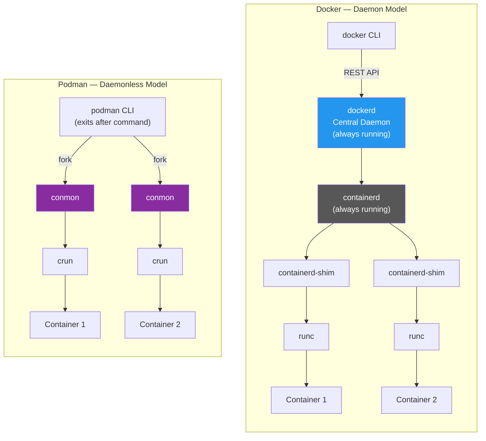
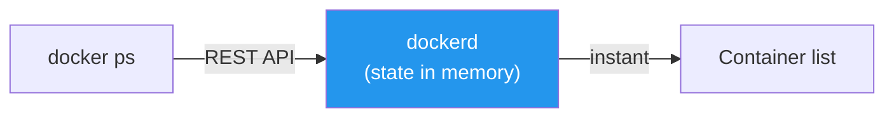
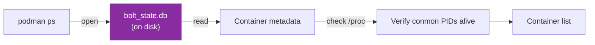
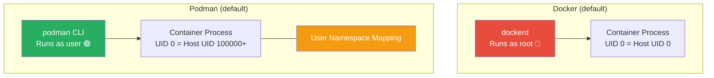

# Docker vs Podman — Comprehensive Comparison

[← Back to Section Index](./README.md) · [← Main Index](../README.md) · [Docker Architecture](./01-docker-architecture.md) · [Podman Architecture](./02-podman-architecture.md) · [Next: containerd Architecture →](./04-containerd-architecture.md)

---

## At a Glance

| | Docker | Podman |
|---|---|---|
| **Developed by** | Docker Inc. (2013) | Red Hat (2018) |
| **Written in** | Go | Go |
| **License** | Apache 2.0 | Apache 2.0 |
| **Architecture** | Client → Daemon → Runtime | Client → Fork → Runtime (no daemon) |
| **Rootless** | Supported, not default | Default and first-class |
| **OCI Compliant** | Yes | Yes |
| **Pod support** | No | Yes (Kubernetes-style) |

---

## 1. Architecture — The Fundamental Difference

This is the core distinction everything else flows from.



| Aspect | Docker | Podman |
|--------|--------|--------|
| **Model** | Client-server (CLI talks to daemon via REST API) | Fork-exec (CLI directly forks runtime processes) |
| **Central daemon** | `dockerd` — always running, single point of failure | None — each command is independent |
| **Communication** | Unix socket (`/var/run/docker.sock`) or TCP | Direct process fork (optional API via `podman system service`) |
| **CLI exits after command?** | Yes, but daemon persists | Yes, and nothing else persists except conmon |

> **Why it matters**: Docker's daemon is a single point of failure — if `dockerd` crashes, you lose API access to all containers. Podman has no such bottleneck.

---

## 2. Process Hierarchy — What's Actually Running

> **What is systemd?**
> `systemd` is the **init system and service manager** on most modern Linux distributions (RHEL, Ubuntu 16+, Fedora, Debian 8+, etc.). It is **PID 1** — the very first process the kernel starts at boot — and it is responsible for:
>
> - **Bootstrapping the system** — mounting filesystems, setting hostname, initializing hardware
> - **Starting and supervising services** — every long-running daemon (networking, logging, SSH, container runtimes) is managed by systemd as a **unit** (e.g., `docker.service`, `containerd.service`)
> - **Dependency ordering** — ensuring services start in the correct order (e.g., networking before Docker daemon)
> - **Process lifecycle** — restarting crashed services, collecting exit statuses, managing cgroups for resource limits
> - **Logging** — aggregating service output into a central journal (`journalctl`)
>
> In the process trees below, `systemd` appears at the top because it is the ancestor of every other process on the host. Both Docker's daemon and Podman's per-container `conmon` processes are ultimately children of systemd. This is also why Podman leans on `systemd` for restart-on-boot behavior (via `podman generate systemd`) — without a daemon, systemd fills the role of "who watches the containers."

### Docker

```
systemd
 ├── dockerd                    ← always running
 │    └── containerd            ← always running
 │
 ├── containerd-shim            ← one per container
 │    └── nginx
 │
 ├── containerd-shim
 │    └── redis-server
```

### Podman

```
systemd
 │
 ├── conmon                     ← one per container
 │    └── nginx
 │
 ├── conmon
 │    └── redis-server
 │
 └── (no podman/daemon process)
```

### Side-by-Side Process Comparison

| Process | Docker | Podman Equivalent |
|---------|--------|-------------------|
| **Always-running daemon** | `dockerd` | None |
| **Container lifecycle manager** | `containerd` (always running) | Libraries inside `podman` binary (ephemeral) |
| **Container monitor / shim** | `containerd-shim` (one per container) | `conmon` (one per container) |
| **OCI runtime** | `runc` (exits after start) | `crun` (exits after start) |

| Process | Docker Lifetime | Podman Lifetime |
|---------|----------------|-----------------|
| **CLI** | Ephemeral | Ephemeral |
| **Daemon / Manager** | Always running (`dockerd` + `containerd`) | N/A — no daemon |
| **Per-container monitor** | `containerd-shim` — lives with container | `conmon` — lives with container |
| **OCI runtime** | `runc` — exits immediately | `crun` — exits immediately |
| **Minimum processes for 1 container** | 4 (`dockerd` + `containerd` + shim + container) | 2 (`conmon` + container) |

---

## 3. Engine Components

| Responsibility | Docker | Podman |
|---------------|--------|--------|
| **API / Management** | `dockerd` (REST API daemon) | `podman` CLI (or optional `podman system service`) |
| **Container lifecycle** | `containerd` | `conmon` (per container) |
| **OCI Runtime** | `runc` | `crun` (default, faster) / `runc` |
| **Container monitor** | `containerd-shim` | `conmon` |
| **Image management** | Built into `dockerd` | `containers/image` library |
| **Storage / Layers** | Built into `dockerd` + `containerd` snapshotter | `containers/storage` library |
| **Networking** | libnetwork (built into daemon) | Netavark (Rust) + Aardvark-dns |
| **Image building** | BuildKit (default) | Buildah (integrated) |
| **DNS resolution** | Embedded DNS server in daemon | Aardvark-dns (separate process) |

---

## 4. State Management

This is where the daemon vs daemonless tradeoff becomes tangible.

### Docker — In-Memory State



- `dockerd` holds all container state **in memory**
- Queries like `docker ps` are fast — just read from the daemon's memory
- State is rebuilt from `containerd` on daemon restart

### Podman — Disk-Based State



- State lives in a **BoltDB database** on disk
- Every `podman` command opens the DB, reads/writes, then closes
- For each "running" container, Podman checks `/proc/<conmon-pid>` to verify it's actually alive

### Performance Impact

| Operation | Docker | Podman |
|-----------|--------|--------|
| `ps` (list containers) | Fast — read from daemon memory | Slower — open DB + check PIDs |
| `run` (start container) | Fast — daemon already initialized | Slightly slower — CLI must load libraries each time |
| `events` (stream) | Native — daemon pushes events in real-time | Polling-based or via optional API service |
| **10 containers** | Imperceptible difference | Imperceptible difference |
| **500+ containers** | Daemon overhead but fast queries | `podman ps` noticeably slower |

> **The tradeoff**: Docker trades a single point of failure for speed. Podman trades speed for resilience.

---

## 5. Security

### Rootless Execution



| Security Aspect | Docker | Podman |
|----------------|--------|--------|
| **Default execution** | Root (daemon runs as root) | Rootless (user-space) |
| **Rootless support** | Yes (since 19.03, opt-in) | Yes (default, first-class) |
| **Container UID mapping** | UID 0 inside = UID 0 on host (rootful) | UID 0 inside = UID 100000+ on host (rootless) |
| **Container escape risk** | Escape = root on host | Escape = unprivileged user |
| **Socket security** | `/var/run/docker.sock` = root access to host | `/run/user/UID/podman/podman.sock` (user-scoped) |
| **Privileged ports (< 1024)** | Allowed (root daemon) | Not allowed in rootless (use ports > 1024) |
| **Seccomp profiles** | Default profile blocks ~44 syscalls | Same seccomp support |
| **SELinux / AppArmor** | Supported | Supported (SELinux deeply integrated on RHEL) |
| **No-new-privileges** | Supported | Supported |

### The Docker Socket Problem

```bash
# Docker: Anyone with access to the socket has root on the host
docker run -v /var/run/docker.sock:/var/run/docker.sock ...
# → This container can control ALL other containers + the host

# Podman: User-scoped socket, no root escalation
podman run -v /run/user/1000/podman/podman.sock:/run/podman.sock ...
# → Scoped to that user's containers only
```

---

## 6. Networking

| Feature | Docker | Podman |
|---------|--------|--------|
| **Network stack** | libnetwork (built into dockerd) | Netavark (Rust-based, default) or CNI plugins |
| **DNS** | Embedded DNS in daemon | Aardvark-dns (paired with Netavark) |
| **Bridge network** | `docker0` bridge (default) | `podman0` bridge (default) |
| **Overlay network** | Yes (Swarm mode) | No (use Kubernetes for multi-host) |
| **Macvlan** | Yes | Yes |
| **Rootless networking** | slirp4netns | slirp4netns or pasta (default) |
| **Port mapping** | iptables / userland proxy | iptables (rootful) / slirp4netns or pasta (rootless) |
| **Inter-container DNS** | Automatic on user-defined networks | Automatic via Aardvark-dns |

### Rootless Networking Difference

```
Docker rootful:
  Container → veth pair → docker0 bridge → iptables → host network
  (full kernel networking, fast)

Podman rootless:
  Container → slirp4netns/pasta → user-space TCP/IP stack → host network
  (user-space networking, slightly slower, no root needed)
```

---

## 7. Image Building

| Feature | Docker | Podman |
|---------|--------|--------|
| **Build tool** | BuildKit (default since Docker 23.0) | Buildah (integrated into `podman build`) |
| **Build file** | `Dockerfile` | `Containerfile` (also accepts `Dockerfile`) |
| **Multi-stage builds** | Yes | Yes |
| **Build cache** | Layer-based + BuildKit cache mounts | Layer-based |
| **Rootless builds** | Yes (with rootless daemon) | Yes (default) |
| **Build secrets** | `--secret` flag (BuildKit) | `--secret` flag |
| **Build daemon required?** | Yes (`dockerd` must be running) | No (Buildah is daemonless) |
| **OCI image output** | Yes | Yes |
| **Image compatibility** | Docker format + OCI | Docker format + OCI (interchangeable) |

```bash
# Docker build
docker build -t myapp:latest .

# Podman build (identical syntax)
podman build -t myapp:latest .

# Podman can also use Buildah directly for advanced builds
buildah bud -t myapp:latest .
buildah from scratch   # build from empty image
```

---

## 8. Orchestration & Kubernetes

| Feature | Docker | Podman |
|---------|--------|--------|
| **Built-in orchestration** | Docker Swarm | None (delegates to Kubernetes) |
| **Pod support** | No (services/tasks in Swarm) | Yes — first-class pods, same concept as K8s |
| **Generate K8s YAML** | No | `podman generate kube` |
| **Run K8s YAML locally** | No | `podman play kube` |
| **K8s runtime** | Removed as default in K8s v1.24 (`dockershim` deprecated) | Not a K8s runtime (but aligns with K8s concepts) |
| **K8s uses under the hood** | containerd (extracted from Docker) | containerd or CRI-O (Red Hat's K8s runtime) |

### Podman's Kubernetes Workflow

```bash
# Create a pod with containers
podman pod create --name webapp -p 8080:80
podman run -d --pod webapp nginx
podman run -d --pod webapp my-api

# Export to Kubernetes YAML
podman generate kube webapp > webapp.yaml

# Later, deploy to actual Kubernetes
kubectl apply -f webapp.yaml

# Or replay locally on another machine
podman play kube webapp.yaml
```

> Docker has no equivalent workflow. The closest is `docker compose` → Kompose → Kubernetes YAML, which requires an extra tool.

---

## 9. Compose Support

| Feature | Docker | Podman |
|---------|--------|--------|
| **Tool** | `docker compose` (v2, built-in plugin) | `podman compose` (wrapper) |
| **Backend** | Native integration with daemon | Calls `docker-compose` or `podman-compose` |
| **Compose file** | `docker-compose.yml` / `compose.yml` | Same format (compatible) |
| **Maturity** | Production-grade, widely used | Works but less mature, occasional edge cases |
| **Watch / Hot reload** | `docker compose watch` | Limited support |
| **Profiles** | Yes | Yes |
| **Dependencies** | Requires `dockerd` running | No daemon required |

```bash
# Docker
docker compose up -d
docker compose ps
docker compose down

# Podman (same syntax, different backend)
podman compose up -d
podman compose ps
podman compose down
```

---

## 10. Container Lifecycle

The lifecycle states and commands are **identical**. Both follow the same state machine:

```
Created → Running → Paused → Running → Stopped → Removed
```

| Command | Docker | Podman | Behavior |
|---------|--------|--------|----------|
| Create | `docker create` | `podman create` | Create container without starting |
| Run | `docker run` | `podman run` | Create + start |
| Stop | `docker stop` | `podman stop` | SIGTERM → 10s → SIGKILL |
| Kill | `docker kill` | `podman kill` | SIGKILL (immediate) |
| Pause | `docker pause` | `podman pause` | cgroup freezer (SIGSTOP) |
| Remove | `docker rm` | `podman rm` | Delete stopped container |

### Restart & Service Management

| Feature | Docker | Podman |
|---------|--------|--------|
| **Restart policies** | `--restart=always/unless-stopped/on-failure` | Same flags, but behavior differs |
| **Who enforces restarts?** | `dockerd` (daemon monitors containers) | Requires systemd (no daemon to monitor) |
| **Generate service file** | Not supported | `podman generate systemd --new --name <ctr>` |
| **Auto-start on boot** | Daemon + restart policy | systemd unit + `loginctl enable-linger` |

```bash
# Docker: restart policy handled by daemon
docker run -d --restart=always nginx

# Podman: restart policy works only while podman service runs
# For true auto-restart, use systemd:
podman generate systemd --new --name web > ~/.config/systemd/user/container-web.service
systemctl --user enable --now container-web.service
loginctl enable-linger $USER
```

---

## 11. Storage & Volumes

| Feature | Docker | Podman |
|---------|--------|--------|
| **Storage driver** | overlay2 (default) | overlay (default), also supports VFS, btrfs |
| **Rootful storage path** | `/var/lib/docker/` | `/var/lib/containers/storage/` |
| **Rootless storage path** | `~/.local/share/docker/` | `~/.local/share/containers/storage/` |
| **Named volumes** | Yes | Yes |
| **Bind mounts** | Yes | Yes |
| **tmpfs mounts** | Yes | Yes |
| **Volume drivers/plugins** | Rich plugin ecosystem | Limited (mostly local) |
| **Image layer format** | Docker + OCI | Docker + OCI |

---

## 12. CLI Compatibility

Podman was designed as a **drop-in replacement** for Docker's CLI.

```bash
# The famous alias — works for most workflows
alias docker=podman
```

### Commands That Work Identically

```bash
pull, push, run, exec, stop, start, kill, rm, rmi,
ps, images, logs, inspect, build, tag, login, logout,
cp, diff, port, top, stats, commit, save, load, export, import
```

### Commands That Differ

| Command / Feature | Docker | Podman |
|-------------------|--------|--------|
| `docker system prune` | Works | Works (same) |
| `docker swarm init` | Initializes Swarm | Not available |
| `docker service create` | Swarm services | Not available |
| `docker compose` | Built-in plugin | Wrapper (`podman compose`) |
| `docker context` | Switch between hosts/endpoints | Limited support |
| `podman pod` | N/A | Manage pods |
| `podman generate kube` | N/A | Export to K8s YAML |
| `podman play kube` | N/A | Run K8s YAML locally |
| `podman generate systemd` | N/A | Create systemd units |
| `podman machine` | N/A (Docker Desktop instead) | Manage Linux VM on macOS/Windows |
| `podman unshare` | N/A | Enter rootless user namespace |

---

## 13. Failure Scenarios

| Scenario | Docker | Podman |
|----------|--------|--------|
| **Daemon crashes** | `dockerd` down = no API, can't run any new commands. Existing containers keep running via shims but are unmanageable until daemon restarts. | No daemon to crash. Each container is fully independent. |
| **Container monitor crashes** | `containerd-shim` crash = one container orphaned | `conmon` crash = one container orphaned |
| **CLI crashes mid-command** | Daemon retains operation state, recoverable | Partial state may be written to disk, usually recoverable from BoltDB |
| **Host reboot** | Daemon + restart policies bring containers back | systemd units + `enable-linger` bring containers back |
| **Runtime upgrade** | `live-restore: true` lets daemon restart without killing containers | No restart needed — conmon/crun are independent processes |
| **Blast radius** | Single point of failure affects all containers | No single point of failure |

---

## 14. macOS / Windows Support

Neither Docker nor Podman runs natively on macOS/Windows — both need a Linux VM. Both now offer full **desktop GUI applications**.

| Feature | Docker Desktop | Podman Desktop |
|---------|---------------|----------------|
| **Type** | Desktop GUI application | Desktop GUI application |
| **VM technology (macOS)** | Apple Virtualization / HyperKit | Apple Virtualization (`applehv`) with Rosetta for x86_64 translation |
| **VM technology (Windows)** | WSL2 / Hyper-V | WSL2 / Hyper-V |
| **Linux support** | Yes | Yes (native, no VM needed) |
| **GUI features** | Dashboard, container management, extensions | Container/pod/image management, Kubernetes explorer, extensions |
| **Kubernetes** | Built-in single-node K8s cluster | Via extensions — Kind, Minikube (create clusters from the GUI) |
| **Extensions** | Docker extensions marketplace | Extensible plugin system (Kind, Minikube, Headlamp, and more) |
| **File sharing** | VirtioFS / gRPC FUSE / osxfs | VirtioFS |
| **Multi-arch builds** | Yes (buildx) | Yes (Buildah, multi-arch support) |
| **GPU acceleration** | Yes | Yes (for local AI/ML workflows) |
| **License** | Free for personal / small business, paid for enterprise (>250 employees) | Fully open source, always free (Apache 2.0) |
| **CNCF status** | Not a CNCF project | CNCF Sandbox project (since Nov 2024) |
| **Setup experience** | Polished installer, one-click | Polished installer, one-click (macOS, Windows, Linux) |
| **Resource management** | GUI sliders for CPU/memory | GUI-based VM configuration + CLI flags |
| **CLI fallback** | `docker` CLI | `podman machine init/start` (CLI still fully available) |
| **Downloads** | Widely adopted | 3M+ downloads (as of mid-2025) |

> **Podman Desktop** ([podman-desktop.io](https://podman-desktop.io)) is a standalone open-source GUI application — separate from the `podman` CLI. It provides a graphical interface for managing containers, pods, images, volumes, and Kubernetes resources. It supports multiple container engines (including Docker) via its extension system.
>
> On macOS, Podman Desktop uses Apple's native hypervisor with Rosetta enabled by default, providing near-native performance for x86_64 builds. On Windows, it creates a WSL2 distribution or uses Hyper-V for the Podman machine.

```bash
# Podman Desktop also supports CLI-based machine management
podman machine init
podman machine start
podman run -d nginx

# Or just use the GUI — same result
```

---

## 15. Ecosystem & Community

| Aspect | Docker | Podman |
|--------|--------|--------|
| **Default registry** | Docker Hub | No default (configurable via `registries.conf`) |
| **Desktop GUI** | Docker Desktop | [Podman Desktop](https://podman-desktop.io) — CNCF Sandbox project, 3M+ downloads |
| **Desktop extensions** | Docker extensions marketplace | Plugin system — Kind, Minikube, Headlamp, community extensions |
| **Desktop multi-engine** | Docker engine only | Supports Podman and Docker engines |
| **Tutorials & docs** | Massive community, most container tutorials are Docker-first | Growing, strong Red Hat / Fedora community |
| **CI/CD support** | Native in GitHub Actions, GitLab CI, etc. | Supported but often requires config tweaks |
| **IDE integration** | Docker extension for VS Code, IntelliJ, etc. | VS Code includes Podman support; Podman Desktop integrates with Dev Containers |
| **Ships with OS** | Must install separately | Ships by default on RHEL, Fedora, CentOS Stream |
| **CNCF affiliation** | Not a CNCF project | Podman Desktop is a CNCF Sandbox project (since Nov 2024) |
| **Stack Overflow questions** | ~180K+ | ~5K+ |

---

## 16. When to Choose Which

| Use Case | Winner | Why |
|----------|--------|-----|
| Learning containers | **Docker** | Larger community, more tutorials, simpler mental model |
| Security-sensitive production | **Podman** | Rootless default, no daemon, no socket-as-root-access |
| CI/CD rootless builds | **Podman** | Daemonless = no privileged daemon in CI runners |
| Docker Compose-heavy workflows | **Docker** | More mature compose, better watch/hot-reload |
| Kubernetes-aligned development | **Podman** | Native pods, `generate kube`, `play kube` |
| Docker Swarm orchestration | **Docker** | Swarm is Docker-only |
| RHEL / Fedora / CentOS | **Podman** | Pre-installed, Docker not in default repos |
| macOS/Windows developer UX | **Docker Desktop** | More mature GUI, but Podman Desktop is catching up fast (CNCF Sandbox, 3M+ downloads) |
| Running 500+ containers on one host | **Docker** | In-memory state = faster queries at scale |
| Minimal resource footprint | **Podman** | No idle daemon consuming memory |
| Systemd-native service management | **Podman** | `podman generate systemd` for proper service units |
| Multi-arch image builds | **Tie** | Both support buildx / Buildah multi-arch |

---

## Summary Cheat Sheet

```
Docker  = Daemon-based    │ Podman = Daemonless
         Root by default  │          Rootless by default
         containerd + shim│          conmon (per container)
         runc             │          crun (faster)
         Swarm            │          Pods (K8s-style)
         BuildKit         │          Buildah
         docker.sock 🔴   │          User-scoped socket 🟢
         In-memory state  │          Disk-based state (BoltDB)
         Fast at scale    │          Resilient at any scale
         Docker Hub       │          Any registry
         alias docker=podman works for 95% of commands
```

---

[← Back to Section Index](./README.md) · [← Main Index](../README.md) · [Docker Architecture](./01-docker-architecture.md) · [Podman Architecture](./02-podman-architecture.md) · [Next: containerd Architecture →](./04-containerd-architecture.md)
