# containerd Architecture & Internals

[← Back to Section Index](./README.md) · [← Main Index](../README.md) · [Previous: Docker vs Podman](./03-docker-vs-podman.md)

---

## What Is containerd?

**containerd** (pronounced "container-dee") is an industry-standard, high-level container runtime. It sits between orchestrators like Kubernetes and the low-level OCI runtime (`runc`) that actually creates containers using Linux kernel primitives.

- **CNCF Graduated** project (since February 2019) — same tier as Kubernetes, Prometheus, and Envoy
- **Licensed** under Apache 2.0 — fully open source
- **Written in** Go
- **Originated** from Docker — extracted out of the Docker daemon in 2016 and donated to the CNCF

> containerd is designed to be **embedded into larger systems** (Docker Engine, Kubernetes, cloud platforms), not used directly by end users. Think of it as the "engine room" — powerful, essential, but not the steering wheel.

---

## Where containerd Sits in the Stack

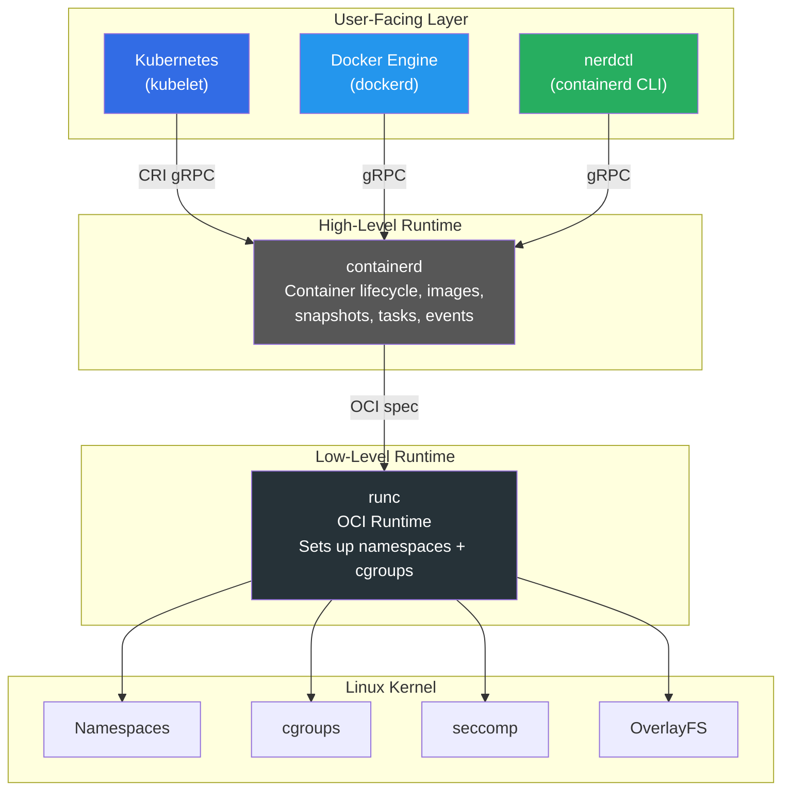

| Layer | Component | Role |
|-------|-----------|------|
| **User-facing** | Kubernetes, Docker, nerdctl | What users interact with |
| **High-level runtime** | containerd | Manages the full container lifecycle — images, snapshots, execution, supervision |
| **Low-level runtime** | runc | Creates the actual Linux sandbox (namespaces, cgroups) and exec's the process |
| **Kernel** | namespaces, cgroups, seccomp, OverlayFS | OS-level isolation primitives |

---

## Why runc Exists — The Low-Level Runtime

You'll see `runc` mentioned everywhere in the container ecosystem — it's the bottom-most layer that actually creates a container. Understanding why it exists as a separate tool is key to understanding the entire runtime stack.

### The Problem: Docker Was a Monolith

In Docker's early days (2013–2015), everything lived inside a single `docker` binary — image management, networking, volumes, and the actual container creation logic. This caused several problems:

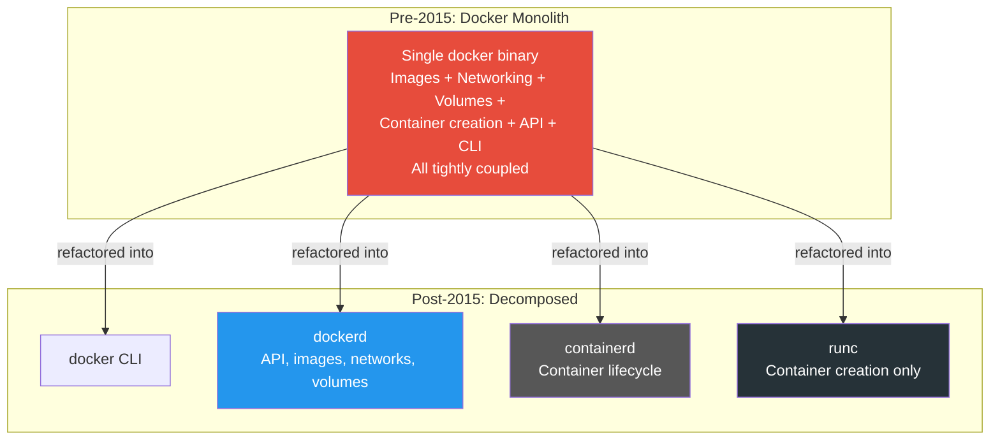

1. **Vendor lock-in** — the industry needed containers, but the only way to create them was through Docker's proprietary daemon
2. **No standard** — every runtime did things differently, making containers non-portable between platforms
3. **Too much surface area** — a bug in networking could affect container creation, and vice versa

### The Solution: OCI and runc

In June 2015, Docker and other industry leaders (Google, CoreOS, Red Hat, IBM, Microsoft) formed the **Open Container Initiative (OCI)** under the Linux Foundation. The OCI defined two specifications:

| Specification | What It Standardizes |
|--------------|---------------------|
| **Runtime Spec** (`runtime-spec`) | How to take a filesystem bundle + config and turn it into a running, isolated process |
| **Image Spec** (`image-spec`) | How container images should be packaged, distributed, and unpacked |

Docker then **extracted** the container creation code from its monolithic daemon, open-sourced it, and donated it to the OCI as **runc** — the **reference implementation** of the OCI Runtime Specification.

### What runc Actually Does

runc is a small, focused CLI tool with a single job: take an OCI bundle (a root filesystem + a `config.json`) and create an isolated Linux process.

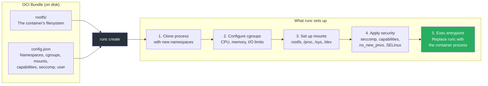

Here's what runc configures using Linux kernel primitives:

| Kernel Feature | What It Isolates | Example |
|---------------|-----------------|---------|
| **PID namespace** | Process IDs | Container sees its entrypoint as PID 1 |
| **NET namespace** | Network stack | Container gets its own interfaces, IP, ports |
| **MNT namespace** | Filesystem mounts | Container sees only its own rootfs |
| **UTS namespace** | Hostname | Container can have its own hostname |
| **IPC namespace** | Inter-process communication | Shared memory, semaphores are isolated |
| **USER namespace** | User/group IDs | UID 0 inside maps to unprivileged UID on host (rootless) |
| **cgroups** | Resource limits | CPU, memory, I/O, PIDs limits |
| **seccomp** | Syscall filtering | Blocks dangerous syscalls like `reboot`, `mount` |
| **Capabilities** | Privilege granularity | Drop `CAP_SYS_ADMIN`, keep `CAP_NET_BIND_SERVICE` |

### runc Is Ephemeral

A critical detail: **runc exits immediately after starting the container**. It does not stay running. This is by design:

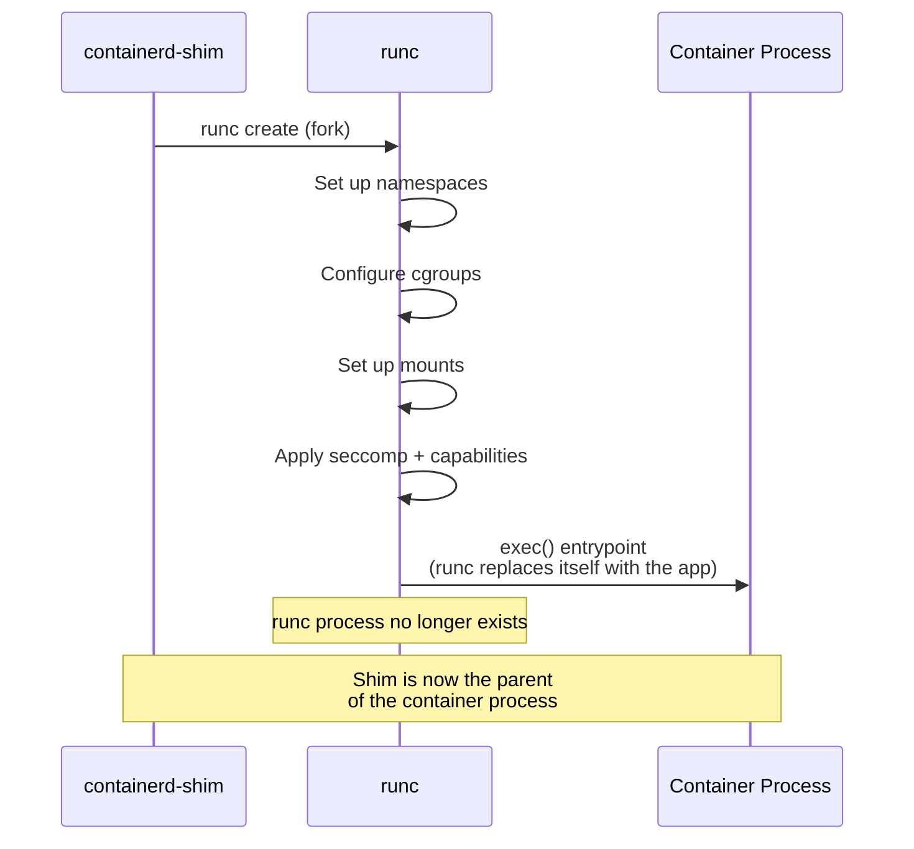

runc's lifecycle:
1. **Called** by containerd-shim (or conmon in Podman)
2. **Sets up** all Linux isolation primitives (namespaces, cgroups, mounts, seccomp)
3. **exec()** — replaces its own process with the container's entrypoint
4. **Gone** — runc is no longer a running process; it literally becomes the container

> This is like a scaffolding crew that builds the framework for a house, hands the keys to the owner, and drives away. The scaffolding (isolation) remains, but the crew (runc) is gone.

### Why Can't containerd Just Do This Itself?

A natural question: if runc sets things up and exits, why not build that logic directly into containerd? Why have a separate subprocess at all?

There are three fundamental reasons.

#### 1. The `exec()` Problem — You Can't Come Back

The most critical reason is the Unix `exec()` system call. When runc finishes setting up namespaces, cgroups, mounts, and seccomp, it doesn't "return" — it calls `exec()`, which **replaces the runc process entirely** with the container's entrypoint. The runc process ceases to exist and becomes your nginx, redis, or whatever the container runs.

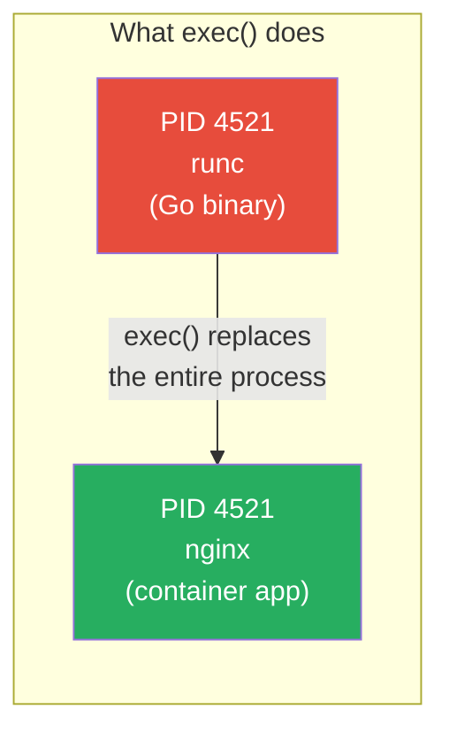

If containerd called `exec()` to become the container process, **the containerd daemon would vanish**. No more API, no more managing other containers, no more image pulls. A daemon cannot sacrifice itself to become a container — it needs to delegate that to a disposable child process.

#### 2. The Namespace Bootstrap Problem — You Can't Go In and Come Back

Creating a container requires entering new Linux namespaces. The process that sets up the container's environment must do so **from inside** those namespaces:

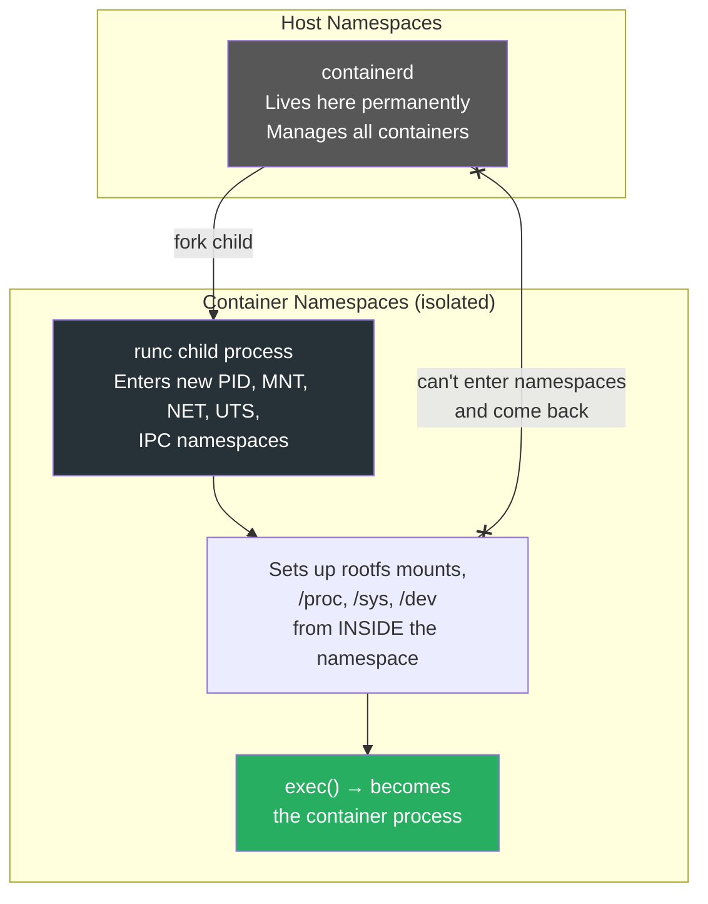

Mounting the container's root filesystem, setting up `/proc` and `/dev`, configuring network interfaces inside the namespace — all of this must happen from inside the sandbox. containerd can't partially enter a container's namespaces, do setup work, and then step back out to its host namespaces. Linux namespaces don't work that way for a multi-threaded daemon. You need a **disposable, single-purpose process** that goes in, sets everything up, and stays there (as the container).

#### 3. The Separation of Concerns — Standards and Swappability

runc implements the **OCI Runtime Specification** — a clean, well-defined contract. This creates a clear architectural boundary:

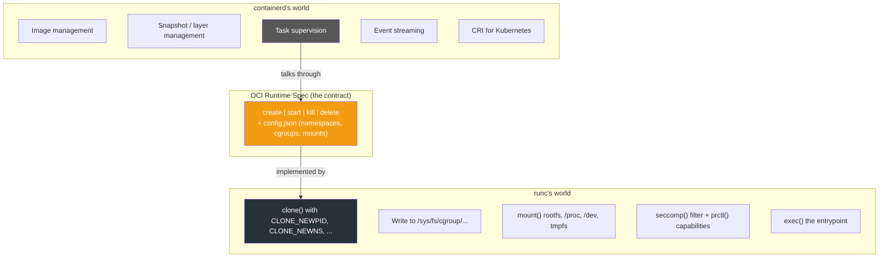

This separation provides:

| Benefit | Why It Matters |
|---------|---------------|
| **Swappable runtimes** | Replace runc with crun (faster), kata (VM isolation), or gVisor (syscall interception) — containerd doesn't change |
| **Independent security patches** | A vulnerability in namespace setup code (runc) doesn't require patching the entire container management daemon (containerd) |
| **Smaller attack surface** | runc runs briefly with elevated privileges, then exits. containerd doesn't carry that kernel-plumbing code in its long-running process |
| **Evolves independently** | Kernel features change across Linux versions. runc adapts to those without containerd needing to know the details |

#### The Analogy

```
containerd  = Air traffic control
              "Flight 747, you're cleared for runway 3, altitude 35,000 ft"
              (decides what runs, where, with what resources)

runc        = The pilot who actually flies the plane
              "Configure flaps, set throttle, execute takeoff roll"
              (interacts directly with the machine's controls)

The shim    = The flight recorder / black box
              (stays with the plane, reports status back to ATC)
```

Air traffic control doesn't fly planes. It can't — it needs to stay in the tower managing all flights. It tells each pilot (runc) what to do, the pilot executes, and the flight recorder (shim) keeps the tower informed. If you rebuilt ATC to also fly planes, you'd have a single point of failure doing two very different jobs.

#### What If containerd Embedded runc as a Library?

Technically, containerd could link runc's code (libcontainer) as a Go library instead of spawning a subprocess. But this would mean:

- containerd itself would need to `fork()` child processes into new namespaces — becoming a complex, multi-threaded daemon doing kernel-level plumbing
- The entire daemon would carry the attack surface of namespace/cgroup manipulation
- You'd lose the ability to swap runtimes (no more kata or gVisor)
- This is exactly the monolithic architecture Docker had pre-2015, which they spent years breaking apart

> **The "exits anyway" part is the feature, not the cost.** runc does its job (build the sandbox), gets out of the way (zero memory overhead), and the shim stays as a minimal babysitter. Each piece does exactly one thing — and that's what makes the system reliable.

### Using runc Directly (for understanding — not recommended for production)

```bash
# 1. Create an OCI bundle from a Docker image
mkdir -p /mycontainer/rootfs
docker export $(docker create busybox) | tar -C /mycontainer/rootfs -xvf -

# 2. Generate a default OCI runtime spec
cd /mycontainer
runc spec    # creates config.json

# 3. Run the container
runc run my-container    # gives you a shell inside the container

# 4. Or use the lifecycle commands separately
runc create my-container   # create but don't start
runc list                  # see it in "created" state
runc start my-container    # start the process
runc list                  # see it in "running" state
runc delete my-container   # clean up after it exits
```

> runc itself says it best: "runc is a low level tool not designed with an end user in mind. It is mostly employed by other higher level container software." Use Docker, Podman, or nerdctl instead.

### runc vs Alternative OCI Runtimes

runc is the default, but it's not the only OCI-compliant low-level runtime:

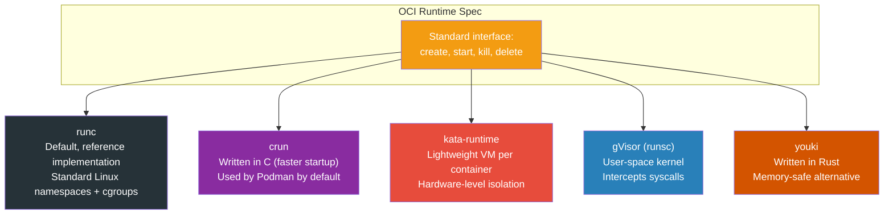

| Runtime | Language | Isolation Model | Used By | Trade-off |
|---------|----------|----------------|---------|-----------|
| **runc** | Go | Namespaces + cgroups | Docker, containerd, most K8s | The standard — battle-tested, widest adoption |
| **crun** | C | Namespaces + cgroups | Podman (default) | Faster startup, lower memory than runc |
| **kata-runtime** | Go | Lightweight VM (QEMU/Cloud Hypervisor) | Sensitive workloads, multi-tenant K8s | Stronger isolation, higher overhead |
| **gVisor (runsc)** | Go | User-space kernel intercepts syscalls | GKE Sandbox, untrusted workloads | Stronger isolation, some syscall incompatibilities |
| **youki** | Rust | Namespaces + cgroups | Experimental, Rust ecosystem | Memory safety, still maturing |

Because the OCI spec is a standard interface, containerd can swap runtimes without any changes to higher-level tools — your `kubectl apply` or `docker run` works the same regardless of whether runc, crun, or kata is underneath.

---

## Core Responsibilities

containerd handles everything between "I want a container" and the actual kernel-level sandbox:

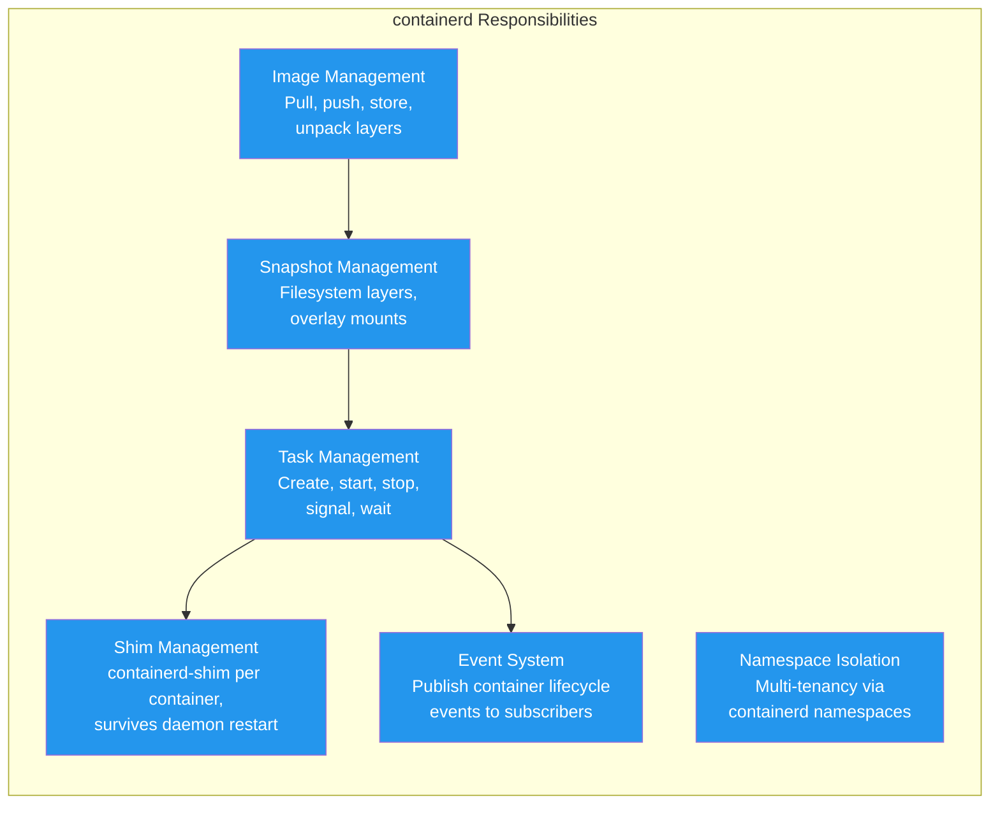

| Responsibility | What It Does |
|----------------|-------------|
| **Image transfer & storage** | Pulls/pushes images from any OCI-compliant registry (Docker Hub, ECR, GCR, etc.). Stores them as content-addressable blobs. |
| **Snapshot management** | Manages filesystem layers using snapshotters (overlay, btrfs, devmapper, etc.). Each container gets a writable layer on top of read-only image layers. |
| **Task management** | A "task" is the running process inside a container. containerd creates, starts, stops, and signals tasks via the low-level runtime. |
| **Shim management** | Spawns a `containerd-shim` for each container. The shim becomes the direct parent of the container process and survives containerd restarts. |
| **Event streaming** | Publishes lifecycle events (container started, stopped, OOM killed, etc.) that higher-level systems can subscribe to. |
| **Namespace isolation** | Supports multiple logical namespaces within a single daemon — Kubernetes uses `k8s.io`, Docker uses `moby`. |

---

## Architecture & Components

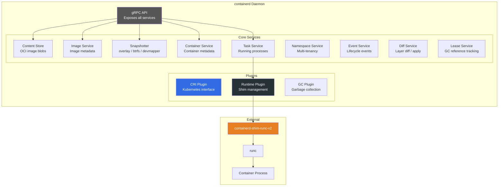

### Plugin Architecture

containerd is built around a **plugin system**. Almost every component is a plugin, making it highly extensible:

| Plugin Type | Examples | Purpose |
|-------------|----------|---------|
| **Content** | Local content store | Stores OCI image blobs on disk |
| **Snapshotter** | overlay, btrfs, devmapper, ZFS | Manages filesystem layers for containers |
| **Runtime** | `io.containerd.runc.v2` | Manages shims and low-level runtimes |
| **CRI** | Built-in CRI plugin | Provides Kubernetes Container Runtime Interface |
| **GC** | Garbage collector | Cleans up unused content and snapshots |
| **Diff** | Walking diff, binary diff | Computes and applies layer diffs |

```bash
# List all registered plugins
ctr plugins ls

# Example output:
# TYPE                  ID                    PLATFORMS   STATUS
# io.containerd.grpc.v1 containers            -           ok
# io.containerd.grpc.v1 content               -           ok
# io.containerd.grpc.v1 images                -           ok
# io.containerd.grpc.v1 tasks                 -           ok
# io.containerd.snapshotter.v1 overlayfs      linux/amd64 ok
# io.containerd.runtime.v2 task               linux/amd64 ok
```

---

## Process Hierarchy

When containerd runs a container, the process tree looks like this:

```
systemd
 ├── containerd                         ← always running (the daemon)
 │
 ├── containerd-shim-runc-v2            ← one per container (survives containerd restart)
 │    └── nginx                         ← actual container process
 │
 ├── containerd-shim-runc-v2            ← one per container
 │    └── redis-server
```

| Process | Lifetime | Role |
|---------|----------|------|
| **`containerd`** | Always running | Daemon — manages images, snapshots, tasks, events |
| **`containerd-shim-runc-v2`** | Per container — lives as long as the container | Direct parent of the container process. Holds stdio, reports exit codes, allows containerd to restart without killing containers |
| **`runc`** | Ephemeral — exits immediately after starting the container | Sets up namespaces + cgroups, exec's the entrypoint, then exits |
| **Container process** | Runs until stopped | Your application (nginx, redis, node, etc.) |

### Why the Shim Exists

The shim is the key design element that allows **daemon-independent container lifecycle**:

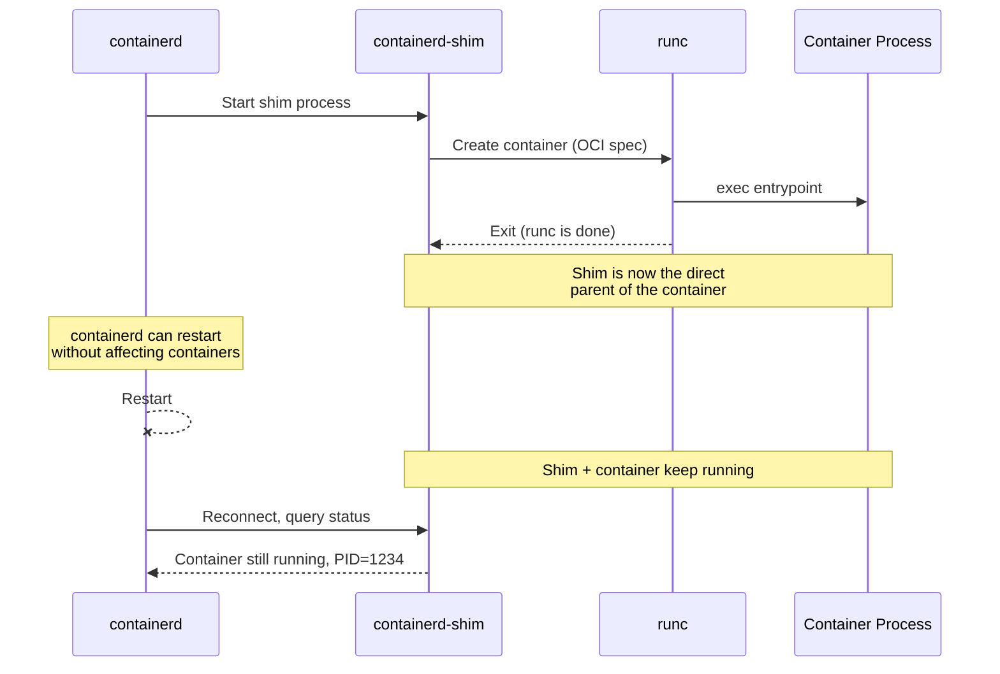

The shim provides:
- **Daemon independence** — containers survive containerd restarts/upgrades
- **STDIO forwarding** — keeps container logs flowing
- **Exit status reporting** — reports the container's exit code back to containerd
- **Reaping** — acts as `init` / subreaper for zombie processes inside the container

---

## containerd Namespaces (Multi-Tenancy)

containerd supports **logical namespaces** — not to be confused with Linux kernel namespaces. These isolate different consumers of the same containerd daemon:

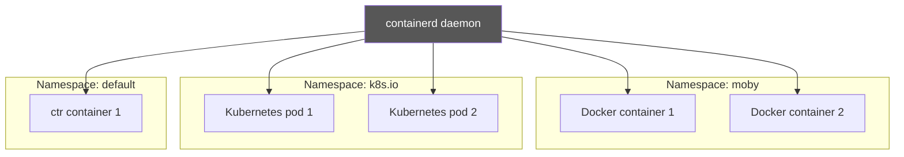

| Namespace | Used By | Purpose |
|-----------|---------|---------|
| `moby` | Docker Engine | Docker's containers, images, and snapshots live here |
| `k8s.io` | Kubernetes (kubelet via CRI) | Kubernetes pods and their images |
| `default` | `ctr` CLI tool | Manual / debug usage |

Each namespace has its own isolated set of images, containers, and snapshots. Docker containers can't see Kubernetes containers and vice versa, even though they share the same containerd daemon.

```bash
# List namespaces
ctr namespaces ls

# List containers in a specific namespace
ctr -n k8s.io containers ls
ctr -n moby containers ls
```

---

## The CRI Plugin — How Kubernetes Talks to containerd

The **Container Runtime Interface (CRI)** is Kubernetes' standard API for communicating with container runtimes. containerd has a built-in CRI plugin — no sidecar or adapter needed.

### Before Kubernetes 1.24 (with Docker)

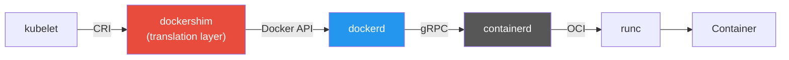

### After Kubernetes 1.24 (direct containerd)

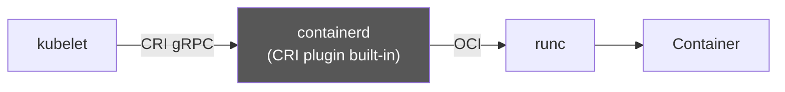

| | Docker Path (old) | containerd Path (current) |
|---|---|---|
| **Hops** | kubelet → dockershim → dockerd → containerd → runc | kubelet → containerd → runc |
| **Layers** | 5 | 3 |
| **Overhead** | Higher — extra daemon + API translation | Lower — direct CRI implementation |
| **Maintenance** | dockershim was removed in K8s 1.24 | Native support, actively maintained |

> This is exactly what your **EKS cluster** uses — kubelet talks directly to containerd via CRI. No Docker involved at runtime.

---

## containerd vs Docker Engine vs CRI-O

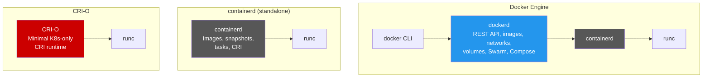

| Feature | containerd | Docker Engine | CRI-O |
|---------|-----------|---------------|-------|
| **Purpose** | General-purpose high-level runtime | Full developer platform (build + run + manage) | Minimal Kubernetes-only runtime |
| **CRI support** | Built-in plugin | Needed dockershim (now removed) | Native — designed for CRI only |
| **Image building** | No (needs BuildKit separately) | Yes (`docker build`) | No |
| **CLI** | `ctr` (minimal) / `nerdctl` (Docker-compatible) | `docker` (full-featured) | `crictl` (debug only) |
| **Compose** | Via nerdctl | `docker compose` | No |
| **Kubernetes runtime** | Yes (EKS, GKE, AKS, etc.) | Removed as default in K8s 1.24 | Yes (OpenShift, some K8s distros) |
| **Used by** | Docker, Kubernetes, cloud providers | Developers, CI/CD | OpenShift, Red Hat K8s |
| **CNCF status** | Graduated | Not a CNCF project | Graduated |
| **License** | Apache 2.0 | Apache 2.0 | Apache 2.0 |

---

## Key CLI Tools

containerd comes with `ctr` — a minimal, developer-oriented CLI. It's not meant for production management but is useful for debugging.

```bash
# Pull an image
ctr images pull docker.io/library/nginx:latest

# List images
ctr images ls

# Run a container
ctr run -d docker.io/library/nginx:latest my-nginx

# List running containers (tasks)
ctr tasks ls

# Execute a command inside a container
ctr tasks exec --exec-id shell1 my-nginx /bin/sh

# Stop and delete
ctr tasks kill my-nginx
ctr containers delete my-nginx
```

For a Docker-like experience on top of containerd, use **nerdctl**:

```bash
# nerdctl is a Docker-compatible CLI for containerd
nerdctl run -d -p 8080:80 --name web nginx
nerdctl ps
nerdctl logs web
nerdctl compose up -d    # supports compose files too
```

---

## Configuration

containerd is configured via a TOML file, typically at `/etc/containerd/config.toml`:

```toml
# /etc/containerd/config.toml

version = 2

[plugins."io.containerd.grpc.v1.cri"]
  # Sandbox (pause) image used by Kubernetes
  sandbox_image = "registry.k8s.io/pause:3.9"

  [plugins."io.containerd.grpc.v1.cri".containerd]
    # Default runtime
    default_runtime_name = "runc"

    [plugins."io.containerd.grpc.v1.cri".containerd.runtimes.runc]
      runtime_type = "io.containerd.runc.v2"

      [plugins."io.containerd.grpc.v1.cri".containerd.runtimes.runc.options]
        SystemdCgroup = true

  [plugins."io.containerd.grpc.v1.cri".registry]
    # Configure mirrors or private registries
    config_path = "/etc/containerd/certs.d"
```

```bash
# Generate default config
containerd config default > /etc/containerd/config.toml

# Restart after changes
sudo systemctl restart containerd

# Check status
sudo systemctl status containerd
```

---

## containerd in EKS (Your Setup)

On Amazon EKS, containerd is the default and only container runtime. Here's how it fits into your stack:

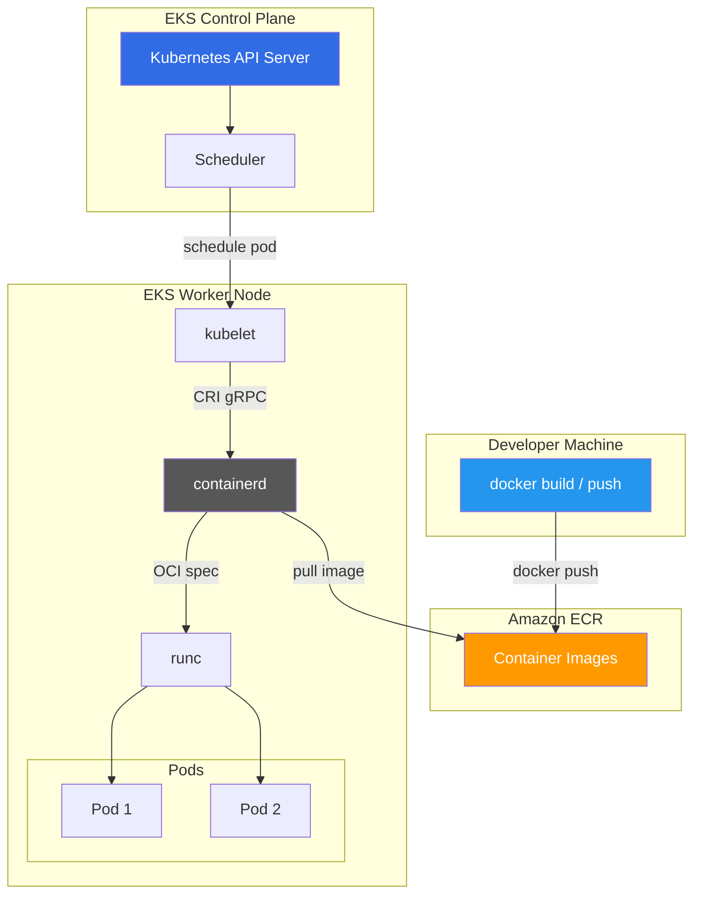

**What happens when you deploy to EKS:**

1. You build an image with `docker build` and push it to ECR
2. You run `kubectl apply -f deployment.yaml`
3. The Kubernetes scheduler picks a node for your pod
4. The kubelet on that node calls containerd via CRI
5. containerd pulls the image from ECR (using the node's IAM role for auth)
6. containerd unpacks the image layers using the overlay snapshotter
7. containerd starts a shim, which starts runc, which creates the container
8. Your application runs

You never install, configure, or interact with containerd directly — **EKS manages it for you**.

---

## Summary

```
containerd = the engine under the hood

  ┌──────────────────────────────────────────────────┐
  │  What it IS                                      │
  │  • High-level container runtime (daemon)         │
  │  • Image pull/push/storage                       │
  │  • Container lifecycle management                │
  │  • Snapshot / filesystem layer management         │
  │  • Built-in Kubernetes CRI plugin                │
  │  • CNCF Graduated, Apache 2.0                    │
  ├──────────────────────────────────────────────────┤
  │  What it is NOT                                  │
  │  • Not a user-facing tool (use Docker/nerdctl)   │
  │  • Not an image builder (use BuildKit/Buildah)   │
  │  • Not an orchestrator (use Kubernetes)           │
  │  • Not a low-level runtime (that's runc)         │
  └──────────────────────────────────────────────────┘

  Who uses containerd:
    Docker Engine  → wraps it with developer UX
    Kubernetes     → talks to it directly via CRI
    EKS/GKE/AKS   → managed containerd on every node
    Cloud providers → embedded in their container platforms
```

---

**Sources**: [containerd.io](https://containerd.io/), [containerd docs](https://containerd.io/docs/main/), [CNCF containerd project](https://www.cncf.io/projects/containerd/), [Docker Engine docs](https://docs.docker.com/engine/). Content was rephrased for compliance with licensing restrictions.

---

[← Back to Section Index](./README.md) · [← Main Index](../README.md) · [Previous: Docker vs Podman](./03-docker-vs-podman.md)
