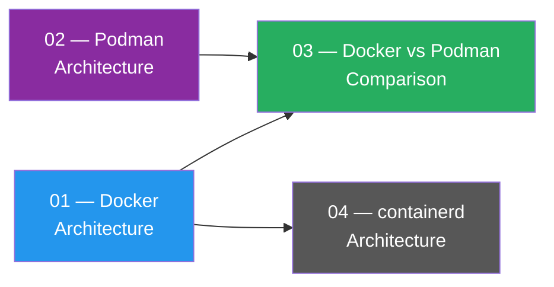

# Container Runtimes — Docker, Podman & Comparison

[← Back to Main Index](../README.md) · [Previous: Containers Fundamentals](../01-containers-fundamentals.md)

---

This section covers the architecture, internals, and trade-offs of the major container runtimes.

## Pages in This Section

| # | Page | Description |
|---|------|-------------|
| 01 | [Docker Architecture & Engine](./01-docker-architecture.md) | dockerd, containerd, runc, process hierarchy, lifecycle, client-server model |
| 02 | [Podman Architecture & Engine](./02-podman-architecture.md) | Daemonless model, conmon, crun, pods, rootless, systemd integration |
| 03 | [Docker vs Podman — Comparison](./03-docker-vs-podman.md) | Side-by-side comparison across architecture, security, networking, orchestration, CLI, and more |
| 04 | [containerd Architecture & Internals](./04-containerd-architecture.md) | High-level runtime, CRI plugin, shim design, namespaces, EKS integration, containerd vs Docker vs CRI-O |

---

## Quick Navigation

> Read Docker and Podman architecture pages first, then use the comparison page as a consolidated reference. The containerd page dives deeper into the runtime that Docker and Kubernetes both use under the hood.

---

[← Back to Main Index](../README.md) · [Next: Orchestration →](../03-orchestration.md)
