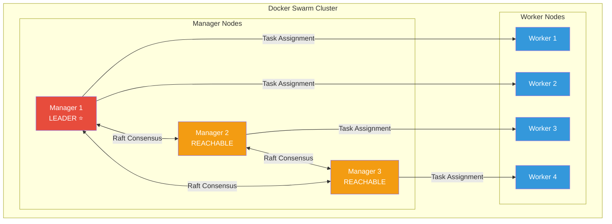
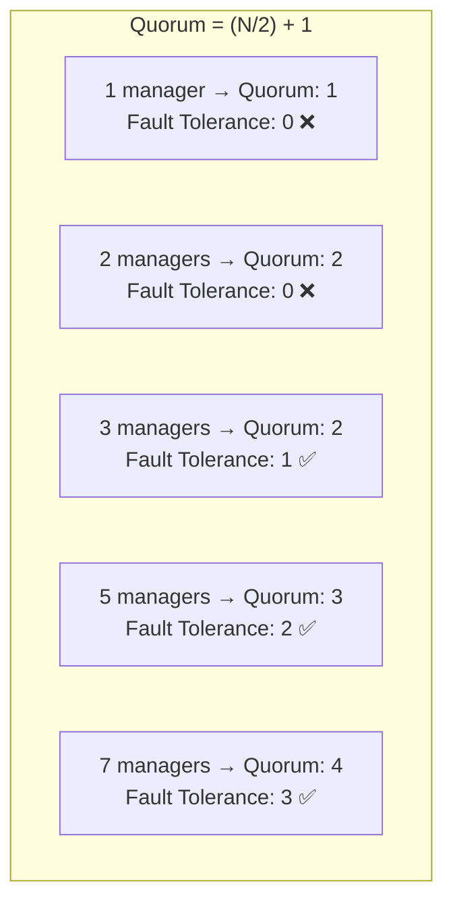
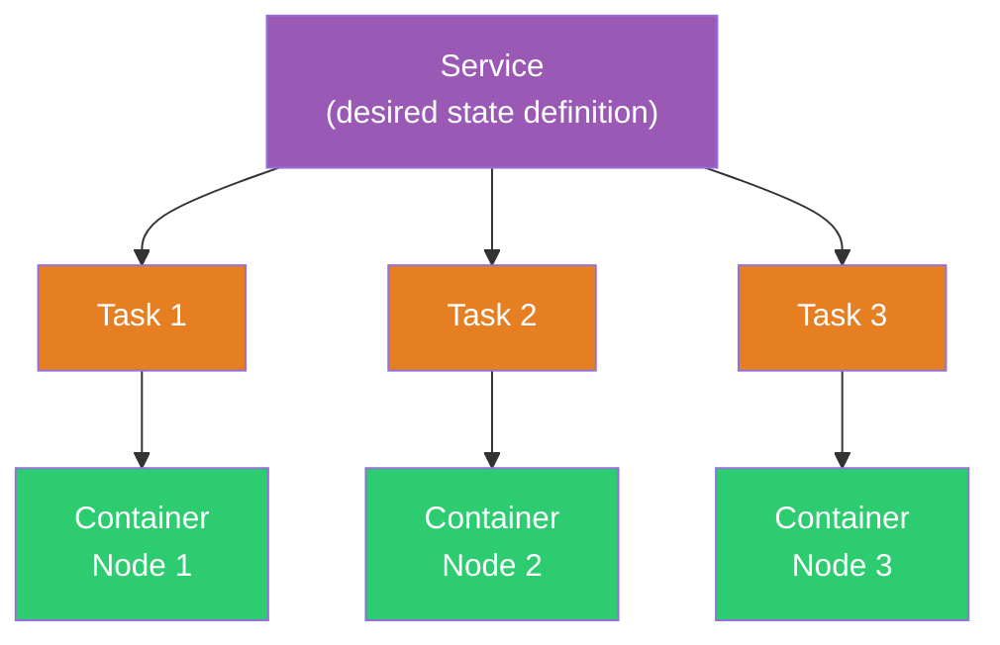
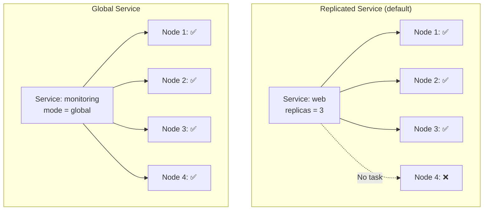
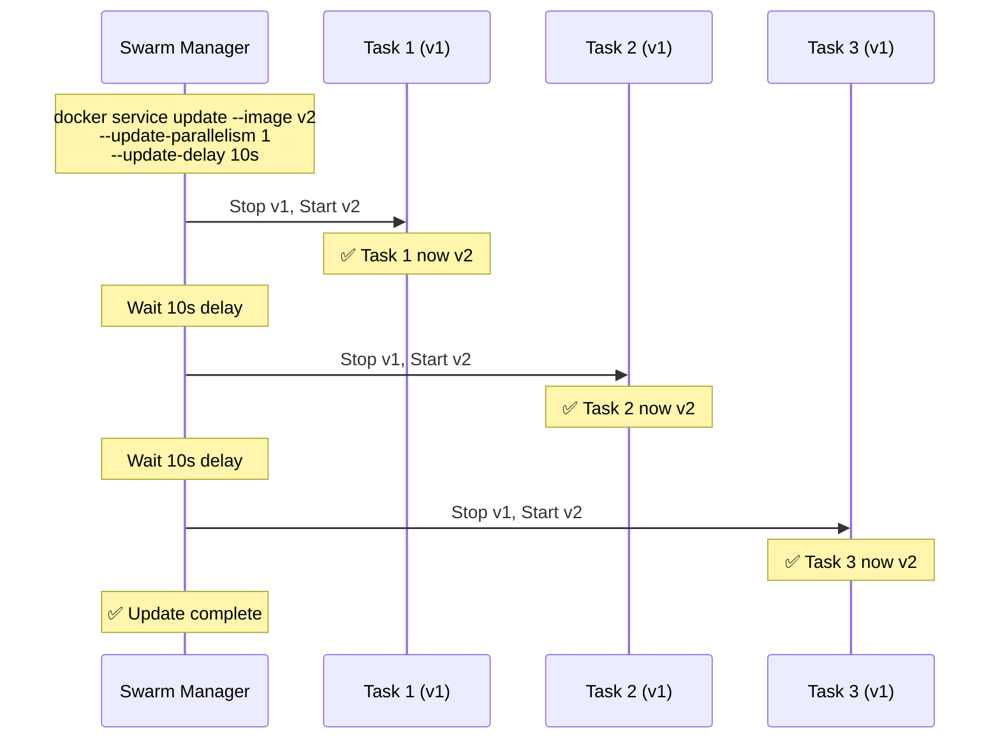

# Domain 1: Orchestration (25% of Exam)

[← Back to Index](./README.md) · [Previous: Docker Architecture](./02-container-runtimes/01-docker-architecture.md)

> 🔴 **Highest weighted domain — study this thoroughly!**

---

## Docker Swarm Architecture



### Manager vs Worker Nodes

| | Manager Nodes | Worker Nodes |
|---|--------------|--------------|
| **Role** | Maintain cluster state, schedule tasks | Execute container tasks |
| **Raft** | Participate in Raft consensus | Do not participate |
| **Run tasks?** | Yes (by default) | Yes |
| **API access** | Accept management commands | Cannot manage cluster |

> Managers can be drained to prevent running tasks: `docker node update --availability drain <manager>`

---

## Swarm Setup Commands

```bash
# Initialize swarm on first manager
docker swarm init --advertise-addr <MANAGER-IP>

# Get join tokens
docker swarm join-token manager
docker swarm join-token worker

# Join as worker
docker swarm join --token <WORKER-TOKEN> <MANAGER-IP>:2377

# Join as manager
docker swarm join --token <MANAGER-TOKEN> <MANAGER-IP>:2377

# Promote / demote nodes
docker node promote <node-name>
docker node demote <node-name>

# List nodes
docker node ls

# Inspect a node
docker node inspect --pretty <node-name>

# Drain a node (maintenance)
docker node update --availability drain <node-name>

# Re-activate a drained node
docker node update --availability active <node-name>

# Leave swarm
docker swarm leave           # Worker leaves
docker swarm leave --force   # Manager leaves (⚠️ may break quorum)
```

---

## Raft Consensus & Quorum



| Managers | Quorum | Fault Tolerance |
|----------|--------|-----------------|
| 1 | 1 | 0 |
| 2 | 2 | 0 |
| **3** | **2** | **1** |
| **5** | **3** | **2** |
| **7** | **4** | **3** |

> **Rules:**
> - Always use an **odd number** of managers (3, 5, or 7)
> - Docker recommends a **maximum of 7** managers (more adds Raft overhead)
> - If quorum is lost, the swarm cannot accept new management commands

---

## Services, Tasks & Containers



- **Service** — the definition: which image, how many replicas, ports, networks
- **Task** — a slot in the scheduler that maps to one container
- **Container** — the actual running process on a node

---

## Replicated vs Global Services



| Mode | Behavior | Use Case |
|------|----------|----------|
| **Replicated** | Runs N replicas across the cluster | Web apps, APIs |
| **Global** | Exactly one task per node | Monitoring agents, log collectors |

---

## Service Commands

```bash
# Create a replicated service
docker service create --name web --replicas 3 -p 8080:80 nginx

# Create a global service
docker service create --name agent --mode global datadog/agent

# List services
docker service ls

# Inspect service
docker service inspect --pretty web

# View tasks
docker service ps web

# Scale a service
docker service scale web=5

# Remove a service
docker service rm web
```

---

## Rolling Updates & Rollbacks



### Update Configuration Flags

```bash
docker service update \
  --image nginx:1.25 \
  --update-parallelism 2 \       # Update 2 tasks at a time
  --update-delay 10s \           # Wait 10s between batches
  --update-failure-action rollback \  # Auto-rollback on failure
  --update-max-failure-ratio 0.25 \   # Tolerate 25% failures
  --update-order start-first \   # Start new before stopping old
  web
```

### Rollback

```bash
# Manual rollback
docker service rollback web

# Rollback config (set at service creation)
docker service create \
  --rollback-parallelism 1 \
  --rollback-delay 5s \
  --rollback-failure-action pause \
  --name web nginx
```

---

## Placement Constraints & Preferences

```bash
# Constraint: only on worker nodes
docker service create --constraint 'node.role==worker' --name web nginx

# Constraint: specific label
docker node update --label-add region=us-east node1
docker service create --constraint 'node.labels.region==us-east' --name web nginx

# Preference: spread across zones
docker service create \
  --placement-pref 'spread=node.labels.datacenter' \
  --name web nginx
```

| Type | Purpose | Behavior |
|------|---------|----------|
| **Constraint** | Hard requirement | Task will NOT be scheduled if constraint not met |
| **Preference** | Soft preference | Swarm tries to spread, but won't fail if it can't |

---

## Stacks (Compose in Swarm)

```bash
# Deploy a stack using compose file
docker stack deploy -c docker-compose.yml myapp

# List stacks
docker stack ls

# List services in a stack
docker stack services myapp

# List tasks in a stack
docker stack ps myapp

# Remove a stack
docker stack rm myapp
```

> Stacks use **version 3+** compose files. Some compose features (like `build`) are ignored in stack mode.

---

## Locking a Swarm (Autolock)

```bash
# Enable autolock on init
docker swarm init --autolock

# Enable autolock on existing swarm
docker swarm update --autolock=true

# Unlock after manager restart
docker swarm unlock

# Rotate unlock key
docker swarm unlock-key --rotate
```

> **Why autolock?** Raft logs and TLS keys are encrypted at rest. Autolock ensures a restarted manager must provide the unlock key before rejoining the cluster, protecting against disk theft scenarios.

---

## Swarm Ports

| Port | Protocol | Purpose |
|------|----------|---------|
| **2377** | TCP | Cluster management & Raft |
| **7946** | TCP + UDP | Node-to-node communication (gossip) |
| **4789** | UDP | Overlay network traffic (VXLAN) |

---

[← Back to Index](./README.md) · [Next: Image Creation & Management →](./04-image-creation-management.md)
