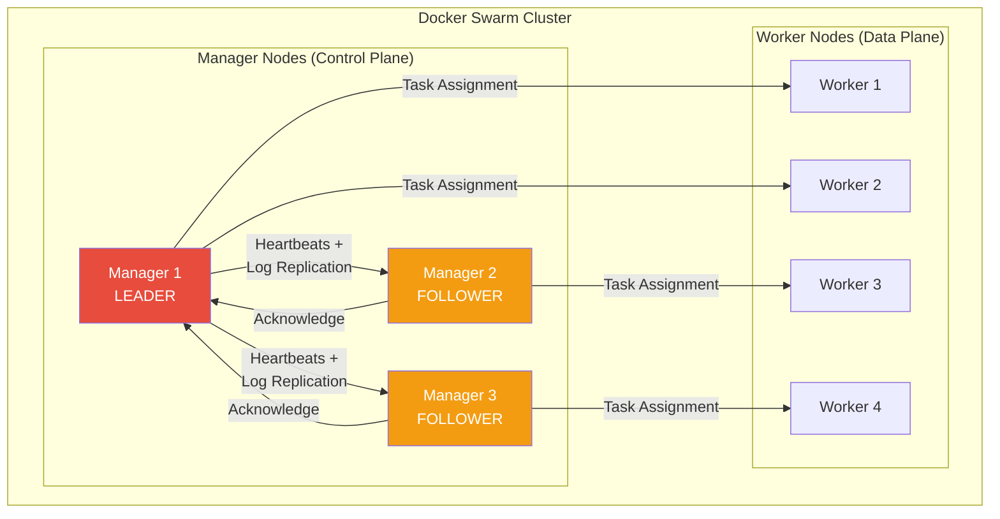
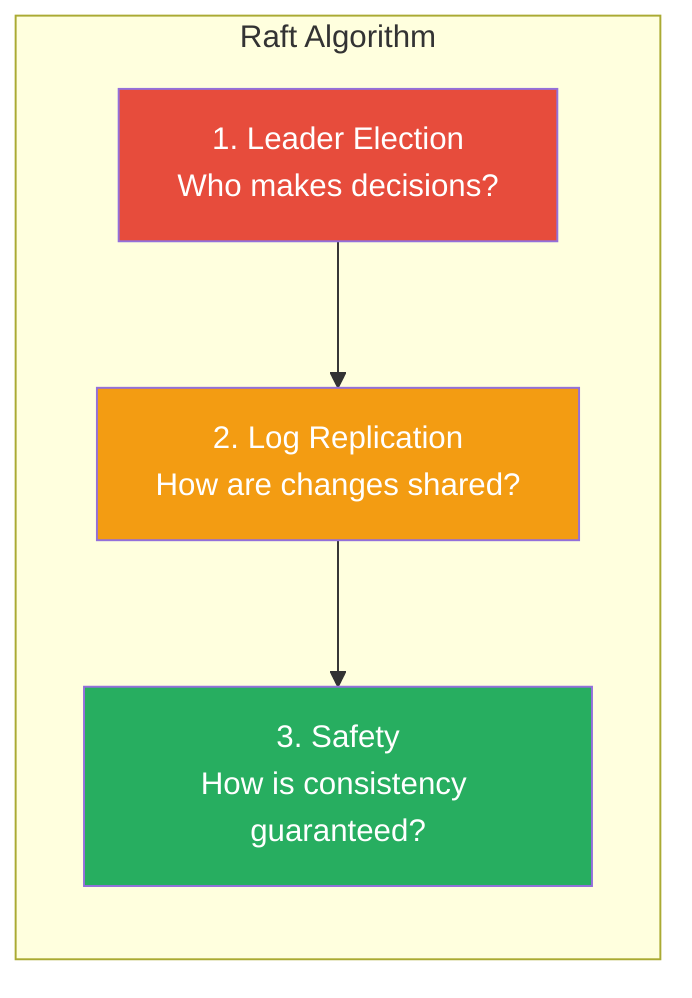
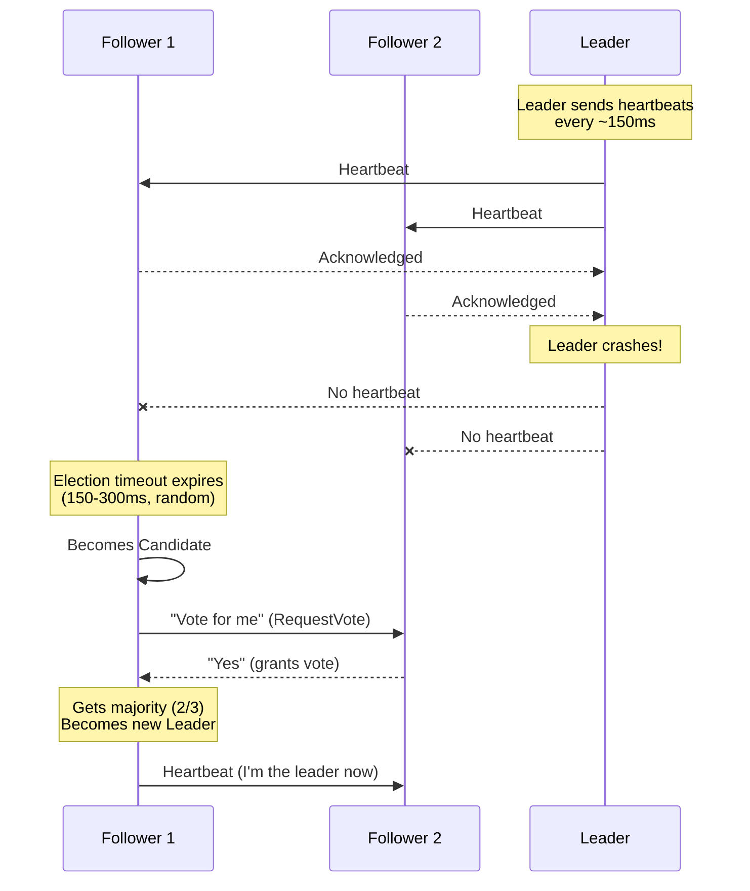
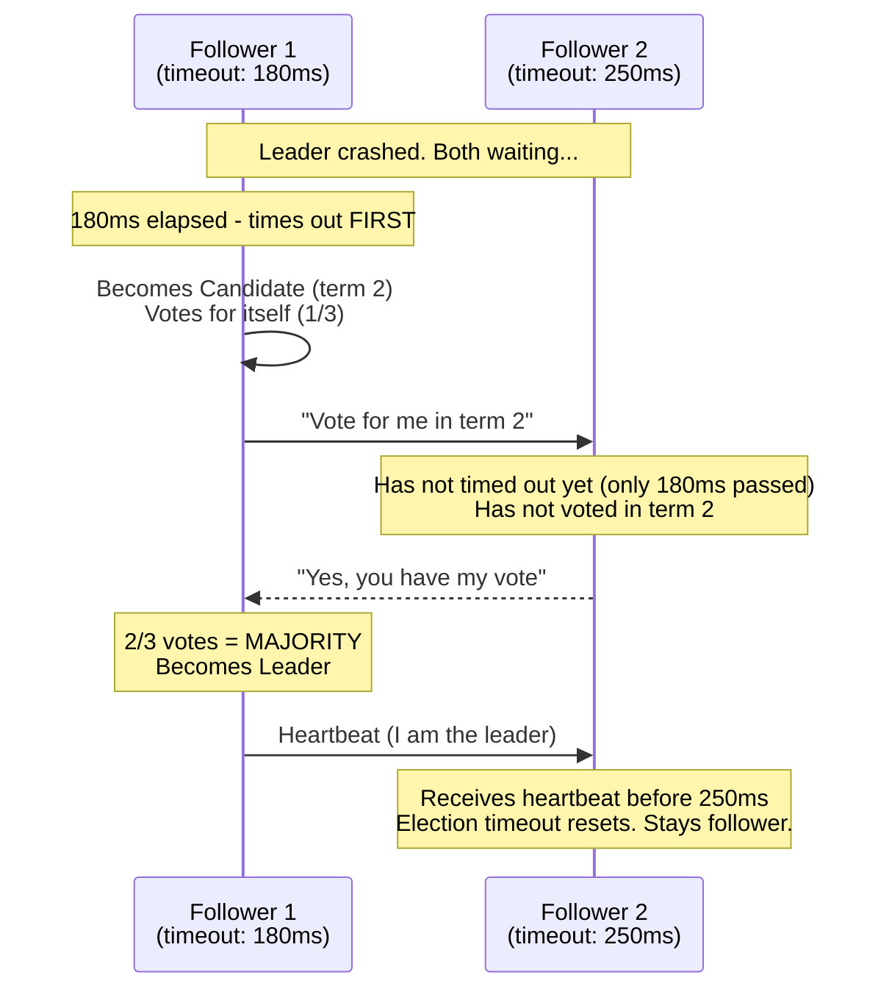
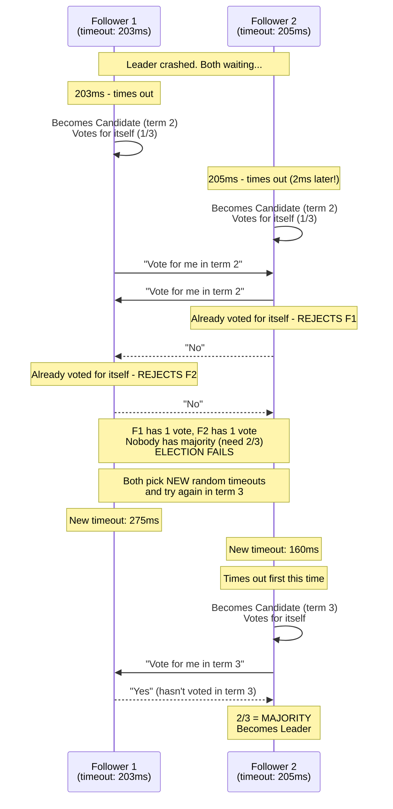
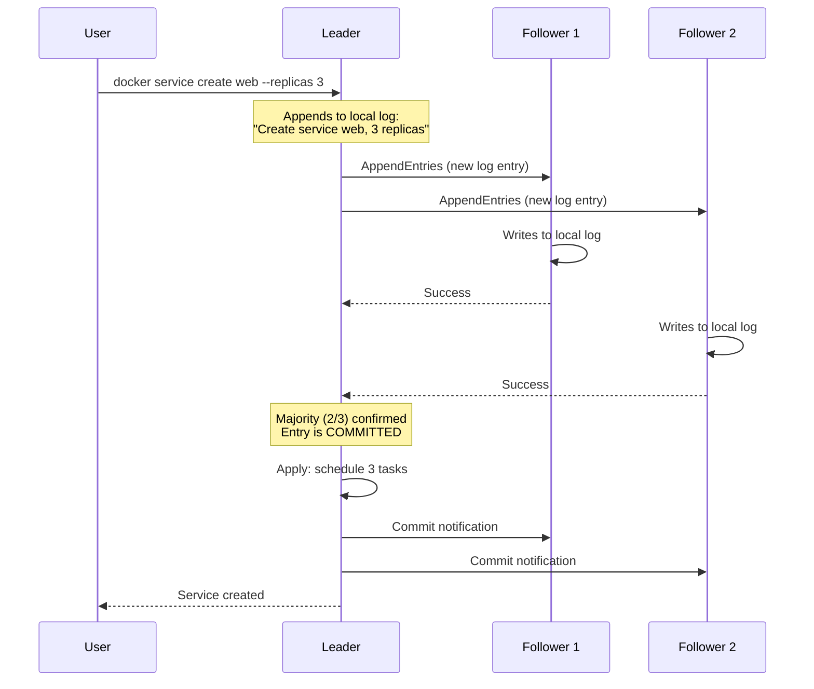
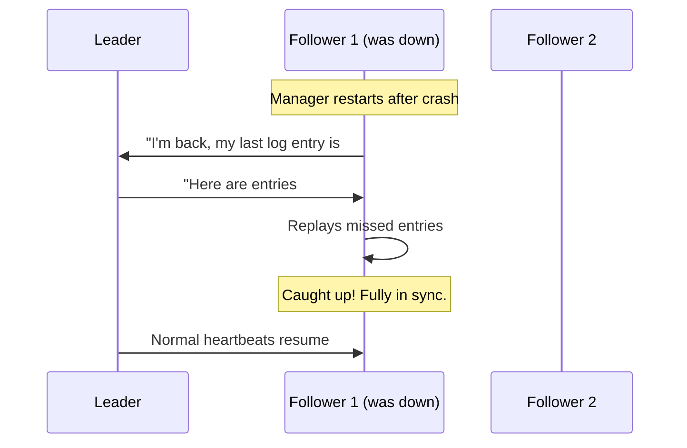
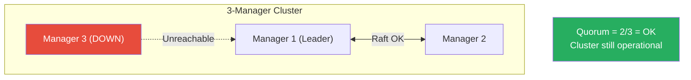
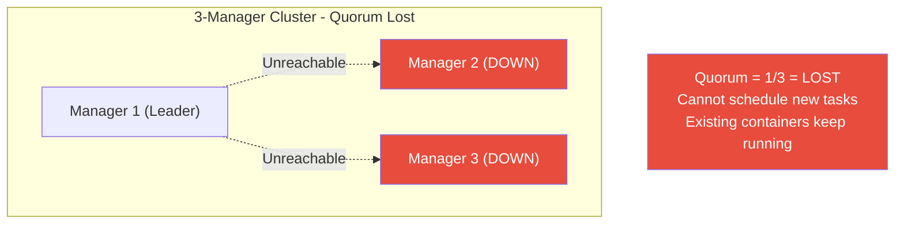
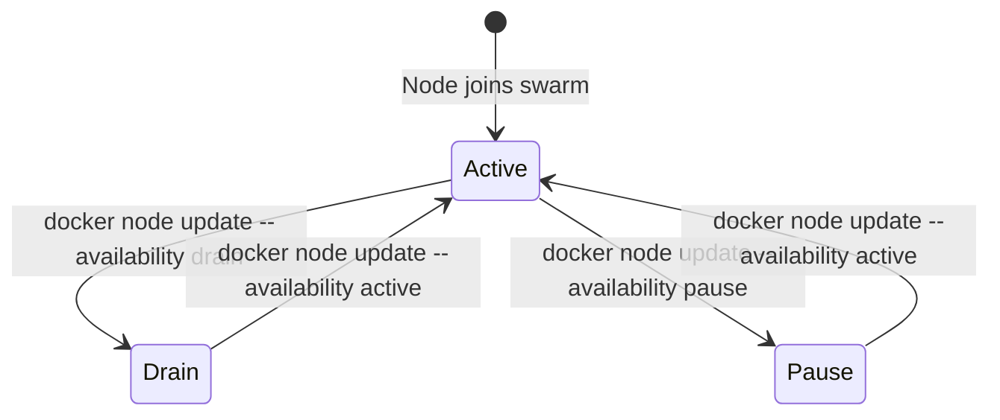

# Swarm Architecture & Cluster Setup

[← Back to Section Index](./README.md) · [← Main Index](../README.md)

---

## What Is Docker Swarm?

Docker Swarm turns a pool of Docker hosts into a single virtual host. It's built into Docker Engine — no extra software to install. When you run `docker swarm init`, the Docker Engine switches from standalone mode to Swarm mode.



> In normal operation, Raft communication is **leader → followers** (heartbeats, log entries) and **followers → leader** (acknowledgments). Followers do not talk to each other. The only exception is during a **leader election** — when the leader goes down, followers communicate to vote for a new leader.

---

## Manager vs Worker Nodes

| | Manager Nodes | Worker Nodes |
|---|--------------|--------------|
| **Role** | Maintain cluster state, schedule tasks, serve the Swarm API | Execute container tasks assigned by managers |
| **Raft** | Participate in Raft consensus | Do not participate |
| **Run tasks?** | Yes (by default) — managers are also workers | Yes |
| **API access** | Accept and process management commands | Cannot manage cluster — only report task status |
| **Minimum for HA** | 3 (for fault tolerance) | 0 (managers can run tasks) |

### Manager States

| State | Meaning |
|-------|---------|
| **Leader** | The single manager that performs all orchestration and scheduling decisions |
| **Reachable** | Participating in Raft, can become leader if the current leader fails |
| **Unreachable** | Manager is down or disconnected — doesn't count toward quorum |

```bash
# Check node roles and states
docker node ls
# ID          HOSTNAME   STATUS   AVAILABILITY   MANAGER STATUS
# abc123 *   manager1   Ready    Active         Leader
# def456     manager2   Ready    Active         Reachable
# ghi789     manager3   Ready    Active         Reachable
# jkl012     worker1    Ready    Active
```

---

## Raft Consensus & Quorum

### What Is Raft?

**Raft** is a consensus algorithm that lets a group of machines agree on shared state, even when some of them fail. It was designed in 2013 by Diego Ongaro and John Ousterhout as an understandable alternative to Paxos (an older, notoriously complex consensus algorithm).

In Docker Swarm, Raft solves this problem: you have 3 (or 5 or 7) manager nodes, and they all need to have the **exact same view of the cluster** — which services exist, how many replicas, which tasks run on which nodes, all secrets, configs, and networks. If managers disagree, the cluster breaks.

Docker, etcd (used by Kubernetes), Consul, and CockroachDB all chose Raft because it provides the same correctness guarantees as Paxos but is dramatically simpler to understand and implement.

### The Three Pillars of Raft

Raft separates consensus into three clear sub-problems:



### Pillar 1: Leader Election — One Leader, Rest Are Followers

At any time, every manager is in one of three roles:

| Role | Count | What It Does |
|------|-------|-------------|
| **Leader** | Exactly 1 | Makes all decisions — schedules tasks, processes API commands, proposes changes |
| **Follower** | N - 1 | Replicates whatever the leader says. Passive — only responds to the leader. |
| **Candidate** | 0 (during elections: 1+) | A follower that hasn't heard from the leader and starts an election |



**Why random election timeouts?** Each follower waits a random amount of time (150–300ms) before starting an election. This prevents all followers from becoming candidates simultaneously, which would split votes and delay leader election. Usually only one follower times out first and wins quickly.

**When does an election happen?**
- Leader crashes or becomes unreachable
- Network partition separates a follower from the leader
- A new Swarm is initialized (first election picks the initial leader)

### What If Two Followers Both Try to Become Leader? (Split Vote)

The randomized timeout usually prevents this — one follower times out before the other and wins cleanly. But if both timeouts fire nearly simultaneously, a **split vote** happens:

**Normal case — different timeouts, clean election:**



**Rare case — nearly identical timeouts, split vote:**



**The rules that prevent chaos:**

| Rule | Purpose |
|------|---------|
| Each node votes **only once per term** | Prevents double-counting — can't vote for both candidates in the same round |
| A candidate always **votes for itself first** | Guarantees at least 1 vote |
| Only a **majority** wins (not just "most votes") | Prevents two leaders in the same term — mathematically impossible for two candidates to both get a majority |
| If election fails, **new random timeouts** are chosen | Breaks the tie on the next attempt — fresh randomization almost always produces different timeouts |
| If a candidate receives a heartbeat from a valid leader, it **steps down** | Prevents two leaders after a network partition heals |
| **Term numbers** always increase | A stale candidate from an old term is rejected by nodes in a newer term |

> In practice, split votes are rare with 3 managers and extremely rare with 5 or 7. The random timeout window (150–300ms) makes it very unlikely that two nodes time out within microseconds of each other. When it does happen, the next round resolves it almost instantly.

### Pillar 2: Log Replication — How Changes Are Shared

Every change to the cluster state is recorded as an entry in the **Raft log**. The leader replicates this log to all followers.



The key rule: **a change is only committed (applied) after a majority of managers have written it to their log**. This guarantees that even if the leader crashes right after committing, at least one other manager has the data and can continue.

**What the Raft log stores in Swarm:**

| Data | Example |
|------|---------|
| Service definitions | Image, replicas, ports, networks, update policy |
| Task assignments | "Task web.1 runs on worker3" |
| Node membership | Which nodes are in the cluster, their roles |
| Network configs | Overlay networks, ingress config |
| Secrets (encrypted) | Database passwords, TLS certificates |
| Configs | nginx.conf, app settings |

This is why manager disks contain sensitive data and why [autolock](./07-swarm-security-and-locking.md) exists — to protect the Raft log at rest.

### Pillar 3: Safety — Consistency Guarantees

Raft guarantees that:
- Only a manager with the **most up-to-date log** can win an election — you never elect a stale leader
- A committed entry is **never lost** — once a majority has it, it survives any single failure
- All managers **apply entries in the same order** — the cluster state is identical everywhere

### Catching Up After a Crash

When a crashed manager comes back online, it doesn't have the latest log entries. Raft handles this automatically:



---

### Quorum — Why Majority Matters

**Quorum = (N / 2) + 1** — a majority of managers must be available for the cluster to function.

| Managers | Quorum Needed | Can Lose | Notes |
|----------|--------------|----------|-------|
| 1 | 1 | 0 | No fault tolerance — single point of failure |
| 2 | 2 | 0 | **Worse** than 1 — both must be up, but you added overhead |
| **3** | **2** | **1** | Minimum recommended for production |
| **5** | **3** | **2** | Good for most production clusters |
| **7** | **4** | **3** | Maximum recommended — more adds Raft overhead |

**Why odd numbers?** With 2 managers, quorum is 2 — both must be alive. You added a manager but gained zero fault tolerance. With 3, quorum is 2 — you can lose one. With 4, quorum is 3 — you can still only lose one (same as 3 managers, but with more overhead). Odd numbers always give you the best fault-tolerance-to-overhead ratio.

**Why max 7?** Every committed write requires acknowledgment from a majority of managers. More managers = more network round trips = slower commits. Beyond 7, the Raft overhead hurts performance without meaningful gains in fault tolerance.

> **Rules:**
> - Always use an **odd number** of managers (3, 5, or 7)
> - 2 managers is **worse** than 1 — overhead with zero fault tolerance
> - Docker recommends a **maximum of 7** managers
> - If quorum is lost, the Swarm cannot process new management commands — existing tasks keep running but can't be updated

### What Happens When Quorum Is Lost

**Scenario 1: One manager down — cluster OK**



**Scenario 2: Two managers down — quorum lost**



```bash
# Force restore quorum from a single manager (last resort)
docker swarm init --force-new-cluster
```

---

## Cluster Setup Commands

### Initialize a Swarm

```bash
# Initialize on the first manager
docker swarm init --advertise-addr <MANAGER-IP>

# If the host has multiple interfaces, specify which one to use
docker swarm init --advertise-addr 192.168.1.100

# The output gives you the worker join token
```

### Join Tokens

```bash
# Get the worker join token
docker swarm join-token worker

# Get the manager join token
docker swarm join-token manager

# Rotate tokens (security — invalidates old tokens)
docker swarm join-token --rotate worker
docker swarm join-token --rotate manager
```

### Join the Swarm

```bash
# Join as a worker
docker swarm join --token <WORKER-TOKEN> <MANAGER-IP>:2377

# Join as a manager
docker swarm join --token <MANAGER-TOKEN> <MANAGER-IP>:2377
```

### Leave the Swarm

```bash
# Worker leaves
docker swarm leave

# Manager leaves (force required — may break quorum)
docker swarm leave --force
```

> **Warning:** A manager leaving reduces the quorum. If you have 3 managers and one leaves, you drop to 2 — one more failure and quorum is lost.

---

## Node Management

### Promote and Demote

```bash
# Promote a worker to manager
docker node promote <node-name>

# Demote a manager to worker
docker node demote <node-name>
```

### Node Availability

| Availability | Meaning |
|-------------|---------|
| **Active** | Node can receive new tasks |
| **Pause** | Node keeps existing tasks but doesn't receive new ones |
| **Drain** | Node evicts all tasks and doesn't receive new ones — use for maintenance |

```bash
# Drain a node (for maintenance)
docker node update --availability drain <node-name>

# Re-activate after maintenance
docker node update --availability active <node-name>

# Pause a node (keep existing tasks, no new ones)
docker node update --availability pause <node-name>
```



### Node Labels

Labels are key-value pairs you attach to nodes for placement constraints.

```bash
# Add labels
docker node update --label-add region=us-east node1
docker node update --label-add disk=ssd node2
docker node update --label-add environment=production node3

# Remove a label
docker node update --label-rm region node1

# Inspect labels
docker node inspect --pretty node1
```

### Inspect and List

```bash
# List all nodes
docker node ls

# Inspect a node in detail
docker node inspect --pretty <node-name>

# See tasks running on a specific node
docker node ps <node-name>
```

---

## Swarm Ports

These ports must be open between all Swarm nodes:

| Port | Protocol | Purpose |
|------|----------|---------|
| **2377** | TCP | Cluster management and Raft consensus (manager-to-manager) |
| **7946** | TCP + UDP | Node-to-node communication — gossip protocol for network discovery |
| **4789** | UDP | Overlay network data traffic (VXLAN encapsulation) |

> For a deeper dive into overlay networking, see [Swarm Networking](./04-swarm-networking.md) and [Overlay Networks](../06-networking/03-overlay-networks.md).

---

[← Back to Section Index](./README.md) · [← Main Index](../README.md) · [Next: Services, Tasks & Scheduling →](./02-services-tasks-scheduling.md)
