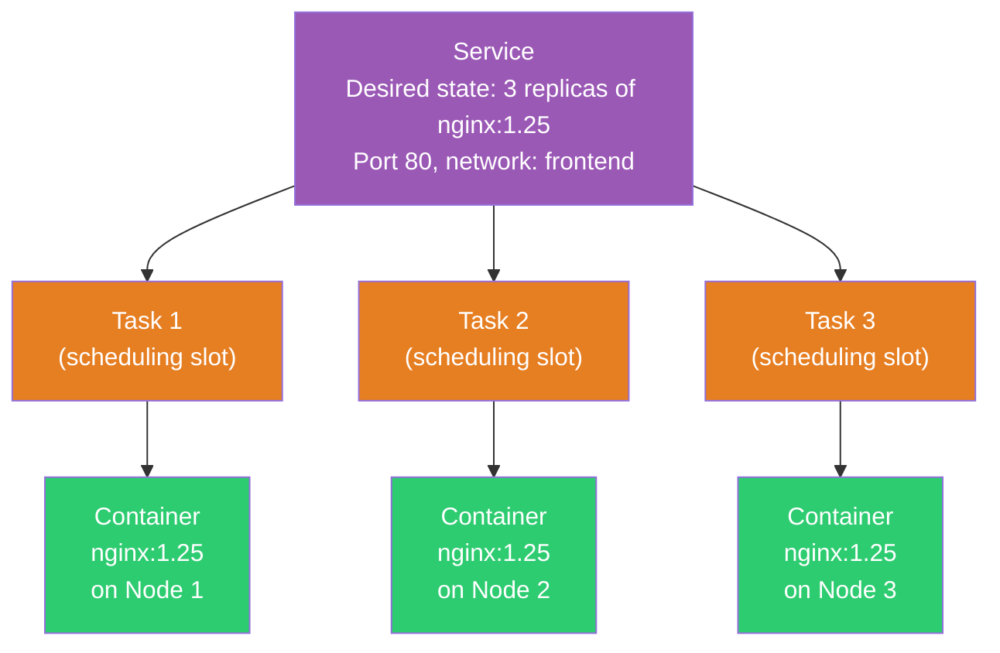
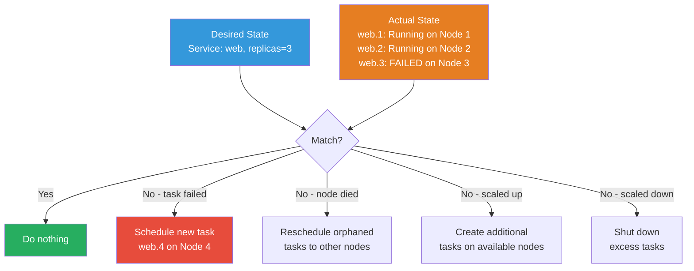
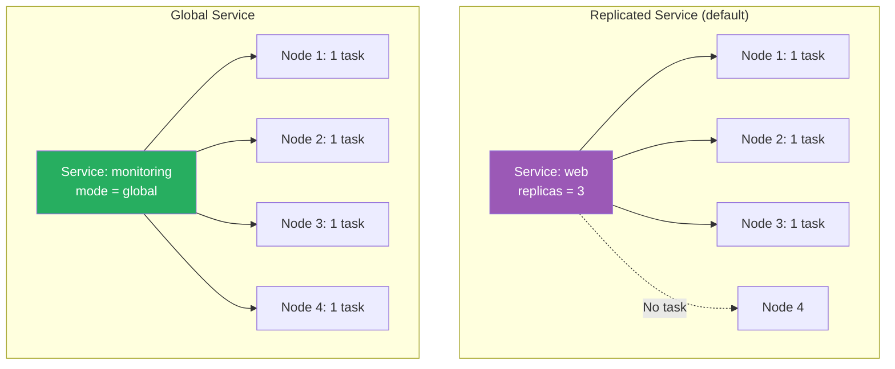
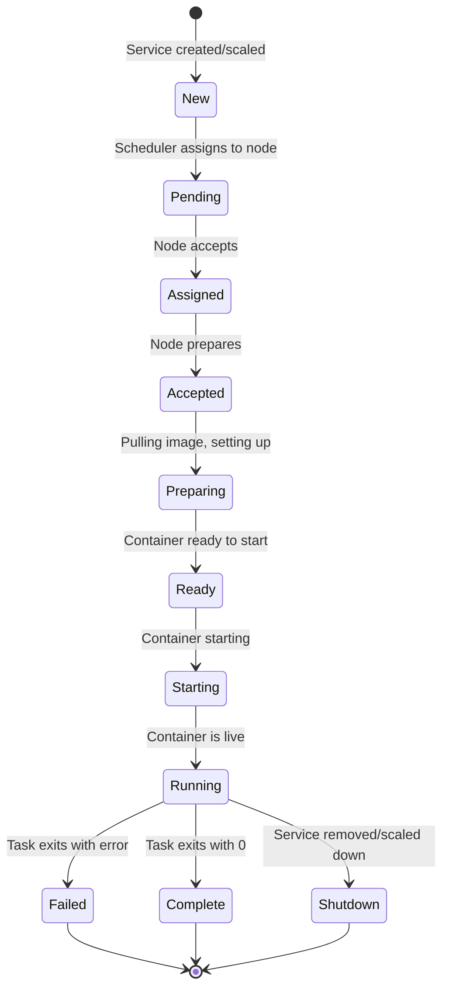
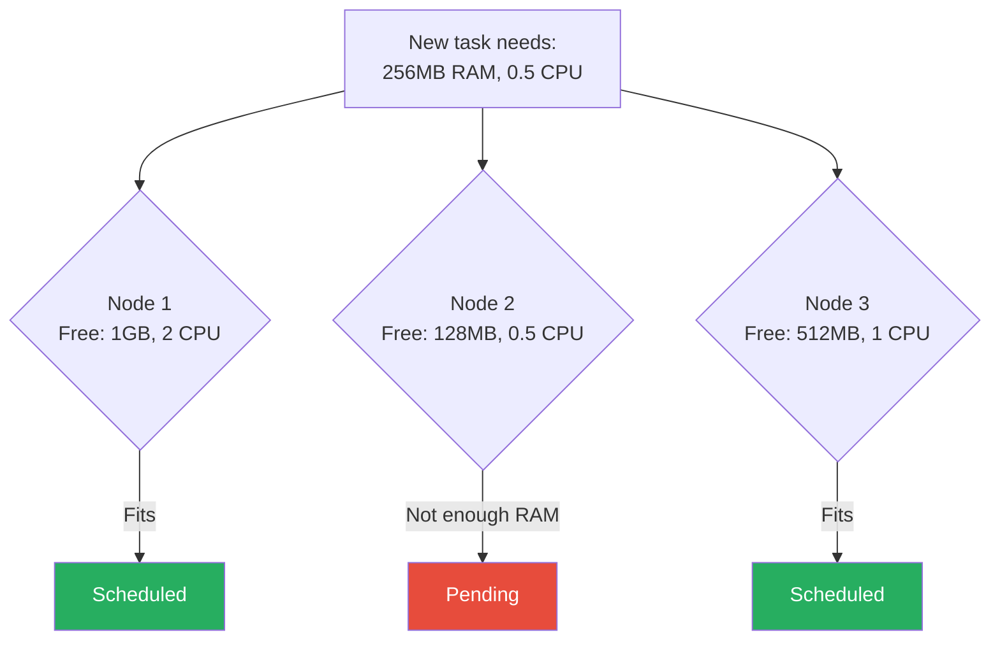

# Services, Tasks & Scheduling

[← Back to Section Index](./README.md) · [← Main Index](../README.md) · [Previous: Swarm Architecture](./01-swarm-architecture.md)

---

## How Swarm and Services Are Related

Without Swarm, you use `docker run` to start a container on a single host. It's manual — you pick the host, start the container, restart it yourself if it crashes. There's no coordination across machines.

With Swarm, you use `docker service create` to **declare what you want**: "I need 3 copies of nginx on port 80." The Swarm takes over — it decides which nodes to place them on, starts them, monitors them, and replaces any that fail. You describe the **desired state**, and the Swarm continuously maintains it.

```
Swarm   = the airport  (infrastructure — runways, control tower, gates)
Service = a scheduled flight  (route, frequency, aircraft type)
Task    = an individual flight on a specific day
Container = the actual plane in the air right now
```

You don't tell the airport "put plane 747 on gate 3 at runway 2." You tell the airline "I need 3 daily flights from NYC to London." The airport's scheduling system figures out which gates and runways to use, and if a plane breaks down, it assigns a replacement.

| | Without Swarm (`docker run`) | With Swarm (`docker service create`) |
|---|---|---|
| **Who decides which host?** | You | Swarm scheduler |
| **Who starts the container?** | You | Swarm |
| **Container crashes — who restarts?** | You (or a restart policy on that one host) | Swarm — schedules a new task on any available node |
| **Node dies — what happens?** | Containers are gone | Swarm reschedules tasks to surviving nodes |
| **Scaling** | Manual — SSH to more hosts, run more containers | `docker service scale web=10` |
| **Rolling updates** | Manual — stop old, start new, hope nothing breaks | `docker service update --image v2 web` |
| **Load balancing** | Set up your own (nginx, HAProxy) | Built-in routing mesh and VIP |

> **You can't create services without a Swarm** — `docker service create` fails if you haven't run `docker swarm init`. But you **can run containers without Swarm** — `docker run` works in standalone mode, you just lose scheduling, scaling, self-healing, and load balancing.

---

## The Service Model

A **service** is the central concept in Swarm. It defines the desired state — which image to run, how many replicas, which ports, which networks. The Swarm manager continuously reconciles the actual state with the desired state.

### Service → Task → Container



| Concept | What It Is | Who Creates It | Lifecycle |
|---------|-----------|----------------|-----------|
| **Service** | The definition — image, replicas, ports, networks, update policy | You (the user) | Lives until you `docker service rm` it |
| **Task** | A scheduling slot assigned to a specific node. Maps to exactly one container. | Swarm scheduler | Immutable — if it fails, Swarm creates a **new** task to replace it (doesn't restart the old one) |
| **Container** | The actual running process on a node | The node's Docker Engine | Started/stopped as the task dictates |

### How Swarm Maintains Desired State (Reconciliation Loop)

This is the core of the Swarm scheduler — it runs continuously and compares what **should be** running with what **actually is** running:



```bash
# You say: "I want 3 replicas"
docker service create --name web --replicas 3 nginx

# Swarm schedules 3 tasks across nodes
# A few hours later, Node 2 dies — web.2 is lost
# Swarm detects: desired=3, actual=2
# Swarm automatically creates web.4 on Node 4 to restore 3 replicas

# You can see the history:
docker service ps web
# web.1   Running on Node 1
# web.4   Running on Node 4     ← replacement
# web.3   Running on Node 3
# web.2   Shutdown on Node 2    ← the failed task (kept for debugging)
```

> Tasks are **immutable**. When task web.2 fails, Swarm doesn't restart it — it creates a brand new task (web.4) as a replacement. The old task remains in the history for debugging. Use `docker service ps --no-trunc web` to see full error messages.

---

## Replicated vs Global Services



| Mode | Behavior | Scaling | Use Case |
|------|----------|---------|----------|
| **Replicated** (default) | You specify the number of replicas. Swarm distributes them. | `docker service scale web=5` | Web apps, APIs, microservices |
| **Global** | Exactly one task per node. Automatic — new nodes get a task, leaving nodes lose theirs. | Cannot scale manually — it's always "one per node" | Monitoring agents, log collectors, security scanners |

---

## Service Commands

```bash
# Create a replicated service
docker service create --name web --replicas 3 -p 8080:80 nginx

# Create a global service
docker service create --name agent --mode global datadog/agent

# List services
docker service ls

# Inspect service details
docker service inspect --pretty web

# View tasks (running and historical)
docker service ps web

# View only running tasks
docker service ps web --filter desired-state=running

# Scale a replicated service
docker service scale web=5

# Scale multiple services at once
docker service scale web=5 api=3

# Update a service (change image, env, etc.)
docker service update --image nginx:1.25 web

# Remove a service
docker service rm web

# View logs
docker service logs web
docker service logs web --follow --tail 100
```

---

## Task Lifecycle



```bash
# Check task state
docker service ps web
# ID          NAME      IMAGE       NODE      DESIRED STATE   CURRENT STATE
# abc123      web.1     nginx:1.25  worker1   Running         Running 2 hours ago
# def456      web.2     nginx:1.25  worker2   Running         Running 2 hours ago
# ghi789      web.3     nginx:1.24  worker1   Shutdown        Shutdown 2 hours ago  ← old version
```

> When a task fails, Swarm schedules a replacement. The old task remains in the history for debugging. Use `docker service ps --no-trunc web` to see full error messages.

---

## Placement Constraints

Constraints are **hard rules** — if no node matches, the task stays in `Pending` state.

```bash
# Only schedule on worker nodes
docker service create --constraint 'node.role==worker' --name web nginx

# Only on nodes with a specific label
docker node update --label-add region=us-east node1
docker node update --label-add region=eu-west node2
docker service create --constraint 'node.labels.region==us-east' --name web nginx

# Not on a specific node
docker service create --constraint 'node.hostname!=node3' --name web nginx

# Multiple constraints (AND logic)
docker service create \
  --constraint 'node.role==worker' \
  --constraint 'node.labels.disk==ssd' \
  --name db postgres
```

### Available Constraint Fields

| Field | Example | Matches |
|-------|---------|---------|
| `node.id` | `node.id==abc123` | Specific node by ID |
| `node.hostname` | `node.hostname==worker1` | Node by hostname |
| `node.role` | `node.role==worker` | `manager` or `worker` |
| `node.platform.os` | `node.platform.os==linux` | OS type |
| `node.platform.arch` | `node.platform.arch==x86_64` | CPU architecture |
| `node.labels.<key>` | `node.labels.region==us-east` | Custom labels (user-defined) |
| `engine.labels.<key>` | `engine.labels.operatingsystem==ubuntu` | Docker Engine labels |

---

## Placement Preferences

Preferences are **soft rules** — Swarm tries to spread tasks but won't fail if it can't evenly distribute.

```bash
# Spread across datacenters
docker service create \
  --placement-pref 'spread=node.labels.datacenter' \
  --replicas 6 \
  --name web nginx

# If you have 3 datacenters, Swarm tries to place 2 tasks per DC
```

| Type | Behavior | Task pending if unmet? |
|------|----------|----------------------|
| **Constraint** | Hard requirement | Yes — task stays pending |
| **Preference** | Soft suggestion | No — Swarm schedules anyway, just tries to spread |

---

## Resource Limits and Reservations

```bash
# Reserve resources (guaranteed minimum)
docker service create \
  --reserve-memory 256m \
  --reserve-cpu 0.5 \
  --name api my-api

# Limit resources (maximum allowed)
docker service create \
  --limit-memory 512m \
  --limit-cpu 1.0 \
  --name api my-api

# Both (reserve minimum + enforce maximum)
docker service create \
  --reserve-memory 256m \
  --limit-memory 512m \
  --reserve-cpu 0.5 \
  --limit-cpu 1.0 \
  --name api my-api
```

| Setting | Purpose | If exceeded |
|---------|---------|-------------|
| **Reserve** | Guarantees the task gets at least this much | Task stays pending if no node has enough free |
| **Limit** | Caps the task to this maximum | Memory: OOM-killed. CPU: throttled. |

---

## Replicas vs Resources — Scheduling Decision



---

[← Back to Section Index](./README.md) · [← Main Index](../README.md) · [Previous: Swarm Architecture](./01-swarm-architecture.md) · [Next: Rolling Updates & Rollbacks →](./03-rolling-updates-rollbacks.md)
