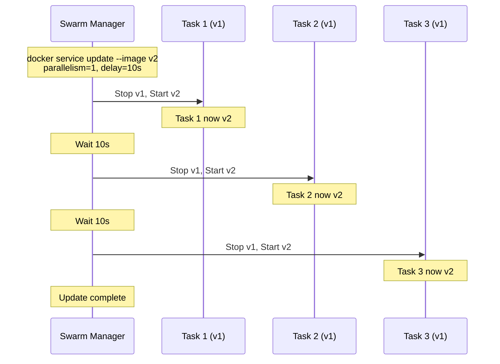
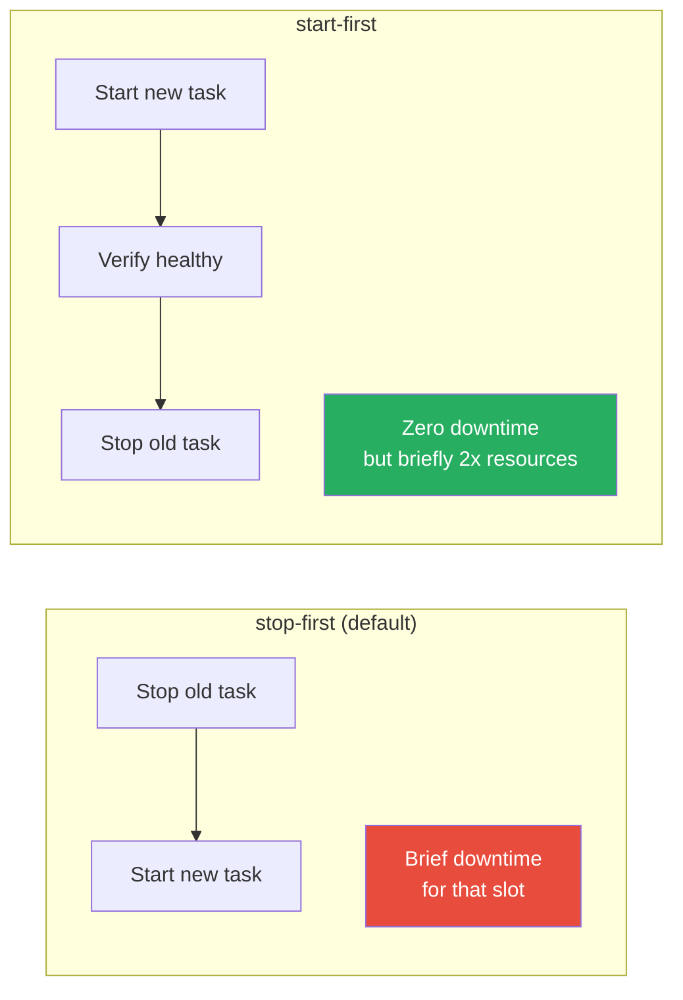
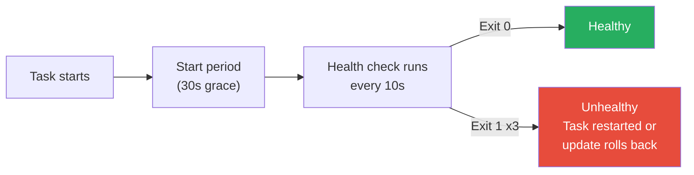

# Rolling Updates & Rollbacks

[← Back to Section Index](./README.md) · [← Main Index](../README.md) · [Previous: Services, Tasks & Scheduling](./02-services-tasks-scheduling.md)

---

## How Rolling Updates Work

When you update a service (change image, env, config), Swarm replaces tasks incrementally — not all at once. This ensures zero-downtime deployments.



---

## Update Configuration

```bash
docker service update \
  --image nginx:1.25 \
  --update-parallelism 2 \
  --update-delay 10s \
  --update-failure-action rollback \
  --update-max-failure-ratio 0.25 \
  --update-order start-first \
  web
```

### Update Flags Explained

| Flag | Default | Description |
|------|---------|-------------|
| `--update-parallelism` | 1 | How many tasks to update simultaneously |
| `--update-delay` | 0s | Wait time between updating each batch |
| `--update-failure-action` | `pause` | What to do if a task fails: `pause`, `continue`, or `rollback` |
| `--update-max-failure-ratio` | 0 | Maximum fraction of tasks that can fail (0.25 = 25%) before the failure action triggers |
| `--update-order` | `stop-first` | `stop-first` (stop old, start new) or `start-first` (start new, then stop old) |
| `--update-monitor` | 5s | Time to monitor a new task after starting, before considering it successful |

### Update Order



| Order | Behavior | Trade-off |
|-------|----------|-----------|
| `stop-first` (default) | Old task stops before new one starts | Brief gap — less resource usage |
| `start-first` | New task starts and becomes healthy before old one stops | Zero downtime — temporarily uses 2x resources |

---

## Triggering Updates

```bash
# Update the image
docker service update --image nginx:1.25 web

# Update environment variables
docker service update --env-add NEW_VAR=value web
docker service update --env-rm OLD_VAR web

# Update resource limits
docker service update --limit-memory 512m --limit-cpu 1.0 web

# Update published ports
docker service update --publish-add 8443:443 web
docker service update --publish-rm 8080:80 web

# Update replicas (same as docker service scale)
docker service update --replicas 5 web

# Update network
docker service update --network-add my-overlay web

# Force update (redeploy even if nothing changed — useful for pulling latest image)
docker service update --force web
```

---

## Rollbacks

If an update goes wrong, Swarm can revert to the previous version.

### Manual Rollback

```bash
# Revert to the previous version
docker service rollback web
```

### Automatic Rollback

Set `--update-failure-action rollback` so Swarm automatically rolls back when tasks fail:

```bash
docker service create \
  --name web \
  --replicas 3 \
  --image nginx:1.24 \
  --update-failure-action rollback \
  --update-max-failure-ratio 0.25 \
  web
```

If more than 25% of tasks fail during update, Swarm stops the update and rolls back all tasks to the previous spec.

### Rollback Configuration

```bash
docker service create \
  --name web \
  --rollback-parallelism 1 \
  --rollback-delay 5s \
  --rollback-failure-action pause \
  --rollback-max-failure-ratio 0 \
  --rollback-monitor 5s \
  --rollback-order stop-first \
  nginx
```

| Flag | Default | Description |
|------|---------|-------------|
| `--rollback-parallelism` | 0 (all at once) | How many tasks to rollback simultaneously |
| `--rollback-delay` | 0s | Wait time between rollback batches |
| `--rollback-failure-action` | `pause` | What to do if rollback itself fails |
| `--rollback-max-failure-ratio` | 0 | Max failure ratio during rollback |
| `--rollback-monitor` | 5s | Monitoring period per task during rollback |
| `--rollback-order` | `stop-first` | `stop-first` or `start-first` |

---

## Health Checks in Updates

Health checks let Swarm know if a new task is actually working, not just running. Without health checks, Swarm considers a task healthy as soon as the container starts.

```bash
docker service create \
  --name web \
  --health-cmd "curl -f http://localhost/ || exit 1" \
  --health-interval 10s \
  --health-timeout 5s \
  --health-retries 3 \
  --health-start-period 30s \
  --update-failure-action rollback \
  nginx
```

| Flag | Description |
|------|-------------|
| `--health-cmd` | Command to check health. Exit 0 = healthy, exit 1 = unhealthy. |
| `--health-interval` | Time between checks |
| `--health-timeout` | Max time for the check to complete |
| `--health-retries` | Consecutive failures before marking unhealthy |
| `--health-start-period` | Grace period after start before health checks count |



---

## Update Example: Blue-Green Style

```bash
# Create service with v1
docker service create --name web --replicas 4 --image myapp:v1 \
  --update-parallelism 2 \
  --update-delay 30s \
  --update-failure-action rollback \
  --update-order start-first \
  --health-cmd "curl -f http://localhost:8080/health || exit 1" \
  --health-interval 10s \
  --health-retries 3 \
  --health-start-period 15s \
  -p 8080:8080

# Deploy v2 — Swarm updates 2 tasks at a time, waits 30s, auto-rollbacks on failure
docker service update --image myapp:v2 web

# Watch the rollout
docker service ps web
```

---

[← Back to Section Index](./README.md) · [← Main Index](../README.md) · [Previous: Services & Scheduling](./02-services-tasks-scheduling.md) · [Next: Swarm Networking →](./04-swarm-networking.md)
