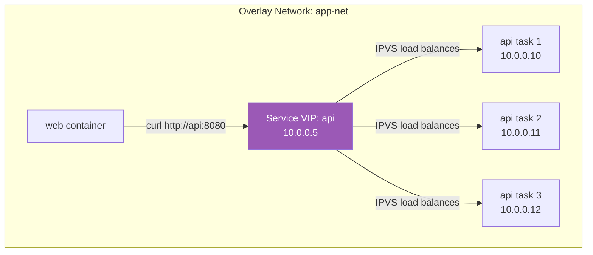
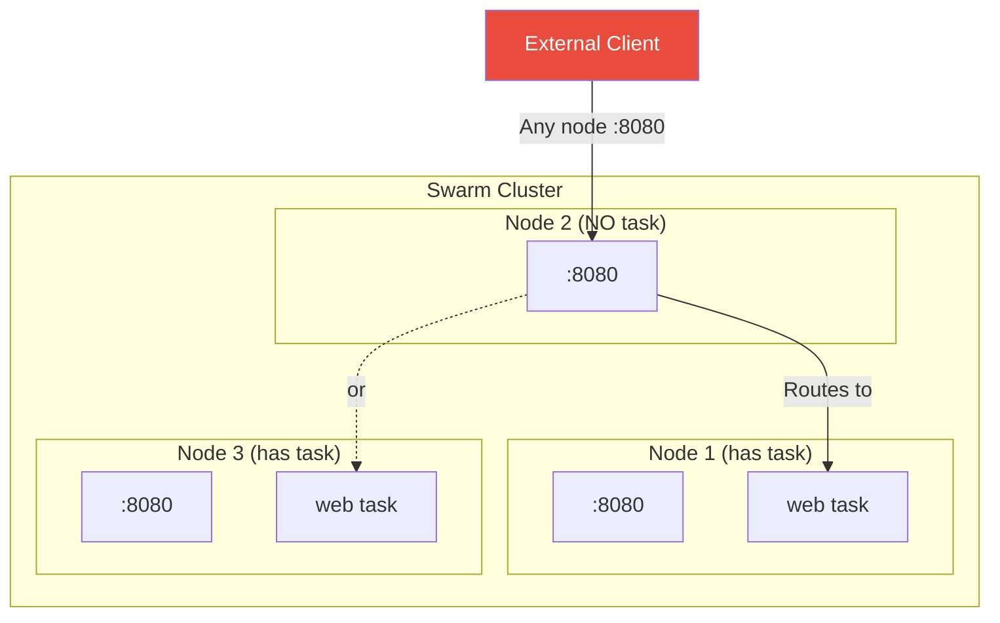
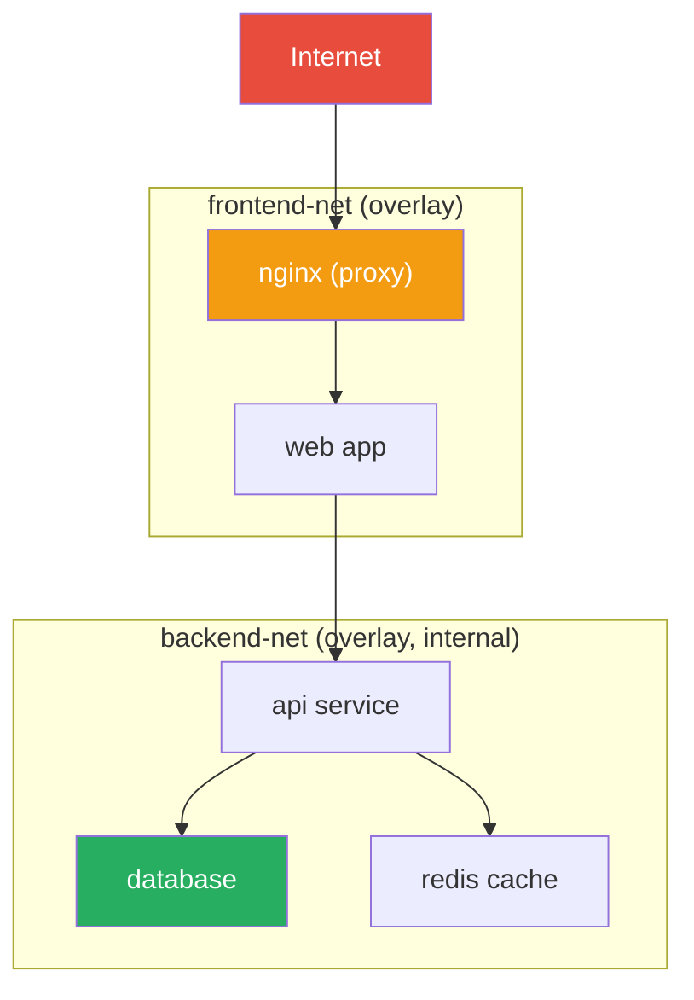

# Swarm Networking

[← Back to Section Index](./README.md) · [← Main Index](../README.md) · [Previous: Rolling Updates & Rollbacks](./03-rolling-updates-rollbacks.md)

> For general Docker networking concepts (bridge, overlay, DNS, port publishing), see the [Networking section](../06-networking/README.md). This page focuses on Swarm-specific networking behavior.

---

## Swarm Network Types

When you initialize a Swarm, Docker automatically creates two networks:

| Network | Driver | Purpose |
|---------|--------|---------|
| **ingress** | overlay | Handles the routing mesh for published service ports |
| **docker_gwbridge** | bridge | Connects Swarm nodes to their overlay networks. Handles outbound traffic. |

```bash
docker network ls
# NETWORK ID     NAME              DRIVER    SCOPE
# abc123         bridge            bridge    local
# def456         docker_gwbridge   bridge    local
# ghi789         host              host      local
# jkl012         ingress           overlay   swarm
```

---

## Service Discovery

Swarm provides automatic DNS-based service discovery. Every service gets a DNS entry that resolves to a Virtual IP (VIP) by default.



### VIP vs DNSRR

| Mode | DNS Returns | Load Balancing | Use Case |
|------|-------------|---------------|----------|
| **VIP** (default) | Single Virtual IP | Kernel-level (IPVS) — transparent to the client | Most services |
| **DNSRR** | All task IPs (round-robin) | Client-side — client picks an IP | External load balancer in front |

```bash
# Default — VIP mode
docker service create --name api --network app-net --replicas 3 my-api

# DNS round robin mode
docker service create --name api --network app-net --replicas 3 \
  --endpoint-mode dnsrr my-api
```

> For a deeper dive into Docker DNS, see [DNS & Service Discovery](../06-networking/05-dns-and-service-discovery.md).

---

## Routing Mesh

The routing mesh makes published service ports available on **every node** in the Swarm, regardless of whether that node runs a task for the service.



```bash
# Ingress mode (default) — routing mesh active
docker service create --name web -p 8080:80 nginx

# Host mode — bypass routing mesh
docker service create --name web \
  --publish mode=host,target=80,published=8080 \
  nginx
```

| Mode | Port on every node | Load balancing | Direct access |
|------|-------------------|---------------|---------------|
| **Ingress** (default) | Yes | Built-in IPVS | No — any node routes to any task |
| **Host** | Only on task nodes | None | Yes — client hits the task directly |

> For details on routing mesh internals and bypass scenarios, see [Overlay Networks](../06-networking/03-overlay-networks.md).

---

## Creating Overlay Networks for Services

```bash
# Create an overlay network
docker network create --driver overlay app-net

# Create service on that network
docker service create --name web --network app-net nginx
docker service create --name api --network app-net my-api

# web can reach api by name: curl http://api:8080
# api can reach web by name: curl http://web:80
```

### Encrypted Overlay

```bash
# Encrypt data plane traffic (IPSec between nodes)
docker network create --driver overlay --opt encrypted secure-net
```

> Encryption adds latency. Use it when Swarm nodes communicate over untrusted networks.

### Internal Network (no external access)

```bash
# Containers can talk to each other but NOT to the internet
docker network create --driver overlay --internal backend-net
```

---

## Multi-Network Service Architecture

A common pattern: public-facing services on one network, backend services on another.



```bash
docker network create --driver overlay frontend-net
docker network create --driver overlay --internal backend-net

docker service create --name nginx --network frontend-net -p 80:80 nginx
docker service create --name web --network frontend-net --network backend-net my-web
docker service create --name api --network backend-net my-api
docker service create --name db --network backend-net postgres
docker service create --name cache --network backend-net redis
```

- `nginx` is on frontend-net — externally accessible
- `web` is on both networks — bridges frontend and backend
- `api`, `db`, `cache` are on backend-net only — no external access

---

## Swarm Required Ports

| Port | Protocol | Purpose |
|------|----------|---------|
| **2377** | TCP | Cluster management (Raft consensus) |
| **7946** | TCP + UDP | Network discovery (gossip protocol) |
| **4789** | UDP | Overlay data traffic (VXLAN) |

---

[← Back to Section Index](./README.md) · [← Main Index](../README.md) · [Previous: Rolling Updates & Rollbacks](./03-rolling-updates-rollbacks.md) · [Next: Secrets & Configs →](./05-secrets-and-configs.md)
