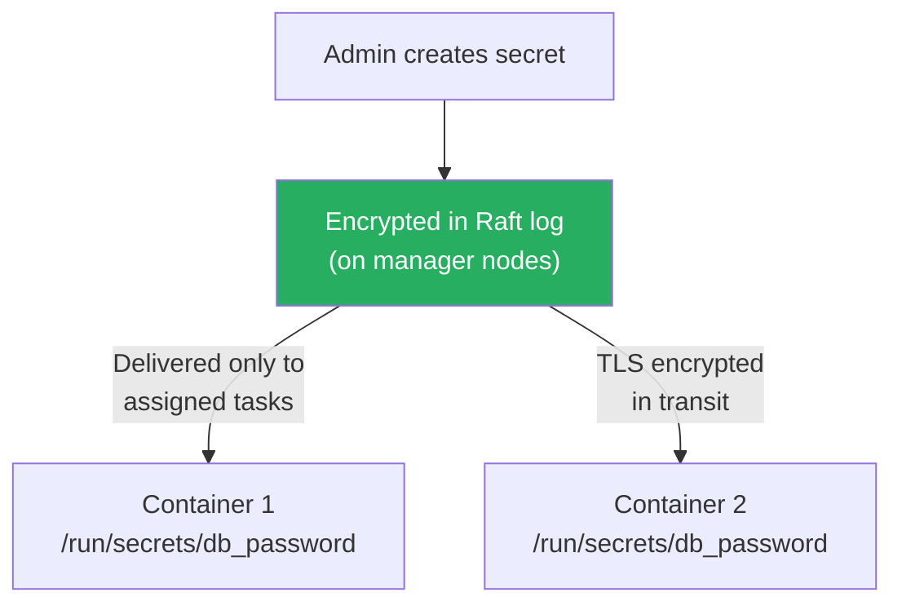
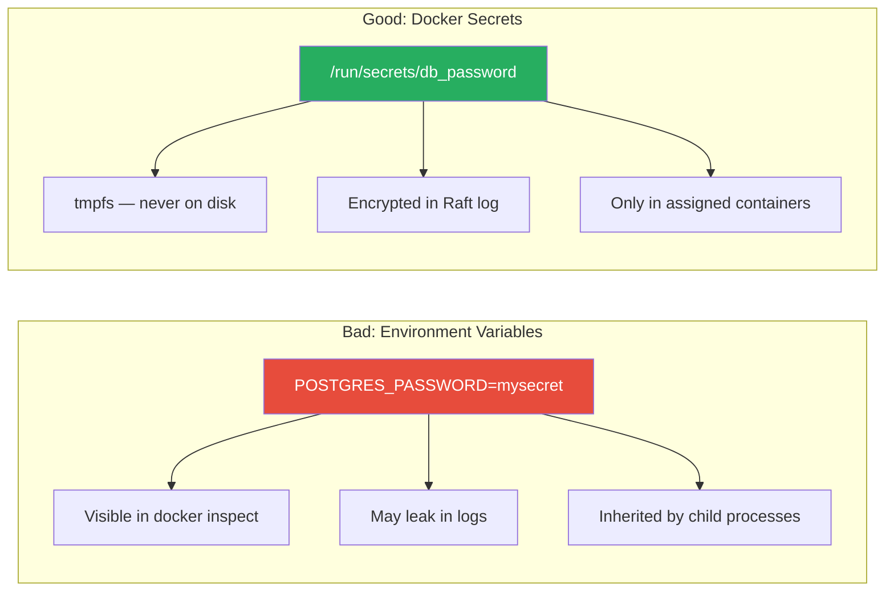

# Secrets & Configs

[← Back to Section Index](./README.md) · [← Main Index](../README.md) · [Previous: Swarm Networking](./04-swarm-networking.md)

---

## Docker Secrets

Secrets provide a secure way to store and deliver sensitive data (passwords, API keys, TLS certificates) to Swarm services. Secrets are encrypted at rest in the Raft log and only delivered to containers that need them.



### How Secrets Work

- Stored encrypted in the Swarm's Raft log (manager nodes only)
- Transmitted to worker nodes over **mutual TLS** — encrypted in transit
- Mounted as files in a **tmpfs** filesystem at `/run/secrets/<name>` inside the container
- **Never written to disk** on worker nodes — in-memory only
- Only delivered to services that are explicitly granted access
- Removed from the container's filesystem when the service no longer needs them

### Secret Commands

```bash
# Create a secret from a string
echo "my-super-password" | docker secret create db_password -

# Create a secret from a file
docker secret create tls_cert ./server.crt
docker secret create tls_key ./server.key

# List secrets
docker secret ls

# Inspect secret metadata (NOT the value — values are never exposed via API)
docker secret inspect db_password

# Remove a secret
docker secret rm db_password
```

### Using Secrets in Services

```bash
# Grant a service access to a secret
docker service create \
  --name db \
  --secret db_password \
  --env POSTGRES_PASSWORD_FILE=/run/secrets/db_password \
  postgres

# Custom mount path (rename inside container)
docker service create \
  --name web \
  --secret source=tls_cert,target=/etc/ssl/cert.pem \
  --secret source=tls_key,target=/etc/ssl/key.pem,mode=0400 \
  nginx
```

### Reading Secrets Inside a Container

```bash
# Secrets appear as files in /run/secrets/
docker exec <container> cat /run/secrets/db_password
# Output: my-super-password

docker exec <container> ls -la /run/secrets/
# total 4
# -r--r--r--  1 root root  18  db_password
```

> Many images support `_FILE` environment variables (e.g., `POSTGRES_PASSWORD_FILE`) that read the password from a file instead of an env var. This is the correct pattern for using secrets.

---

## Rotating Secrets

You can't update a secret in place. The process is: create a new secret, update the service to use it, remove the old one.

```bash
# Create new version
echo "new-password-2025" | docker secret create db_password_v2 -

# Update service to swap secrets
docker service update \
  --secret-rm db_password \
  --secret-add source=db_password_v2,target=db_password \
  db

# Remove old secret
docker secret rm db_password
```

> The `target=db_password` keeps the filename the same inside the container, so the application doesn't need changes.

---

## Docker Configs

Configs are similar to secrets but for **non-sensitive** configuration data. They're stored in the Raft log but **not encrypted** — they're mounted directly into the container's filesystem (not tmpfs).

| | Secrets | Configs |
|---|---------|---------|
| **Storage** | Encrypted in Raft log | Unencrypted in Raft log |
| **Mount** | tmpfs at `/run/secrets/` (in-memory) | Directly in container filesystem |
| **Use case** | Passwords, keys, certificates | Config files, environment settings |
| **Accessible via API** | Metadata only (value hidden) | Full content accessible |

### Config Commands

```bash
# Create a config from a file
docker config create nginx_conf ./nginx.conf

# Create from stdin
echo "max_connections = 100" | docker config create db_settings -

# List
docker config ls

# Inspect (shows the actual content, base64-encoded)
docker config inspect nginx_conf

# Remove
docker config rm nginx_conf
```

### Using Configs in Services

```bash
# Mount config into a service
docker service create \
  --name web \
  --config source=nginx_conf,target=/etc/nginx/nginx.conf \
  nginx

# Custom permissions
docker service create \
  --name web \
  --config source=nginx_conf,target=/etc/nginx/nginx.conf,mode=0440 \
  nginx
```

### Rotating Configs

Same pattern as secrets — create new, update service, remove old:

```bash
docker config create nginx_conf_v2 ./nginx-v2.conf
docker service update \
  --config-rm nginx_conf \
  --config-add source=nginx_conf_v2,target=/etc/nginx/nginx.conf \
  web
docker config rm nginx_conf
```

---

## Secrets & Configs in Compose (Stacks)

```yaml
version: '3.8'

services:
  db:
    image: postgres
    secrets:
      - db_password
    environment:
      POSTGRES_PASSWORD_FILE: /run/secrets/db_password

  web:
    image: nginx
    configs:
      - source: nginx_conf
        target: /etc/nginx/nginx.conf
    secrets:
      - source: tls_cert
        target: /etc/ssl/cert.pem
      - source: tls_key
        target: /etc/ssl/key.pem
        mode: 0400

secrets:
  db_password:
    external: true            # Secret already exists in Swarm
  tls_cert:
    file: ./certs/server.crt  # Created from local file at deploy time
  tls_key:
    file: ./certs/server.key

configs:
  nginx_conf:
    file: ./nginx.conf
```

| Source Type | Meaning |
|------------|---------|
| `external: true` | Secret/config already exists in Swarm (created via CLI) |
| `file: ./path` | Created from a local file when the stack is deployed |

---

## Security: Secrets vs Environment Variables



| Risk | Environment Variables | Docker Secrets |
|------|----------------------|---------------|
| Visible in `docker inspect` | Yes | No (metadata only) |
| In process environment | Yes (any child process can read) | No (file-based, explicit read) |
| Persisted to disk | May be (depending on logging) | Never (tmpfs) |
| Encrypted at rest | No | Yes (Raft log) |
| Encrypted in transit | No | Yes (mutual TLS) |

> **Rule:** Never put passwords in environment variables in Swarm. Use secrets.

---

[← Back to Section Index](./README.md) · [← Main Index](../README.md) · [Previous: Swarm Networking](./04-swarm-networking.md) · [Next: Stacks & Compose →](./06-stacks-and-compose.md)
