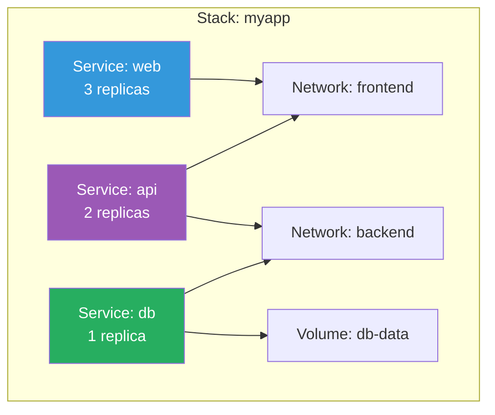
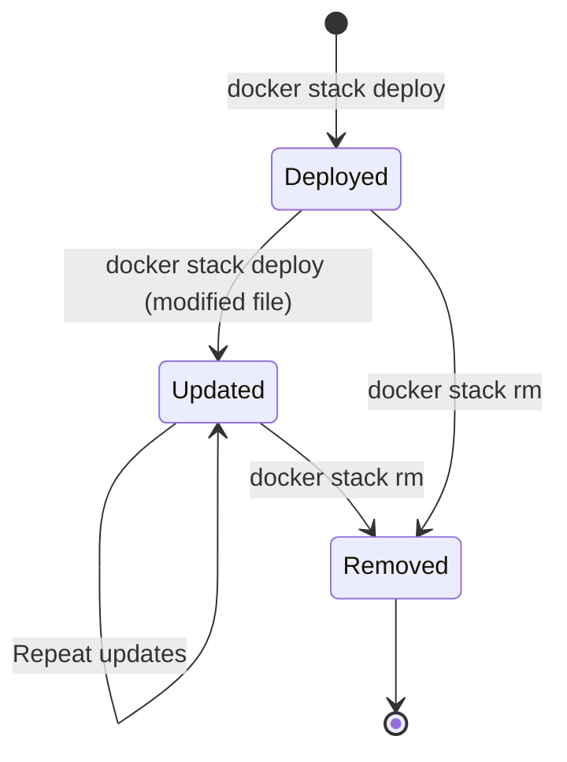

# Stacks & Compose in Swarm

[← Back to Section Index](./README.md) · [← Main Index](../README.md) · [Previous: Secrets & Configs](./05-secrets-and-configs.md)

---

## What Is a Stack?

A stack is a group of interrelated services, networks, and volumes deployed together as a unit from a Compose file. It's the Swarm equivalent of `docker compose up` but designed for production clusters.



---

## Stack Commands

```bash
# Deploy a stack from a compose file
docker stack deploy -c docker-compose.yml myapp

# List stacks
docker stack ls

# List services in a stack
docker stack services myapp

# List tasks across all services in a stack
docker stack ps myapp

# Remove a stack (services, networks removed — volumes persist)
docker stack rm myapp
```

---

## Compose File for Swarm (v3)

Stacks use **Compose file version 3+**. The key Swarm-specific section is `deploy`.

```yaml
version: '3.8'

services:
  web:
    image: nginx:1.25
    ports:
      - "80:80"
    networks:
      - frontend
    deploy:
      replicas: 3
      update_config:
        parallelism: 1
        delay: 10s
        failure_action: rollback
        order: start-first
      rollback_config:
        parallelism: 1
        delay: 5s
      restart_policy:
        condition: on-failure
        delay: 5s
        max_attempts: 3
        window: 120s
      placement:
        constraints:
          - node.role == worker
      resources:
        limits:
          cpus: '0.5'
          memory: 256M
        reservations:
          cpus: '0.25'
          memory: 128M

  api:
    image: my-api:latest
    networks:
      - frontend
      - backend
    deploy:
      replicas: 2

  db:
    image: postgres:15
    volumes:
      - db-data:/var/lib/postgresql/data
    networks:
      - backend
    secrets:
      - db_password
    environment:
      POSTGRES_PASSWORD_FILE: /run/secrets/db_password
    deploy:
      replicas: 1
      placement:
        constraints:
          - node.labels.disk == ssd

networks:
  frontend:
    driver: overlay
  backend:
    driver: overlay
    internal: true

volumes:
  db-data:

secrets:
  db_password:
    external: true
```

---

## Deploy Section Reference

| Key | Description | Example |
|-----|-------------|---------|
| `replicas` | Number of tasks | `replicas: 3` |
| `mode` | `replicated` or `global` | `mode: global` |
| `update_config` | Rolling update settings | See below |
| `rollback_config` | Rollback settings | Same structure as update_config |
| `restart_policy` | What to do when a task exits | `condition: on-failure` |
| `placement.constraints` | Hard scheduling rules | `node.role == worker` |
| `placement.preferences` | Soft scheduling rules | `spread: node.labels.dc` |
| `resources.limits` | Maximum CPU/memory | `memory: 512M` |
| `resources.reservations` | Guaranteed CPU/memory | `cpus: '0.25'` |
| `labels` | Service labels | `com.example.tier: frontend` |
| `endpoint_mode` | `vip` or `dnsrr` | `endpoint_mode: dnsrr` |

### Restart Policy Options

| Option | Values | Description |
|--------|--------|-------------|
| `condition` | `none`, `on-failure`, `any` (default) | When to restart |
| `delay` | Duration | Wait before restart attempt |
| `max_attempts` | Number | Max restart attempts (0 = unlimited) |
| `window` | Duration | Time window for `max_attempts` |

---

## What Works in Stacks vs `docker compose`

| Feature | `docker compose up` | `docker stack deploy` |
|---------|--------------------|-----------------------|
| `build` | ✅ Builds images | ❌ Ignored — images must be pre-built |
| `deploy` section | ❌ Ignored | ✅ Used for replicas, placement, updates |
| `depends_on` | ✅ Start order | ❌ Ignored — Swarm handles scheduling |
| `restart` | ✅ Restart policy | ❌ Ignored — use `deploy.restart_policy` |
| `networks` | ✅ | ✅ (creates overlay networks) |
| `volumes` | ✅ | ✅ |
| `secrets` / `configs` | ✅ (from files) | ✅ (from Swarm secrets/configs or files) |
| `ports` | ✅ | ✅ (ingress mode by default) |

> **Key difference:** Stacks **cannot build images**. You must build and push to a registry first, then reference the image in the compose file.

---

## Stack Naming Convention

When you deploy a stack, all resources are prefixed with the stack name:

```bash
docker stack deploy -c compose.yml myapp

# Creates:
# Services:  myapp_web, myapp_api, myapp_db
# Networks:  myapp_frontend, myapp_backend
# Volumes:   myapp_db-data
```

---

## Updating a Stack

To update a stack, modify the compose file and re-deploy:

```bash
# Edit compose file (change image version, replicas, etc.)
vim docker-compose.yml

# Re-deploy — Swarm calculates the diff and applies changes
docker stack deploy -c docker-compose.yml myapp
```

Swarm compares the new spec with the running state and only changes what's different. Unchanged services are not restarted.

---

## Stack Lifecycle



> **Note:** `docker stack rm` removes services and networks but **does not remove volumes**. This prevents accidental data loss. Clean up volumes manually if needed.

---

[← Back to Section Index](./README.md) · [← Main Index](../README.md) · [Previous: Secrets & Configs](./05-secrets-and-configs.md) · [Next: Swarm Security & Locking →](./07-swarm-security-and-locking.md)
