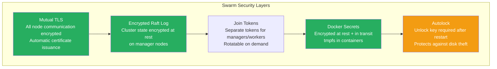
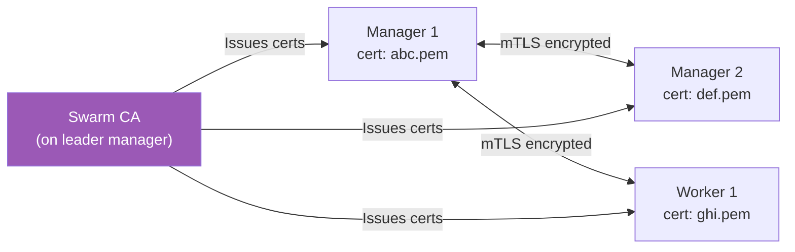
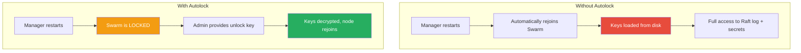

# Swarm Security & Locking

[← Back to Section Index](./README.md) · [← Main Index](../README.md) · [Previous: Stacks & Compose](./06-stacks-and-compose.md)

---

## Swarm Security Model

Docker Swarm has security built-in by default — no manual setup needed for baseline protection.



---

## Mutual TLS (mTLS)

When a Swarm is initialized, Docker automatically:

1. Creates a **Certificate Authority (CA)** for the cluster
2. Issues a **TLS certificate** to every node
3. **Encrypts** all manager-to-manager and manager-to-worker communication
4. **Authenticates** every node — only nodes with valid certificates can participate



All of this is **automatic** — you don't need to manage certificates manually.

### Certificate Rotation

```bash
# View current certificate expiry
docker system info | grep -i cert

# Change rotation interval (default: 90 days)
docker swarm update --cert-expiry 48h

# Force immediate rotation of the CA certificate
docker swarm ca --rotate
```

| Setting | Default | Description |
|---------|---------|-------------|
| Certificate expiry | 90 days | How long each node certificate is valid |
| Minimum expiry | 1 hour | Shortest allowed rotation interval |
| CA rotation | Manual | `docker swarm ca --rotate` — reissues all node certs |

---

## Join Tokens

Swarm uses separate tokens for managers and workers. A token is the only thing needed to join a node to the cluster.

```bash
# View tokens
docker swarm join-token worker
docker swarm join-token manager

# Rotate tokens (invalidates old tokens)
docker swarm join-token --rotate worker
docker swarm join-token --rotate manager
```

> **When to rotate tokens:**
> - A node is compromised
> - A token is accidentally exposed
> - An employee who knew the token leaves the team
> - Regular rotation as a security practice

After rotation, existing nodes are **not affected** — only new join attempts using the old token will fail.

---

## Autolock

By default, the Raft log encryption keys and TLS keys are stored **unencrypted on disk** on manager nodes. If someone steals a manager's disk, they could read the cluster state and secrets.

**Autolock** requires a human-provided unlock key after a manager restarts, preventing automatic access to the encryption keys.



### Autolock Commands

```bash
# Enable autolock on a new Swarm
docker swarm init --autolock

# Enable autolock on an existing Swarm
docker swarm update --autolock=true
# Outputs the unlock key — SAVE THIS SECURELY

# Unlock a locked manager after restart
docker swarm unlock
# Prompts for the unlock key

# View the current unlock key
docker swarm unlock-key

# Rotate the unlock key
docker swarm unlock-key --rotate

# Disable autolock
docker swarm update --autolock=false
```

> **Critical:** If you lose the unlock key and all managers restart, you **cannot recover the Swarm**. Store the key in a secure vault (AWS Secrets Manager, HashiCorp Vault, etc.).

---

## Encrypted Overlay Networks

By default, overlay network **control traffic** (gossip, routing) is encrypted. **Data plane** traffic (actual container-to-container packets) is **not** encrypted by default.

```bash
# Create overlay with data plane encryption (IPSec)
docker network create --driver overlay --opt encrypted secure-net
```

| Traffic Type | Encrypted by Default? | How to Enable |
|-------------|----------------------|---------------|
| Management (Raft, port 2377) | ✅ Always (mTLS) | Automatic |
| Network discovery (gossip, port 7946) | ✅ Always | Automatic |
| Data plane (VXLAN, port 4789) | ❌ Not by default | `--opt encrypted` on the overlay |

> Data plane encryption adds overhead (IPSec). Only enable it when nodes communicate over untrusted networks.

---

## Security Best Practices

| Practice | Why |
|----------|-----|
| Use **3 or 5 managers** | Fault tolerance without excessive overhead |
| **Drain managers** from running tasks | Protect the control plane from workload issues |
| Enable **autolock** in production | Protect against disk theft and unauthorized restarts |
| **Rotate join tokens** regularly | Limit exposure window if a token leaks |
| Set **short cert expiry** (e.g., 48h) | Limit the impact of a compromised certificate |
| Use **Docker secrets** for sensitive data | Never put passwords in env vars or images |
| Use **--opt encrypted** for sensitive overlays | Encrypt data in transit between nodes |
| Use **internal networks** for backends | `--internal` prevents outbound internet access |
| Run with **--read-only** filesystem | Prevent container filesystem modifications |
| **Label nodes** and use **placement constraints** | Control where sensitive workloads run |

```bash
# Production-hardened service example
docker service create \
  --name api \
  --replicas 3 \
  --network secure-net \
  --secret db_password \
  --read-only \
  --constraint 'node.role==worker' \
  --constraint 'node.labels.environment==production' \
  --limit-memory 512m \
  --limit-cpu 1.0 \
  --update-failure-action rollback \
  --health-cmd "curl -f http://localhost:8080/health || exit 1" \
  --health-interval 15s \
  my-api:v1
```

---

[← Back to Section Index](./README.md) · [← Main Index](../README.md) · [Previous: Stacks & Compose](./06-stacks-and-compose.md)
