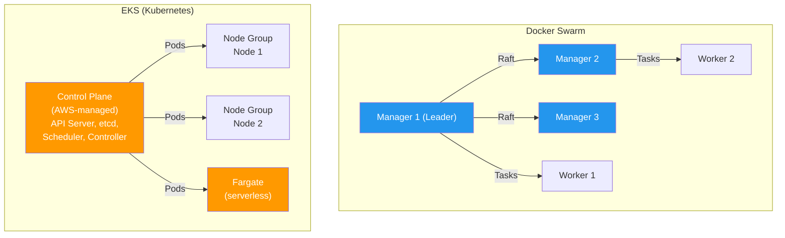
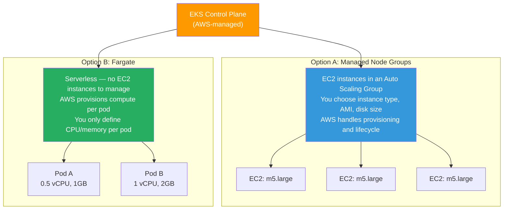
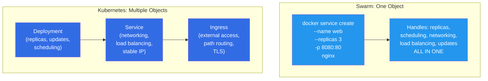
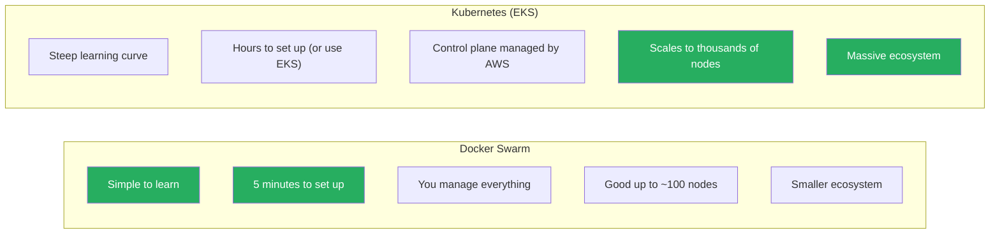

# Docker Swarm vs Kubernetes (EKS) — Concept Mapping

[← Back to Section Index](./README.md) · [← Main Index](../README.md) · [Previous: Swarm Security & Locking](./07-swarm-security-and-locking.md)

---

## Why Compare?

Docker Swarm and Kubernetes solve the **same problem** — container orchestration. They're independent products from different ecosystems, but every Swarm concept has a Kubernetes equivalent. Understanding both strengthens your mental model of orchestration regardless of which platform you use.

> In this guide, Kubernetes examples use **Amazon EKS** since that's the target production environment.

---

## Architecture Side-by-Side



| Aspect | Docker Swarm | EKS (Kubernetes) |
|--------|-------------|-----------------|
| **Control plane** | Manager nodes — you deploy, manage, and secure them | AWS-managed — you never see the masters, AWS handles HA, patching, etcd |
| **Consensus** | Raft (built into manager nodes) | etcd (managed by AWS, also uses Raft internally) |
| **Worker nodes** | Worker nodes (you manage) | EKS Node Groups (you manage) or Fargate (serverless, AWS manages) |
| **Scheduler** | Built into Swarm manager | kube-scheduler (managed by AWS) |
| **API** | Docker API — `docker service create` | Kubernetes API — `kubectl apply` |
| **CLI** | `docker` | `kubectl` + `aws eks` |
| **Config format** | Compose YAML (v3) | Kubernetes YAML manifests (or Helm charts) |

### EKS Worker Node Options — Node Groups vs Fargate

In Swarm, worker nodes are simple — they're Docker hosts that join the cluster. In EKS, you have two options for running pods, and understanding them is key:



| | Managed Node Groups | Fargate |
|---|---|---|
| **What it is** | A pool of EC2 instances that run your pods. You pick the instance type (e.g., m5.large, t3.medium). AWS puts them in an Auto Scaling Group. | Serverless compute — AWS provisions an isolated micro-VM per pod. No EC2 instances to manage at all. |
| **You manage** | Instance type, AMI, scaling policies, SSH access, OS patching | Nothing — just define CPU/memory in the pod spec |
| **Scaling** | Cluster Autoscaler or Karpenter adds/removes EC2 instances | Automatic — AWS spins up compute when pods are scheduled |
| **Cost** | Pay for EC2 instances (even if idle) | Pay per pod (per vCPU-second + GB-second). No idle cost. |
| **DaemonSets** | ✅ Supported | ❌ Not supported (no "node" concept) |
| **GPU / specialized hardware** | ✅ Choose GPU instances (p3, g5) | ❌ Not available |
| **Storage** | EBS volumes, instance store | EFS only (no EBS) |
| **SSH into node** | ✅ Yes | ❌ Not possible |
| **Best for** | Most workloads — general purpose, GPU, stateful apps | Batch jobs, microservices, bursty workloads, teams that don't want to manage servers |

**Swarm equivalent:** Swarm only has one worker type — a Docker host. There's no "Fargate for Swarm." The closest would be running Swarm on EC2 instances (like a Node Group), but you manage everything yourself including the control plane.

> Most production EKS clusters use **both**: Node Groups for always-on services (databases, core APIs) and Fargate for bursty or short-lived workloads (batch jobs, cron tasks).

---

## Concept Mapping — Complete Reference

### Workloads

| Swarm | Kubernetes (EKS) | Notes |
|-------|------------------|-------|
| **Service** (replicated) | **Deployment** | Manages replica count, rolling updates, rollback. In K8s, networking is handled separately by a Service object. |
| **Service** (global) | **DaemonSet** | One pod per node — exactly like global mode. Used for monitoring agents, log collectors. |
| **Task** | **Pod** | The scheduling unit. K8s pods can have **multiple containers** (sidecars). Swarm tasks are always one container. |
| **Container** | **Container** (inside a Pod) | The actual process. In K8s, a Pod wraps one or more containers. |
| **Stack** (compose file) | **Helm chart** / **Kustomize** / `kubectl apply -f` | Declarative multi-resource deployment |
| `docker service scale web=5` | `kubectl scale deployment web --replicas=5` or **HPA** (auto) | K8s has auto-scaling (HPA) based on CPU/memory/custom metrics. Swarm only has manual scaling. |

### The Service Split — Swarm vs Kubernetes

This is the biggest conceptual difference. In Swarm, a single "service" handles everything — replicas, networking, and load balancing. In Kubernetes, these concerns are split:



```yaml
# Swarm: ONE command does everything
docker service create --name web --replicas 3 -p 8080:80 nginx

# Kubernetes: THREE objects for the same result
---
# 1. Deployment — manages replicas and updates
apiVersion: apps/v1
kind: Deployment
metadata:
  name: web
spec:
  replicas: 3
  selector:
    matchLabels:
      app: web
  template:
    metadata:
      labels:
        app: web
    spec:
      containers:
        - name: nginx
          image: nginx
          ports:
            - containerPort: 80
---
# 2. Service — internal load balancing and stable IP
apiVersion: v1
kind: Service
metadata:
  name: web
spec:
  selector:
    app: web
  ports:
    - port: 80
      targetPort: 80
---
# 3. Ingress or LoadBalancer Service — external access
apiVersion: v1
kind: Service
metadata:
  name: web-external
spec:
  type: LoadBalancer    # Creates an AWS ALB/NLB
  selector:
    app: web
  ports:
    - port: 8080
      targetPort: 80
```

### Networking

| Swarm | Kubernetes (EKS) | Notes |
|-------|------------------|-------|
| **Overlay network** | **VPC CNI** (AWS native) | EKS gives every pod a real VPC IP — no overlay encapsulation needed. Pods communicate directly via the VPC. |
| **Routing mesh** | **Service** (type: LoadBalancer) + **AWS ALB** | K8s doesn't have a built-in routing mesh. You use a Service + cloud load balancer or an Ingress controller. |
| **Ingress network** | **Ingress Controller** (NGINX, ALB Ingress, Traefik) | L7 routing with path-based and host-based rules |
| **VIP (service discovery)** | **ClusterIP Service** | Stable virtual IP that load-balances to pods. Same concept as Swarm VIP. |
| **DNSRR** | **Headless Service** (`clusterIP: None`) | DNS returns all pod IPs directly. No VIP. |
| **Embedded DNS** (127.0.0.11) | **CoreDNS** | Cluster DNS that resolves service names to ClusterIPs |
| `docker network create --driver overlay` | Handled by VPC CNI automatically | In EKS you don't create networks — all pods are on the VPC. Use **Network Policies** (Calico) for isolation. |
| `--opt encrypted` (IPSec on overlay) | **Pod-to-pod encryption** (service mesh: Istio, Linkerd) | EKS VPC traffic is unencrypted by default. Use a service mesh for mTLS. |

### Updates & Rollbacks

| Swarm | Kubernetes (EKS) | Notes |
|-------|------------------|-------|
| `--update-parallelism 2` | `maxSurge: 2` | How many extra pods can exist during update |
| `--update-delay 10s` | `minReadySeconds: 10` | Wait before proceeding to next batch |
| `--update-failure-action rollback` | Auto via `progressDeadlineSeconds` | K8s auto-detects stuck rollouts and stops |
| `--update-order start-first` | Default in K8s (start new, then stop old) | K8s always starts new before stopping old by default |
| `docker service rollback web` | `kubectl rollout undo deployment/web` | Both keep revision history |
| `--health-cmd "curl ..."` | `livenessProbe` / `readinessProbe` | K8s separates "is it alive?" (liveness) from "is it ready for traffic?" (readiness). Swarm has one check. |

### Secrets & Configuration

| Swarm | Kubernetes (EKS) | Notes |
|-------|------------------|-------|
| **Docker secrets** | **K8s Secrets** (or AWS Secrets Manager via CSI) | K8s secrets are base64-encoded, not encrypted by default. Use KMS encryption or AWS Secrets Manager for real security. |
| **Docker configs** | **ConfigMaps** | Non-sensitive configuration injected into containers |
| Secrets mounted at `/run/secrets/` (tmpfs) | Secrets mounted as files or env vars | K8s supports both file and env var injection. Swarm is file-only. |
| `docker secret create` | `kubectl create secret` | Both can create from literal or file |

### Scheduling & Placement

| Swarm | Kubernetes (EKS) | Notes |
|-------|------------------|-------|
| `--constraint node.role==worker` | `nodeSelector: { role: worker }` | Hard scheduling rules |
| `--constraint node.labels.region==us-east` | `nodeAffinity` (required) | Match nodes by label |
| `--placement-pref spread=node.labels.dc` | `podAntiAffinity` (preferred) | Spread pods across zones/nodes |
| `--reserve-memory 256m` | `resources.requests.memory: 256Mi` | Guaranteed minimum |
| `--limit-memory 512m` | `resources.limits.memory: 512Mi` | Maximum cap |
| Node drain: `docker node update --availability drain` | `kubectl drain node1` | Evict workloads for maintenance |
| Node labels: `docker node update --label-add` | `kubectl label node` | Add metadata for scheduling |

### Security

| Swarm | Kubernetes (EKS) | Notes |
|-------|------------------|-------|
| **Mutual TLS** (automatic) | **Service mesh** (Istio, Linkerd) or EKS pod identity | Swarm has mTLS built-in. K8s requires a service mesh for pod-to-pod mTLS. |
| **Autolock** | **EKS envelope encryption** (KMS) | Encrypting secrets at rest |
| **Join tokens** | **IAM + aws-auth ConfigMap** | How nodes authenticate to the cluster |
| **Certificate rotation** (`--cert-expiry`) | Managed by EKS (auto-rotated) | AWS handles control plane certs |
| **Encrypted overlay** | **Network Policies** + service mesh | VPC CNI traffic is private but unencrypted by default |

### Storage

| Swarm | Kubernetes (EKS) | Notes |
|-------|------------------|-------|
| `--mount type=volume` | **PersistentVolumeClaim** (PVC) | K8s has a richer storage model with PV, PVC, and StorageClasses |
| Volume drivers (rclone, NFS) | **CSI drivers** (EBS, EFS, S3 Mountpoint) | See [Storage Plugins Across Clouds](../08-storage-volumes/09-storage-plugins-across-clouds.md) |
| `docker volume create` | `kubectl apply -f pvc.yaml` | K8s storage is declarative |

---

## Complexity Trade-off



| | Docker Swarm | Kubernetes (EKS) |
|---|---|---|
| **Setup time** | `docker swarm init` — 5 seconds | EKS: 15–30 minutes. Self-managed: hours. |
| **Learning curve** | Low — if you know Docker, you know 80% of Swarm | Steep — new concepts (pods, deployments, services, ingress, PVC, RBAC, CRDs) |
| **Compose compatibility** | Native — same YAML format | Requires translation (Kompose) or rewrite |
| **Auto-scaling** | Manual (`docker service scale`) | HPA, VPA, Cluster Autoscaler, Karpenter |
| **Ecosystem** | Docker-only | Helm, Istio, ArgoCD, Prometheus, Keda, Karpenter, hundreds of operators |
| **Cloud integration** | Minimal | Deep (ALB, EBS, EFS, IAM roles for pods, CloudWatch) |
| **Multi-tenancy** | Limited (no namespace isolation) | Namespaces, RBAC, Network Policies, Pod Security Standards |
| **CI/CD** | Basic (`docker stack deploy`) | GitOps (ArgoCD, FluxCD), Tekton, GitHub Actions integration |
| **Production adoption** | Declining | Industry standard for container orchestration |

---

## When to Use Which

| Scenario | Choose | Why |
|----------|--------|-----|
| Learning orchestration concepts | **Swarm** | Simpler, faster feedback loop, concepts transfer to K8s |
| Small team, few services (<20) | **Swarm** | Faster to set up and operate |
| Production at scale | **Kubernetes (EKS)** | Auto-scaling, ecosystem, cloud integration, industry standard |
| Existing Docker Compose workflows | **Swarm** | Native compose support, minimal rewrite |
| Multi-cloud or hybrid | **Kubernetes** | Portable across AWS/GCP/Azure/on-prem |
| Need service mesh, GitOps, advanced networking | **Kubernetes** | Ecosystem support (Istio, ArgoCD, Calico) |
| DCA exam preparation | **Swarm** | The exam is Docker-focused — Swarm is 25% of it |

---

## Quick Translation Cheat Sheet

```bash
# Swarm                                     # Kubernetes (EKS)
docker swarm init                           # eksctl create cluster
docker node ls                              # kubectl get nodes
docker service create --name web nginx      # kubectl create deployment web --image=nginx
docker service scale web=5                  # kubectl scale deployment web --replicas=5
docker service update --image v2 web        # kubectl set image deployment/web nginx=nginx:v2
docker service rollback web                 # kubectl rollout undo deployment/web
docker service ps web                       # kubectl get pods -l app=web
docker service logs web                     # kubectl logs -l app=web
docker stack deploy -c compose.yml app      # helm install app ./chart
docker secret create pw ./secret.txt        # kubectl create secret generic pw --from-file=./secret.txt
docker network create -d overlay net1       # (automatic — VPC CNI handles it)
docker service inspect web                  # kubectl describe deployment web
```

---

[← Back to Section Index](./README.md) · [← Main Index](../README.md) · [Previous: Swarm Security & Locking](./07-swarm-security-and-locking.md)
