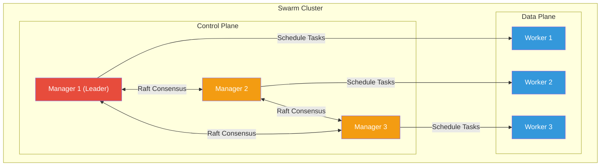

# Domain 1: Orchestration (25% of Exam)

[← Back to Main Index](../README.md) · [Previous: Container Runtimes](../02-container-runtimes/README.md)

> 🔴 **Highest weighted domain — study this thoroughly!**

---

Docker Swarm is Docker's built-in container orchestration tool. It turns a group of Docker hosts into a single, virtual Docker host with built-in clustering, service scheduling, load balancing, and fault tolerance.

## Swarm at a Glance

## Pages in This Section

| # | Page | Description |
|---|------|-------------|
| 01 | [Swarm Architecture & Cluster Setup](./01-swarm-architecture.md) | Manager vs worker, Raft consensus, quorum, init/join/leave, node management |
| 02 | [Services, Tasks & Scheduling](./02-services-tasks-scheduling.md) | Replicated vs global, service lifecycle, placement constraints, resource limits |
| 03 | [Rolling Updates & Rollbacks](./03-rolling-updates-rollbacks.md) | Update strategies, parallelism, failure actions, rollback config, health checks |
| 04 | [Swarm Networking](./04-swarm-networking.md) | Overlay, ingress, routing mesh, service discovery, load balancing, published ports |
| 05 | [Secrets & Configs](./05-secrets-and-configs.md) | Creating, managing, rotating secrets and configs, in-memory filesystem, Compose integration |
| 06 | [Stacks & Compose in Swarm](./06-stacks-and-compose.md) | Stack deploy, compose v3 features, multi-service apps, stack lifecycle |
| 07 | [Swarm Security & Locking](./07-swarm-security-and-locking.md) | Mutual TLS, certificate rotation, autolock, RBAC, encrypted overlay |
| 08 | [Swarm vs Kubernetes (EKS)](./08-swarm-vs-kubernetes-eks.md) | Concept mapping across architecture, workloads, networking, secrets, updates, CLI |

---

## Quick Navigation

```mermaid
graph LR
    A["01 - Swarm<br/>Architecture"] --> B["02 - Services<br/>& Scheduling"]
    B --> C["03 - Rolling Updates<br/>& Rollbacks"]
    C --> D["04 - Swarm<br/>Networking"]
    D --> E["05 - Secrets<br/>& Configs"]
    E --> F["06 - Stacks<br/>& Compose"]
    F --> G["07 - Security<br/>& Locking"]
    G --> H["08 - Swarm vs<br/>Kubernetes (EKS)"]

    style A fill:#e74c3c,color:#fff
    style B fill:#9b59b6,color:#fff
    style C fill:#e67e22,color:#fff
    style D fill:#3498db,color:#fff
    style E fill:#27ae60,color:#fff
    style F fill:#f39c12,color:#fff
    style G fill:#575757,color:#fff
    style H fill:#FF9900,color:#fff
```

> Start with Swarm architecture to understand the cluster, then services and scheduling, then how updates and networking work on top.

---

[← Back to Main Index](../README.md) · [Next: Image Creation & Management →](../04-image-creation-management.md)
