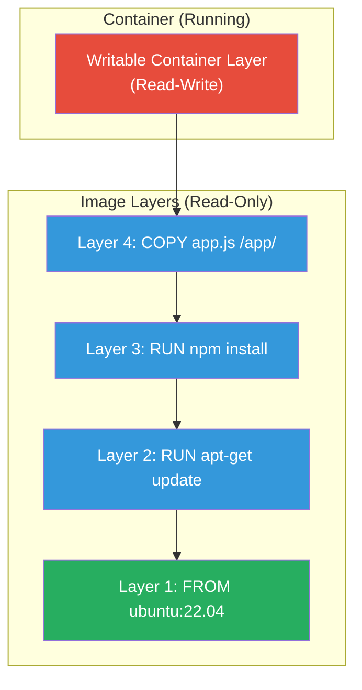
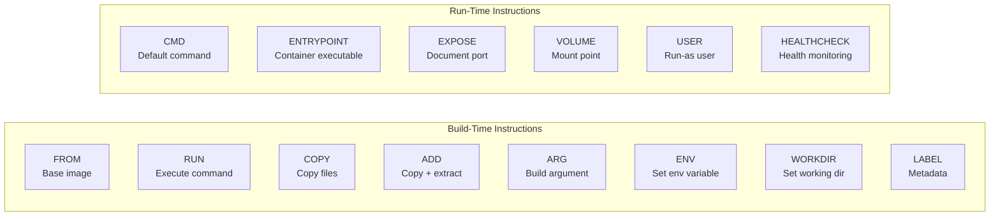
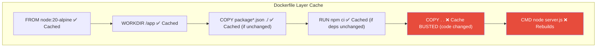
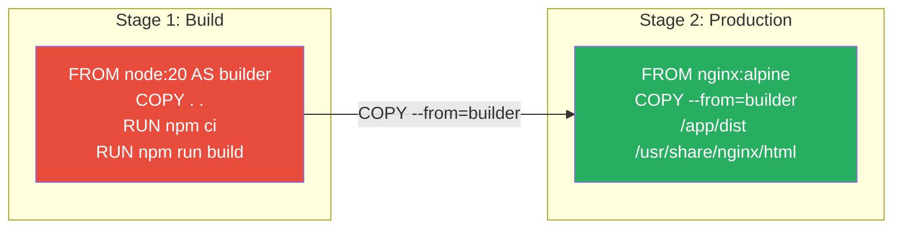
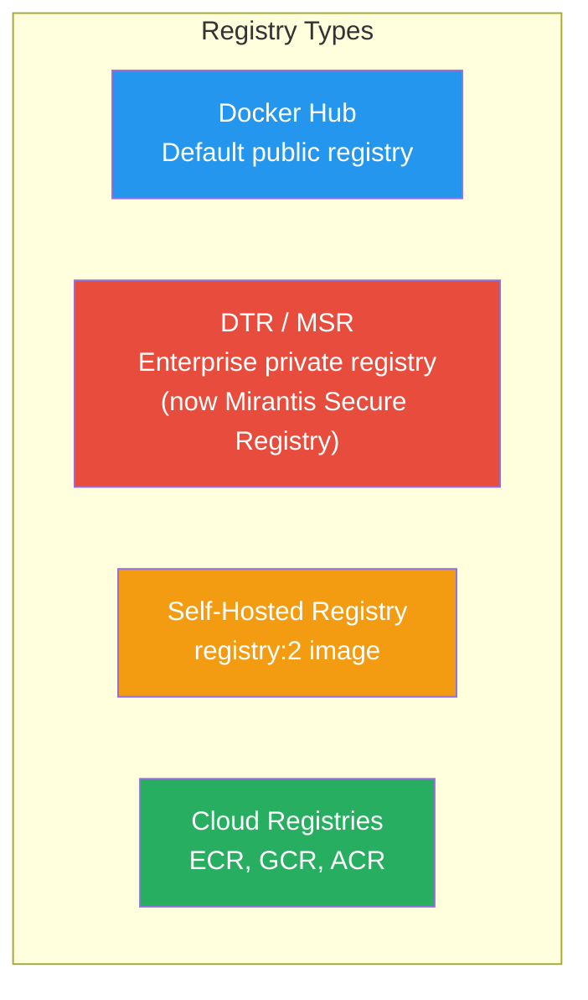

# Domain 2: Image Creation, Management & Registry (20% of Exam)

[← Back to Index](./README.md) · [Previous: Orchestration](./03-orchestration.md)

> 🔴 **Second highest weight — master Dockerfile and image workflows!**

---

## Image Layer Architecture



- Each Dockerfile instruction creates a **layer**
- Layers are **cached** — if a layer hasn't changed, Docker reuses it
- Layers are **shared** across images that use the same base
- Container adds a thin **writable layer** on top (Copy-on-Write)

---

## Dockerfile Instructions Reference



---

## Dockerfile Best Practices

```dockerfile
# 1. Use specific base image tags (never :latest in production)
FROM node:20-alpine

# 2. Set working directory
WORKDIR /app

# 3. Copy dependency files FIRST (leverages cache)
COPY package.json package-lock.json ./

# 4. Install dependencies (cached if package.json unchanged)
RUN npm ci --only=production

# 5. Copy application code LAST (changes frequently)
COPY . .

# 6. Run as non-root user
RUN addgroup -S appgroup && adduser -S appuser -G appgroup
USER appuser

# 7. Expose port (documentation only — doesn't publish)
EXPOSE 3000

# 8. Use exec form for CMD (proper PID 1 signal handling)
CMD ["node", "server.js"]
```

### Cache Optimization



> **Rule of thumb:** Put things that change **least often** at the **top** of the Dockerfile.

---

## CMD vs ENTRYPOINT

| | CMD | ENTRYPOINT |
|---|-----|------------|
| **Purpose** | Default arguments / command | Main executable |
| **Override** | Easily overridden at `docker run` | Requires `--entrypoint` flag |
| **Exec form** | `CMD ["nginx", "-g", "daemon off;"]` | `ENTRYPOINT ["nginx"]` |
| **Shell form** | `CMD nginx -g "daemon off;"` | `ENTRYPOINT nginx -g "daemon off;"` |
| **Combined** | `ENTRYPOINT ["nginx"]` + `CMD ["-g", "daemon off;"]` — CMD provides default args to ENTRYPOINT |

```bash
# Override CMD
docker run myimage echo "hello"

# Override ENTRYPOINT
docker run --entrypoint /bin/sh myimage
```

---

## COPY vs ADD

| | COPY | ADD |
|---|------|-----|
| Copy local files | ✅ | ✅ |
| Auto-extract tar | ❌ | ✅ |
| Fetch from URL | ❌ | ✅ |
| **Best Practice** | **Preferred** (explicit) | Only when tar extraction needed |

---

## Multi-Stage Builds



```dockerfile
# Stage 1: Build
FROM node:20 AS builder
WORKDIR /app
COPY package*.json ./
RUN npm ci
COPY . .
RUN npm run build

# Stage 2: Production (tiny final image)
FROM nginx:1.25-alpine
COPY --from=builder /app/dist /usr/share/nginx/html
EXPOSE 80
CMD ["nginx", "-g", "daemon off;"]
```

**Benefits:**
- Final image contains only the runtime + built artifacts
- Build tools, source code, and `node_modules` are discarded
- Drastically reduces image size (often 10x smaller)

---

## Image Tagging & Naming

```
registry.example.com/organization/repository:tag
└──── registry ──────┘ └─ namespace ─┘ └─ repo ─┘ └tag┘
```

```bash
# Tag an image
docker image tag myapp:latest myapp:1.0
docker image tag myapp:1.0 registry.example.com/myapp:1.0

# List images
docker images
docker image ls
docker image ls --filter dangling=true

# Inspect layers
docker image history myapp:1.0
docker image inspect myapp:1.0
```

---

## Image Commands

```bash
# Build
docker build -t myapp:1.0 .
docker build -t myapp:1.0 -f Dockerfile.prod .
docker build --no-cache -t myapp:1.0 .

# Push / Pull
docker push registry.example.com/myapp:1.0
docker pull nginx:1.25

# Remove
docker image rm myapp:1.0
docker image prune              # Remove dangling images
docker image prune -a           # Remove all unused images

# Save / Load (offline transfer)
docker image save myapp:1.0 -o myapp.tar
docker image load -i myapp.tar

# Export / Import (from container filesystem)
docker export <container-id> -o container.tar
docker import container.tar myimage:latest
```

### Save/Load vs Export/Import

| | `save` / `load` | `export` / `import` |
|---|-----------------|---------------------|
| **Source** | Image | Container |
| **Preserves** | Layers, tags, history | Flat filesystem snapshot |
| **Use case** | Transfer images between hosts | Create image from container state |

---

## Docker Content Trust (DCT)

```bash
# Enable content trust
export DOCKER_CONTENT_TRUST=1

# Push (will sign the image)
docker push myregistry/myimage:1.0

# Pull (will verify signature)
docker pull myregistry/myimage:1.0
```

- Uses **Notary** under the hood
- Images are signed with a **private key** on push
- Signature is verified on pull when DCT is enabled
- Prevents pulling tampered or unsigned images

---

## Registry



```bash
# Run a local registry
docker run -d -p 5000:5000 --name registry registry:2

# Tag for local registry
docker tag myapp:1.0 localhost:5000/myapp:1.0

# Push to local registry
docker push localhost:5000/myapp:1.0

# Login to Docker Hub
docker login

# Login to private registry
docker login registry.example.com
```

---

[← Back to Index](./README.md) · [Next: Installation & Configuration →](./05-installation-configuration.md)
