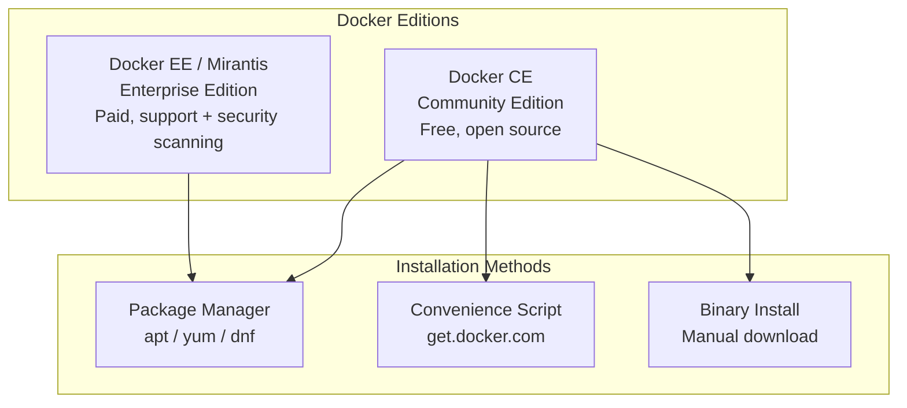
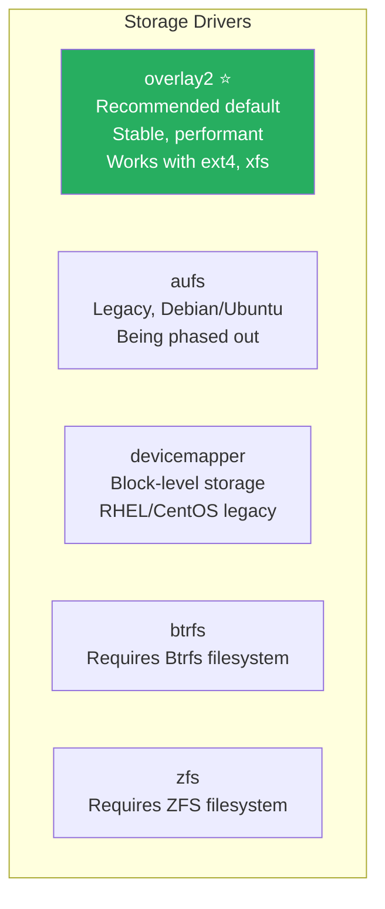
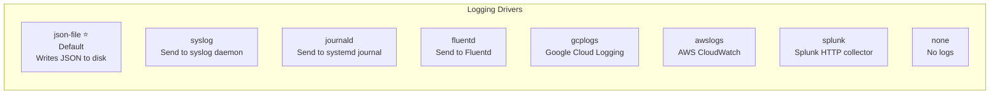

# Domain 3: Installation & Configuration (15% of Exam)

[← Back to Index](./README.md) · [Previous: Images & Registry](./04-image-creation-management.md)

---

## Docker Editions



> **Naming update:** Docker Enterprise / UCP is now **Mirantis Kubernetes Engine (MKE)**. Docker Trusted Registry (DTR) is now **Mirantis Secure Registry (MSR)**.

---

## Installation on Ubuntu/Debian

```bash
# 1. Remove old versions
sudo apt-get remove docker docker-engine docker.io containerd runc

# 2. Set up repository
sudo apt-get update
sudo apt-get install ca-certificates curl gnupg
sudo install -m 0755 -d /etc/apt/keyrings
curl -fsSL https://download.docker.com/linux/ubuntu/gpg | \
  sudo gpg --dearmor -o /etc/apt/keyrings/docker.gpg

# 3. Add Docker repo
echo "deb [arch=$(dpkg --print-architecture) \
  signed-by=/etc/apt/keyrings/docker.gpg] \
  https://download.docker.com/linux/ubuntu \
  $(lsb_release -cs) stable" | \
  sudo tee /etc/apt/sources.list.d/docker.list > /dev/null

# 4. Install
sudo apt-get update
sudo apt-get install docker-ce docker-ce-cli containerd.io \
  docker-buildx-plugin docker-compose-plugin

# 5. Verify
docker version
docker info
sudo systemctl status docker
```

---

## Managing the Docker Daemon

```bash
# Start / Stop / Restart
sudo systemctl start docker
sudo systemctl stop docker
sudo systemctl restart docker

# Enable on boot
sudo systemctl enable docker

# Check status
sudo systemctl status docker

# View daemon logs
sudo journalctl -u docker.service
sudo journalctl -u docker.service --since "1 hour ago"

# Run as non-root user
sudo usermod -aG docker $USER
# Then log out and back in
```

---

## Daemon Configuration — `daemon.json`

**Location:** `/etc/docker/daemon.json`

```json
{
  "storage-driver": "overlay2",
  "log-driver": "json-file",
  "log-opts": {
    "max-size": "10m",
    "max-file": "3"
  },
  "default-address-pools": [
    { "base": "172.80.0.0/16", "size": 24 }
  ],
  "dns": ["8.8.8.8", "8.8.4.4"],
  "live-restore": true,
  "debug": false,
  "tls": true,
  "tlscacert": "/etc/docker/ca.pem",
  "tlscert": "/etc/docker/server-cert.pem",
  "tlskey": "/etc/docker/server-key.pem",
  "hosts": ["unix:///var/run/docker.sock", "tcp://0.0.0.0:2376"],
  "insecure-registries": ["myregistry.local:5000"],
  "default-runtime": "runc"
}
```

### Key Options

| Option | Purpose | Default |
|--------|---------|---------|
| `storage-driver` | Backend for image/container layers | `overlay2` |
| `log-driver` | Default logging driver | `json-file` |
| `live-restore` | Keep containers running during daemon restart | `false` |
| `debug` | Enable debug-level logging | `false` |
| `dns` | Default DNS for containers | Host DNS |
| `insecure-registries` | Allow HTTP registries | `[]` |
| `default-runtime` | Container runtime | `runc` |
| `tls` / `tlscacert` / `tlscert` / `tlskey` | Secure daemon API with TLS | Disabled |

> **Exam tip:** Know the difference between configuring via `daemon.json` vs `dockerd` CLI flags. They **cannot** overlap — setting the same option in both causes a startup failure.

---

## Storage Drivers



| Driver | Backing FS | Status |
|--------|-----------|--------|
| **overlay2** | ext4, xfs | ⭐ Recommended default |
| aufs | ext4, xfs | Legacy (Ubuntu only) |
| devicemapper | direct-lvm | Legacy (RHEL/CentOS) |
| btrfs | Btrfs | Niche |
| zfs | ZFS | Niche |

```bash
# Check current storage driver
docker info | grep "Storage Driver"

# Set in daemon.json
# { "storage-driver": "overlay2" }
```

---

## Logging Drivers



```bash
# Set default log driver in daemon.json
# { "log-driver": "json-file", "log-opts": { "max-size": "10m", "max-file": "3" } }

# Override per container
docker run --log-driver syslog --log-opt syslog-address=udp://1.2.3.4:514 nginx

# Check container log driver
docker inspect --format '{{.HostConfig.LogConfig.Type}}' <container>

# View logs (only works with json-file and journald)
docker logs <container>
```

> **Exam tip:** `docker logs` only works with `json-file` and `journald` drivers. Other drivers require external log viewers.

---

## Docker Data Directory

Default location: `/var/lib/docker/`

```
/var/lib/docker/
├── containers/     # Container metadata, logs
├── image/          # Image metadata
├── overlay2/       # Layers (if using overlay2)
├── volumes/        # Named volumes
├── network/        # Network config
├── swarm/          # Swarm state (Raft logs, certs)
└── tmp/            # Temporary files
```

```bash
# Change data directory via daemon.json
# { "data-root": "/mnt/docker-data" }
```

---

## Namespaces & cgroups (Conceptual)

These are the Linux kernel features Docker relies on:

| Feature | What It Does | Docker Uses It For |
|---------|--------------|-------------------|
| **Namespaces** | Isolates what a process can **see** | PID, network, filesystem, hostname, IPC, user isolation |
| **cgroups** | Limits what a process can **use** | CPU, memory, I/O, PID count limits |

```bash
# Resource limits at container level
docker run --memory=512m --cpus=1.5 nginx
```

---

[← Back to Index](./README.md) · [Next: Networking →](./06-networking.md)
