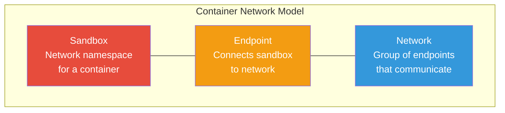
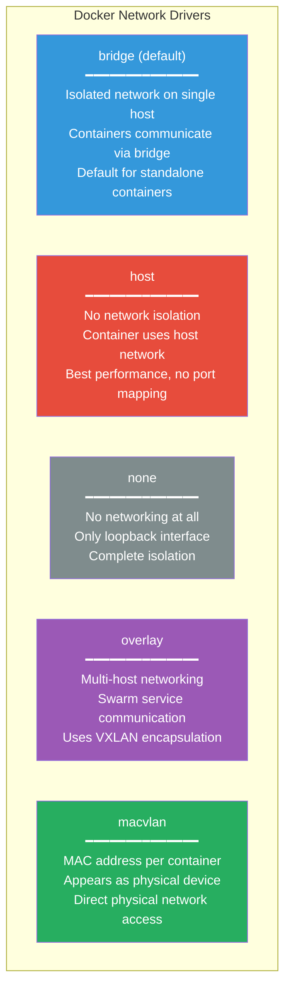
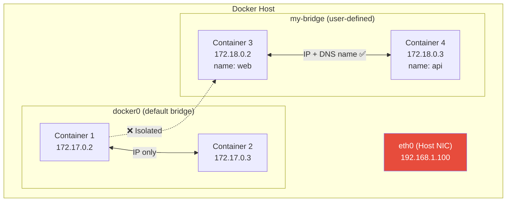
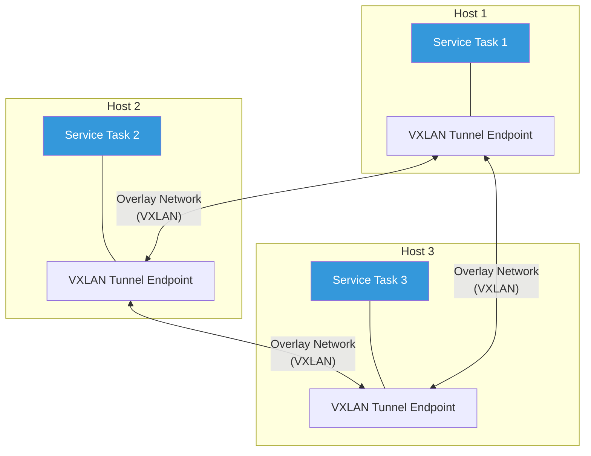
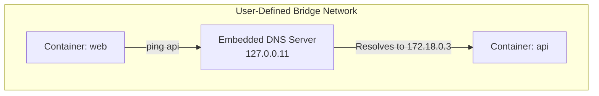
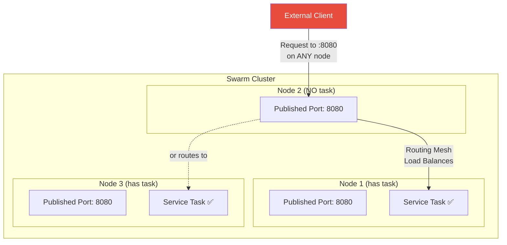

# Domain 4: Networking (15% of Exam)

[← Back to Index](./README.md) · [Previous: Installation & Configuration](./05-installation-configuration.md)

---

## Container Network Model (CNM)



| CNM Component | Description |
|---------------|-------------|
| **Sandbox** | Isolated network namespace for a container (interfaces, routes, DNS) |
| **Endpoint** | Virtual network interface connecting a sandbox to a network |
| **Network** | A group of endpoints that can communicate directly |

---

## Network Drivers



| Driver | Scope | Use Case |
|--------|-------|----------|
| **bridge** | Single host | Default; standalone containers on same host |
| **host** | Single host | Maximum performance; no NAT overhead |
| **none** | Single host | Complete network isolation |
| **overlay** | Multi-host | Swarm services across nodes |
| **macvlan** | Single host | Containers need to appear on physical network |

---

## Bridge Network



### Default Bridge vs User-Defined Bridge

| Feature | Default Bridge (`docker0`) | User-Defined Bridge |
|---------|---------------------------|---------------------|
| **DNS resolution** | ❌ No (use `--link`, deprecated) | ✅ Automatic by container name |
| **Isolation** | All containers on same bridge | Only containers on that network |
| **Connect/disconnect live** | ❌ Must recreate container | ✅ Can connect/disconnect anytime |
| **Environment sharing** | Via `--link` (deprecated) | Not shared |

> **Always use user-defined bridge networks.** The default bridge is legacy.

---

## Overlay Network (Swarm / Multi-Host)



- Uses **VXLAN** encapsulation to tunnel L2 frames over L3
- Created automatically for swarm services
- Can be made `--attachable` to allow standalone containers

```bash
# Create overlay for swarm
docker network create --driver overlay my-overlay

# Attachable overlay (standalone containers can join)
docker network create --driver overlay --attachable my-overlay

# Encrypted overlay (data plane encryption)
docker network create --driver overlay --opt encrypted my-secure-overlay
```

---

## Host Network

```bash
# Container shares host's network namespace
docker run --network host nginx

# No port mapping needed — container binds directly to host ports
# nginx is directly on host:80
```

- No network isolation between container and host
- No NAT, no port mapping — maximum performance
- Container can see all host interfaces
- **Linux only** (on macOS/Windows, host networking works differently)

---

## Network Commands

```bash
# List networks
docker network ls

# Create a bridge network
docker network create my-network
docker network create --driver bridge --subnet 172.20.0.0/16 my-network

# Connect container to network
docker network connect my-network my-container

# Disconnect from network
docker network disconnect my-network my-container

# Inspect a network
docker network inspect my-network

# Run container on specific network
docker run -d --name web --network my-network nginx

# Remove / prune
docker network rm my-network
docker network prune
```

---

## Port Publishing

```bash
# Publish port — host:container
docker run -d -p 8080:80 nginx

# Bind to specific host interface
docker run -d -p 127.0.0.1:8080:80 nginx

# Random host port for all EXPOSE ports
docker run -d -P nginx

# UDP port
docker run -d -p 8080:80/udp myapp

# Check published ports
docker port <container>
```

---

## DNS in Docker



- **User-defined networks** → Automatic DNS resolution by container name
- **Default bridge** → No DNS, must use IP or deprecated `--link`
- Embedded DNS server at `127.0.0.11`
- Containers can also use `--dns` flag to specify external DNS

```bash
# Custom DNS
docker run --dns 8.8.8.8 nginx

# Custom DNS search domain
docker run --dns-search example.com nginx
```

---

## Swarm Routing Mesh



- Published ports are available on **every node** in the swarm
- The **ingress network** handles routing to a node that has the task
- Built-in **internal load balancing** distributes across tasks

### Bypass Routing Mesh

```bash
# Direct host mode — only accessible on nodes running the task
docker service create --name web \
  --publish mode=host,target=80,published=8080 \
  nginx
```

---

## Swarm Network Ports

| Port | Protocol | Purpose |
|------|----------|---------|
| **2377** | TCP | Cluster management (Raft) |
| **7946** | TCP + UDP | Container network discovery (gossip) |
| **4789** | UDP | Overlay network data (VXLAN) |

---

[← Back to Index](./README.md) · [Next: Security →](./07-security.md)
