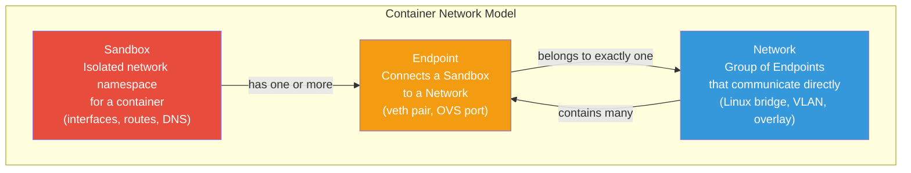
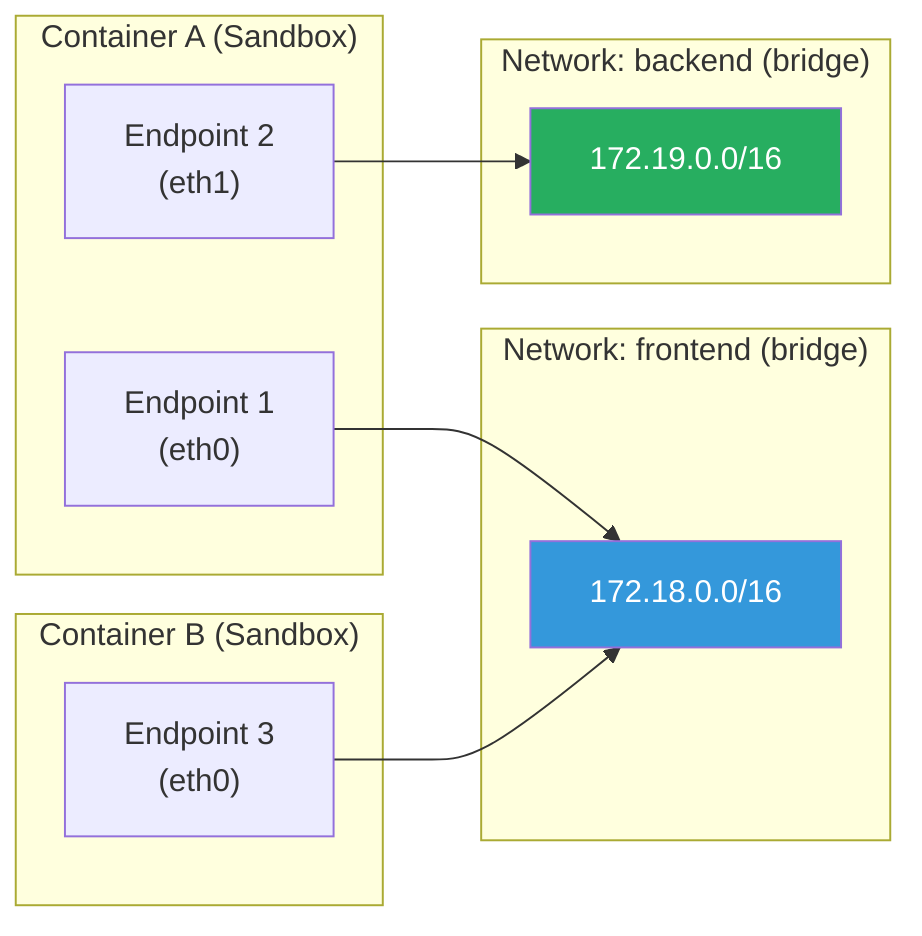
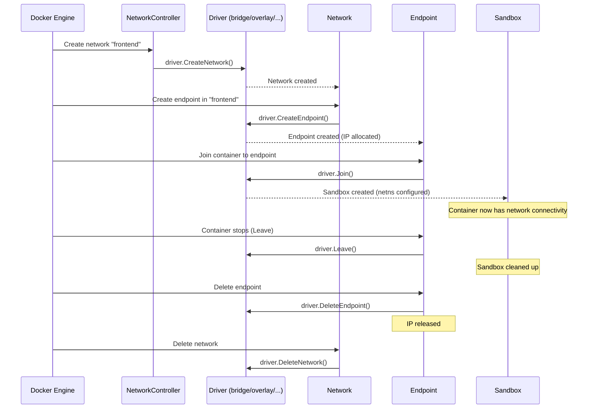

# Container Network Model (CNM)

[← Back to Section Index](./README.md) · [← Main Index](../README.md)

---

## What Is the CNM?

The **Container Network Model (CNM)** is Docker's networking architecture specification. It defines how networking is provided to containers and was designed by Docker, implemented in the [libnetwork](https://github.com/moby/libnetwork) project.

> The formal CNM specification lives at [github.com/moby/libnetwork/blob/master/docs/design.md](https://github.com/moby/libnetwork/blob/master/docs/design.md). Docker's own docs embed CNM concepts throughout the [Networking overview](https://docs.docker.com/engine/network/) and [Network drivers](https://docs.docker.com/engine/network/drivers/) pages.

---

## The Three Core Components



| Component | What It Is | Implementation | Cardinality |
|-----------|-----------|----------------|-------------|
| **Sandbox** | An isolated network environment for a container. Contains interfaces, routing table, DNS settings. | Linux network namespace | One per container. Can have multiple endpoints. |
| **Endpoint** | A virtual network interface that connects a Sandbox to a Network. | veth pair, Open vSwitch port | Belongs to exactly one Network and one Sandbox. |
| **Network** | A group of Endpoints that can communicate with each other directly. | Linux bridge, VLAN, VXLAN overlay | Contains many Endpoints. |

### How They Relate



- Container A is connected to **two networks** (frontend and backend) via two endpoints
- Container B is only on the frontend network
- Container A can talk to Container B via the frontend network
- Container B **cannot** reach the backend network — network isolation is enforced

---

## CNM Objects in libnetwork

libnetwork exposes the CNM through programmatic objects:

| Object | Role |
|--------|------|
| **NetworkController** | Entry point into libnetwork. Creates and manages Networks. Binds drivers. |
| **Driver** | Implements the actual networking (bridge, overlay, macvlan, etc.). Not user-visible. |
| **Network** | A CNM Network. Created via the controller. Operations delegated to the bound driver. |
| **Endpoint** | A CNM Endpoint. Created within a Network. Driver allocates IP addresses. |
| **Sandbox** | A CNM Sandbox. Created when an Endpoint is joined to a container. Uses OS constructs (netns). |

---

## CNM Lifecycle



Key lifecycle rules:
- **Endpoint.Join()** creates the Sandbox if it doesn't exist yet
- **Endpoint.Leave()** cleans up driver state; libnetwork deletes the Sandbox when the last endpoint leaves
- IP addresses are held as long as the Endpoint exists — reused if the container restarts
- **Network.Delete()** fails if any Endpoints are still attached

---

## CNM vs CNI (Kubernetes)

This is a common interview and exam topic. Docker uses CNM. Kubernetes uses **CNI (Container Network Interface)** — a different, simpler standard.

| | CNM (Docker) | CNI (Kubernetes) |
|---|---|---|
| **Full name** | Container Network Model | Container Network Interface |
| **Designed by** | Docker (libnetwork) | CoreOS, now CNCF |
| **Used by** | Docker Engine, Docker Swarm | Kubernetes, CRI-O, containerd |
| **Architecture** | Sandbox + Endpoint + Network objects | Plugin binary called by the runtime |
| **Driver model** | Built-in + remote plugins via Docker Plugin API | External binaries following a simple JSON spec |
| **IP management** | Driver-managed (IPAM built into libnetwork) | Separate IPAM plugins |
| **Complexity** | More complex — full object model with lifecycle | Simpler — just "add container to network" / "remove" |
| **Multi-network** | ✅ Container can join multiple networks via endpoints | ✅ Pod can have multiple interfaces (via Multus) |
| **Popular plugins** | bridge, overlay, macvlan (built-in) | Calico, Cilium, Flannel, Weave |

> **Why Kubernetes chose CNI over CNM:** CNI is simpler and more Unix-like (just a binary + JSON config). CNM's tighter coupling with Docker's daemon made it harder to integrate with other container runtimes. This is one of the reasons Kubernetes dropped Docker as a runtime.

---

## How CNM Maps to What You See

```bash
# Create a network (CNM: Network object + Driver.CreateNetwork)
docker network create frontend

# Run a container on it (CNM: Endpoint.Create + Endpoint.Join + Sandbox)
docker run -d --name web --network frontend nginx

# Connect to another network (CNM: second Endpoint.Create + Endpoint.Join)
docker network connect backend web

# Inspect — see Sandbox, Endpoints, Networks
docker inspect web --format '{{json .NetworkSettings.Networks}}' | jq
```

The `docker inspect` output directly reflects CNM:
- `NetworkSettings.SandboxID` — the Sandbox (network namespace)
- `NetworkSettings.Networks.<name>.EndpointID` — each Endpoint
- `NetworkSettings.Networks.<name>.NetworkID` — the Network

---

[← Back to Section Index](./README.md) · [← Main Index](../README.md) · [Next: Bridge Networks →](./02-bridge-networks.md)
