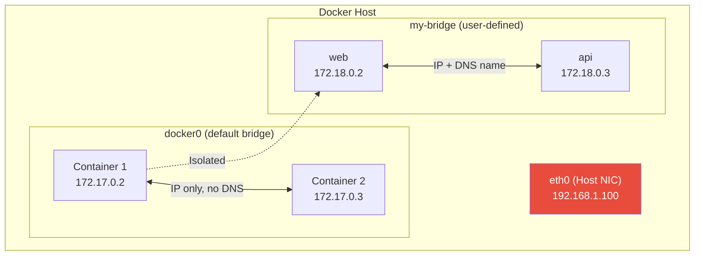
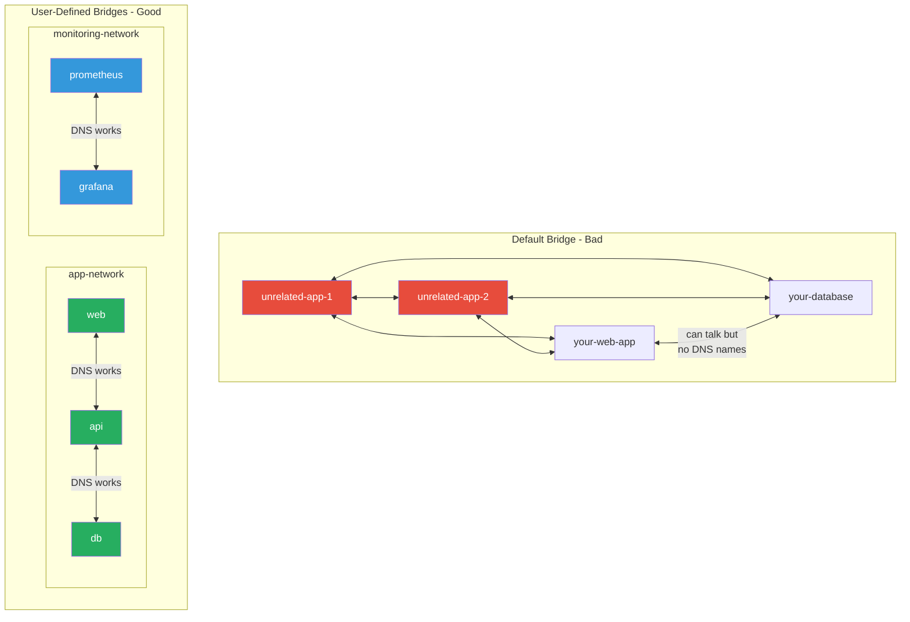

# Bridge Networks

[← Back to Section Index](./README.md) · [← Main Index](../README.md) · [Previous: Container Network Model](./01-container-network-model.md)

---

## What Is a Bridge Network?

A bridge network uses a software bridge on the Docker host that lets containers on the same bridge communicate, while isolating them from containers on other bridges and from external networks. It's the **default network driver** in Docker.



---

## Default Bridge vs User-Defined Bridge

This is one of the most important distinctions in Docker networking.

| Feature | Default Bridge (`docker0`) | User-Defined Bridge |
|---------|---------------------------|---------------------|
| **DNS resolution** | ❌ No — containers can only reach each other by IP | ✅ Automatic — containers resolve each other by name or alias |
| **Isolation** | ❌ All containers land here by default — unrelated containers can communicate | ✅ Only explicitly connected containers can communicate |
| **Connect/disconnect on the fly** | ❌ Must stop and recreate the container | ✅ `docker network connect/disconnect` while running |
| **Configuration** | Requires editing `daemon.json` + Docker restart | Configured per-network at creation time |
| **Ports between containers** | All ports exposed between containers on same bridge | All ports exposed between containers on same bridge |
| **Environment sharing** | Via `--link` (legacy, deprecated) | Use volumes, compose, or secrets instead |

> **The default bridge is considered legacy and is not recommended for production.** Always create user-defined bridge networks.

### Why User-Defined Bridges Are Superior



---

## Creating and Using Bridge Networks

```bash
# Create a user-defined bridge network
docker network create my-app-net

# Create with specific subnet and gateway
docker network create \
  --driver bridge \
  --subnet 172.20.0.0/16 \
  --gateway 172.20.0.1 \
  my-app-net

# Run containers on the network
docker run -d --name web --network my-app-net nginx
docker run -d --name api --network my-app-net my-api-image

# Containers can reach each other by name
docker exec web ping api        # works
docker exec api ping web        # works

# Connect a running container to an additional network
docker network connect backend-net web

# Disconnect
docker network disconnect my-app-net web
```

---

## Inter-Container Communication (ICC)

By default, containers on the same bridge can communicate freely. You can disable this:

```bash
# Create a bridge with ICC disabled
docker network create \
  --driver bridge \
  --opt com.docker.network.bridge.enable_icc=false \
  isolated-net
```

With ICC disabled, containers on the network can only communicate via published ports, not directly by IP.

---

## Bridge Network Options

| Option | Default | Description |
|--------|---------|-------------|
| `com.docker.network.bridge.name` | auto | Interface name for the Linux bridge |
| `com.docker.network.bridge.enable_ip_masquerade` | `true` | Enable NAT for outbound traffic |
| `com.docker.network.bridge.enable_icc` | `true` | Enable inter-container connectivity |
| `com.docker.network.bridge.host_binding_ipv4` | all addresses | Default IP when binding container ports |
| `com.docker.network.driver.mtu` | `0` (no limit) | Maximum Transmission Unit for containers |
| `com.docker.network.container_iface_prefix` | `eth` | Prefix for container interfaces |

---

## Configuring the Default Bridge

The default bridge is configured via `daemon.json` (not `docker network create`):

```json
{
  "bip": "192.168.1.1/24",
  "fixed-cidr": "192.168.1.0/25",
  "mtu": 1500,
  "dns": ["8.8.8.8", "8.8.4.4"]
}
```

> Changes to `daemon.json` require a Docker restart. This is another reason to prefer user-defined networks — they can be created and configured without restarting Docker.

---

## Internal Networks

You can create a bridge network with no external access:

```bash
# Internal network — containers can talk to each other but NOT to the outside
docker network create --internal backend-only

docker run -d --name db --network backend-only postgres
# db can't reach the internet, but other containers on backend-only can reach db
```

This is useful for backend services (databases, caches) that should never have outbound internet access.

---

[← Back to Section Index](./README.md) · [← Main Index](../README.md) · [Previous: CNM](./01-container-network-model.md) · [Next: Overlay Networks →](./03-overlay-networks.md)
