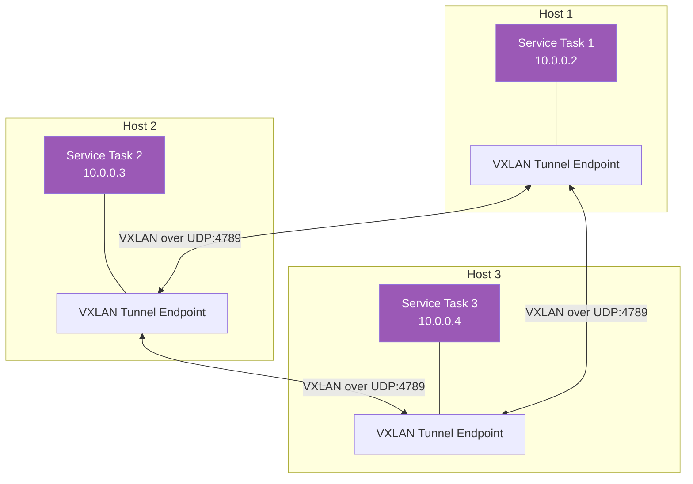
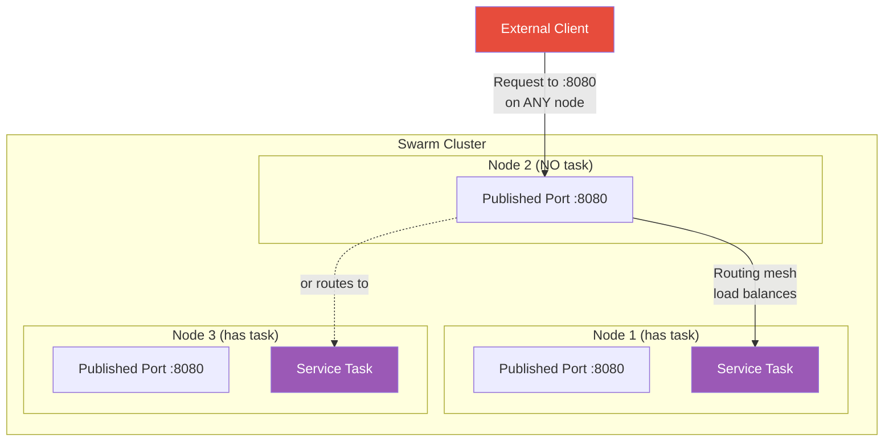
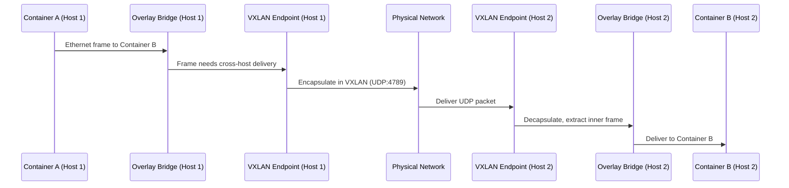

# Overlay Networks & Swarm Networking

[← Back to Section Index](./README.md) · [← Main Index](../README.md) · [Previous: Bridge Networks](./02-bridge-networks.md)

---

## What Is an Overlay Network?

Overlay networks connect containers across multiple Docker hosts. They use **VXLAN** encapsulation to tunnel Layer 2 frames over the Layer 3 network, creating a virtual network that spans the cluster.



---

## Creating Overlay Networks

> **Prerequisite:** Overlay networks require Docker Swarm. You must initialize Swarm before creating overlays — even a single-node Swarm is enough for testing. Without Swarm you'll get: `Error: This node is not a swarm manager.`
>
> ```bash
> # Initialize single-node Swarm (required before creating overlays)
> docker swarm init
>
> # Leave Swarm when done testing
> docker swarm leave --force
> ```

```bash
# Basic overlay for Swarm services
docker network create --driver overlay my-overlay

# Attachable overlay — standalone containers can also join
docker network create --driver overlay --attachable my-overlay

# Encrypted overlay — data plane encryption (IPSec)
docker network create --driver overlay --opt encrypted my-secure-overlay

# With specific subnet
docker network create --driver overlay --subnet 10.10.0.0/16 my-overlay
```

| Flag | Purpose |
|------|---------|
| `--driver overlay` | Use the overlay driver |
| `--attachable` | Allow standalone containers (not just Swarm services) to connect |
| `--opt encrypted` | Encrypt data traffic between nodes (IPSec). Adds overhead. |
| `--internal` | No external connectivity — only inter-container traffic |

> Without `--attachable`, only Swarm services can use the overlay. Standalone `docker run` containers cannot join.

---

## Swarm Networking — Built-in Networks

When you initialize a Swarm, Docker creates two special networks automatically:

| Network | Driver | Purpose |
|---------|--------|---------|
| **ingress** | overlay | Handles the routing mesh for published service ports. All nodes participate. |
| **docker_gwbridge** | bridge | Connects overlay networks to the Docker host's network. Handles outbound traffic from Swarm. |

```bash
# See them after swarm init
docker network ls
# NETWORK ID     NAME              DRIVER    SCOPE
# abc123         bridge            bridge    local
# def456         docker_gwbridge   bridge    local
# ghi789         host              host      local
# jkl012         ingress           overlay   swarm
# mno345         none              null      local
```

---

## Routing Mesh

The routing mesh ensures that a published service port is accessible on **every node** in the Swarm, even nodes that aren't running a task for that service.



- Published ports are available on **every node** via the ingress network
- Built-in **internal load balancing** distributes across running tasks
- The routing mesh uses IPVS (IP Virtual Server) in the Linux kernel

### Bypass the Routing Mesh

For cases where you need direct access (e.g., sticky sessions, host-level load balancer):

```bash
# Host mode — port only accessible on nodes running the task
docker service create --name web \
  --publish mode=host,target=80,published=8080 \
  nginx
```

| Mode | Behavior |
|------|----------|
| `mode=ingress` (default) | Port available on all nodes; routing mesh distributes traffic |
| `mode=host` | Port only available on nodes running a task; no load balancing |

---

## Swarm Network Ports

These ports must be open between Swarm nodes:

| Port | Protocol | Purpose |
|------|----------|---------|
| **2377** | TCP | Cluster management and Raft consensus |
| **7946** | TCP + UDP | Container network discovery (gossip protocol) |
| **4789** | UDP | Overlay network data traffic (VXLAN) |

> If you enable `--opt encrypted`, the VXLAN traffic on port 4789 is encrypted with IPSec (ESP, IP protocol 50).

---

## Overlay Network Traffic Flow



---

## Cleanup After Leaving Swarm

`docker swarm leave --force` removes the node from the cluster but does **not** delete any networks. Overlay networks, `ingress`, and `docker_gwbridge` become orphaned — they show in `docker network ls` but are non-functional.

```bash
# Leave Swarm
docker swarm leave --force

# Orphaned networks still visible
docker network ls
# NETWORK ID     NAME              DRIVER    SCOPE
# abc123         my-overlay        overlay   swarm   ← orphaned, unusable
# def456         ingress           overlay   swarm   ← orphaned
# ghi789         docker_gwbridge   bridge    local   ← leftover

# Clean up manually
docker network rm my-overlay
docker network rm ingress
docker network rm docker_gwbridge

# Or prune all unused networks at once
docker network prune
```

> This is consistent with Docker's general philosophy — Docker never auto-deletes resources. Just like `docker rm` doesn't delete volumes and `docker service rm` doesn't delete networks, `docker swarm leave` doesn't clean up networks created during Swarm membership.

---

[← Back to Section Index](./README.md) · [← Main Index](../README.md) · [Previous: Bridge Networks](./02-bridge-networks.md) · [Next: Host, Macvlan, IPvlan & None →](./04-host-macvlan-ipvlan-none.md)
