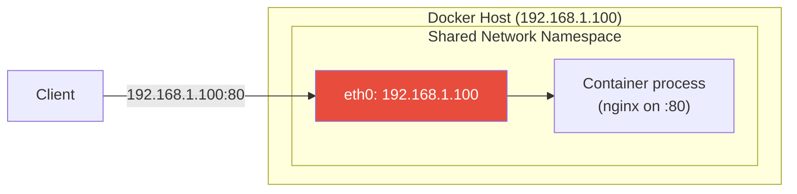
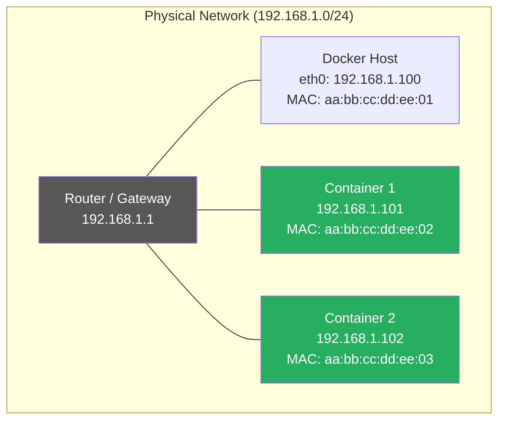
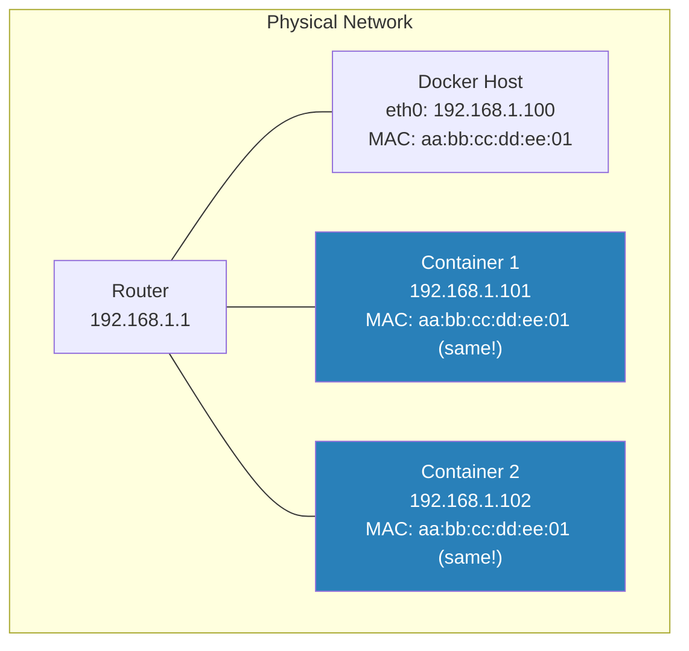

# Host, Macvlan, IPvlan & None Networks

[← Back to Section Index](./README.md) · [← Main Index](../README.md) · [Previous: Overlay Networks](./03-overlay-networks.md)

---

## Host Network

The host driver removes network isolation — the container shares the Docker host's network namespace directly.



```bash
# Container uses the host's network stack directly
docker run --network host nginx

# No port mapping needed — nginx binds to host:80 directly
# No -p flag required (or supported)
```

| Aspect | Details |
|--------|---------|
| **Performance** | Maximum — no NAT, no bridge, no veth pair overhead |
| **Port mapping** | Not needed and not supported — container binds directly to host ports |
| **Isolation** | None — container sees all host interfaces, routes, iptables |
| **Port conflicts** | Container ports conflict with host ports and other containers using host networking |
| **Platform** | **Linux only** — on Docker Desktop (macOS/Windows), host mode refers to the VM, not your actual machine |
| **Swarm services** | Not supported for ingress routing mesh — only in `mode=host` publish mode |

**When to use:** Latency-sensitive applications, containers that need to handle a very high volume of ports, or applications that need access to the host's network stack (monitoring, network tools).

---

## Macvlan Network

Macvlan assigns a **unique MAC address** to each container, making it appear as a physical device on the network. No bridge, no NAT — containers get IPs directly from the physical network.



```bash
# Create macvlan network using the host's physical interface
docker network create -d macvlan \
  --subnet=192.168.1.0/24 \
  --gateway=192.168.1.1 \
  -o parent=eth0 \
  my-macvlan

# Run container — gets an IP on the physical network
docker run -d --network my-macvlan --name web nginx

# 802.1Q trunk mode (VLAN tagging)
docker network create -d macvlan \
  --subnet=192.168.10.0/24 \
  --gateway=192.168.10.1 \
  -o parent=eth0.10 \
  macvlan-vlan10
```

| Aspect | Details |
|--------|---------|
| **MAC address** | Each container gets a unique MAC |
| **IP address** | From the physical network's subnet |
| **Performance** | Near-native — no bridge overhead |
| **Host communication** | ⚠️ Host **cannot** communicate with macvlan containers directly (Linux kernel limitation). Requires a macvlan sub-interface on the host. |
| **VLAN support** | ✅ 802.1Q trunk mode via sub-interfaces (e.g., `eth0.10`) |
| **Promiscuous mode** | Required on the parent NIC — some cloud providers and WiFi drivers don't support this |

**When to use:** Legacy applications that expect to be directly on the physical network, migration from VMs, applications that need a real network identity.

---

## IPvlan Network

IPvlan is similar to macvlan but all containers **share the host's MAC address**. Each container gets a unique IP but the same MAC. This is important when the network limits MAC addresses per port (common in cloud environments and some switches).



```bash
# IPvlan L2 mode (default) — same subnet as host
docker network create -d ipvlan \
  --subnet=192.168.1.0/24 \
  --gateway=192.168.1.1 \
  -o parent=eth0 \
  my-ipvlan

# IPvlan L3 mode — containers on different subnets, host acts as router
docker network create -d ipvlan \
  --subnet=10.10.0.0/24 \
  -o parent=eth0 \
  -o ipvlan_mode=l3 \
  my-ipvlan-l3
```

### IPvlan Modes

| Mode | Layer | Behavior |
|------|-------|----------|
| **L2** (default) | Layer 2 | Same subnet as the host. Traffic bridged at L2. Similar to macvlan but shared MAC. |
| **L3** | Layer 3 | Containers on separate subnets. Host acts as a router. No broadcast/multicast between subnets. |
| **L3S** | Layer 3 + symmetric | Like L3 but with connection tracking for stateful firewalling. |

### Macvlan vs IPvlan

| | Macvlan | IPvlan |
|---|---|---|
| **MAC address** | Unique per container | Shared with host |
| **Promiscuous mode** | Required on parent NIC | Not required |
| **Cloud compatibility** | ⚠️ Many clouds block promiscuous mode | ✅ Works where macvlan doesn't |
| **VLAN trunking** | ✅ 802.1Q | ✅ 802.1Q |
| **L3 mode** | ❌ | ✅ |
| **Kernel requirement** | Linux 3.x+ | Linux 4.2+ |

> **Use IPvlan when:** You can't use macvlan — cloud VMs that block promiscuous mode, switches that limit MACs per port, or when you need L3 routing mode.

---

## None Network

The none driver provides **no networking at all**. The container only has a loopback interface.

```bash
docker run --network none alpine ip addr
# Only shows: lo (127.0.0.1)
# No eth0, no external connectivity
```

| Aspect | Details |
|--------|---------|
| **Interfaces** | Only loopback (`lo`) |
| **External access** | None — cannot reach any network |
| **Use case** | Batch jobs that don't need networking, security-sensitive processing, testing |
| **Swarm** | Not available for Swarm services |

---

## Driver Comparison

| Driver | Isolation | Performance | Multi-host | Port mapping | Use case |
|--------|-----------|-------------|------------|-------------|----------|
| **bridge** | ✅ Network-level | Good | ❌ Single host | ✅ Required | Most standalone containers |
| **host** | ❌ None | Best | ❌ Single host | ❌ Not needed | Performance-critical, network tools |
| **overlay** | ✅ Network-level | Good (VXLAN overhead) | ✅ Multi-host | ✅ Via routing mesh | Swarm services |
| **macvlan** | ✅ Network-level | Near-native | ❌ Single host | ❌ Not needed | Legacy apps, VM migration |
| **ipvlan** | ✅ Network-level | Near-native | ❌ Single host | ❌ Not needed | Cloud VMs, MAC-limited networks |
| **none** | ✅ Complete | N/A | ❌ | ❌ | Batch jobs, security isolation |

---

[← Back to Section Index](./README.md) · [← Main Index](../README.md) · [Previous: Overlay Networks](./03-overlay-networks.md) · [Next: DNS & Service Discovery →](./05-dns-and-service-discovery.md)
