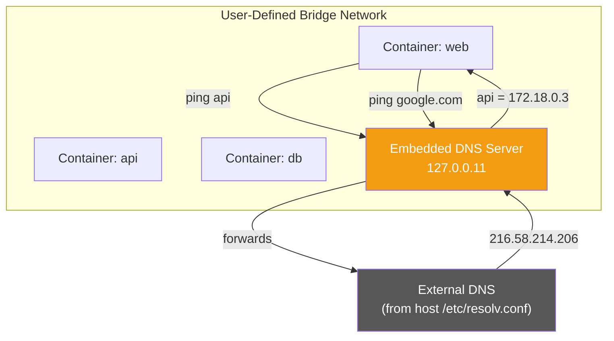
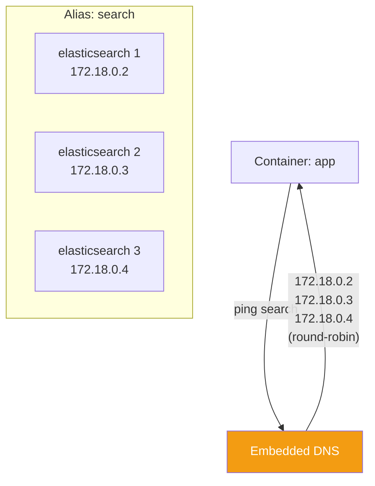
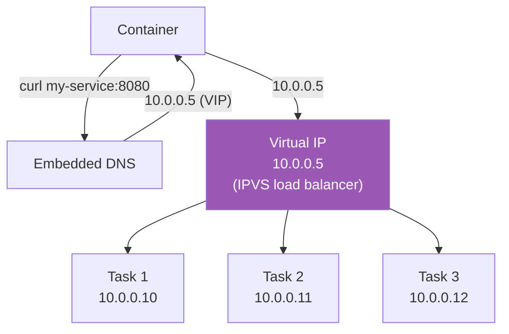

# DNS & Service Discovery

[← Back to Section Index](./README.md) · [← Main Index](../README.md) · [Previous: Host, Macvlan, IPvlan & None](./04-host-macvlan-ipvlan-none.md)

---

## Embedded DNS Server

Docker runs an embedded DNS server at `127.0.0.11` for containers on **user-defined networks**. This is what makes container name resolution work.



### How DNS Resolution Works

| Network Type | DNS Behavior |
|-------------|-------------|
| **User-defined networks** | Embedded DNS at `127.0.0.11`. Resolves container names and aliases. Forwards external lookups to host's DNS. |
| **Default bridge** | No embedded DNS. Container gets a copy of host's `/etc/resolv.conf`. Cannot resolve container names. |
| **host** | Uses the host's DNS directly (shared `/etc/resolv.conf`). |

### What Names Are Resolvable?

| Name Type | Resolvable? | Example |
|-----------|------------|---------|
| Container name (`--name`) | ✅ Yes | `ping my-container` |
| Network alias (`--network-alias`) | ✅ Yes | Multiple containers can share an alias for load balancing |
| Service name (Swarm) | ✅ Yes | `ping my-service` resolves to VIP or task IPs |
| Container ID | ❌ No | Auto-generated IDs are not registered in DNS |
| Default bridge containers | ❌ No | Must use IP or legacy `--link` |

---

## DNS Configuration Flags

```bash
# Custom DNS server
docker run --dns 8.8.8.8 nginx

# Multiple DNS servers
docker run --dns 8.8.8.8 --dns 8.8.4.4 nginx

# DNS search domain
docker run --dns-search example.com nginx
# Allows: ping api → resolves api.example.com

# DNS options
docker run --dns-opt timeout:3 --dns-opt attempts:2 nginx

# Custom hostname
docker run --hostname my-web-server nginx
```

| Flag | Description |
|------|-------------|
| `--dns` | Custom DNS server IP. On user-defined networks, forwarded by embedded DNS. On default bridge, written to `/etc/resolv.conf`. |
| `--dns-search` | DNS search domain for non-FQDN lookups |
| `--dns-opt` | Key-value DNS options (timeout, attempts, etc.) |
| `--hostname` | Container's hostname (defaults to container ID) |

---

## Network Aliases (Round-Robin DNS)

Multiple containers can share a network alias. DNS returns all container IPs for that alias — this provides basic client-side load balancing.

```bash
# Create network
docker network create my-net

# Start 3 containers with the same alias
docker run -d --network my-net --network-alias search elasticsearch:7.17
docker run -d --network my-net --network-alias search elasticsearch:7.17
docker run -d --network my-net --network-alias search elasticsearch:7.17

# Resolve the alias — returns all 3 IPs (round-robin)
docker run --rm --network my-net alpine nslookup search
```



---

## Swarm Service Discovery

In Docker Swarm, services get automatic DNS entries. There are two resolution modes:

### VIP (Virtual IP) — Default

Each service gets a **single Virtual IP** (VIP). DNS resolves the service name to this VIP, and IPVS in the kernel load-balances to actual task IPs.



### DNSRR (DNS Round Robin)

DNS returns **all task IPs** directly. No VIP, no kernel load balancing — the client picks an IP.

```bash
# Create service with DNS round robin
docker service create --name my-service \
  --endpoint-mode dnsrr \
  --replicas 3 \
  my-image
```

| Mode | DNS Returns | Load Balancing | Routing Mesh | Use Case |
|------|-------------|---------------|-------------|----------|
| **VIP** (default) | Single Virtual IP | Kernel-level (IPVS) | ✅ Supported | Most services — stable single IP for clients |
| **DNSRR** | All task IPs (round-robin) | Client-side | ❌ Not supported | Services behind an external load balancer |

---

## DNS Resolver Behavior

| Scenario | Behavior |
|----------|----------|
| **User-defined network, internal name** | Embedded DNS resolves immediately |
| **User-defined network, external name** | Embedded DNS forwards to upstream servers in order; stops after success or NXDOMAIN |
| **Default bridge, any name** | Container's resolver queries servers from `/etc/resolv.conf`. Behavior depends on the resolver library (may query in parallel). |
| **Multiple `--dns` servers** | On default bridge: resolver determines query order. On user-defined network: embedded DNS queries upstream servers in order. |

---

[← Back to Section Index](./README.md) · [← Main Index](../README.md) · [Previous: Host, Macvlan, IPvlan & None](./04-host-macvlan-ipvlan-none.md) · [Next: Port Publishing & Traffic Flow →](./06-port-publishing-and-traffic-flow.md)
