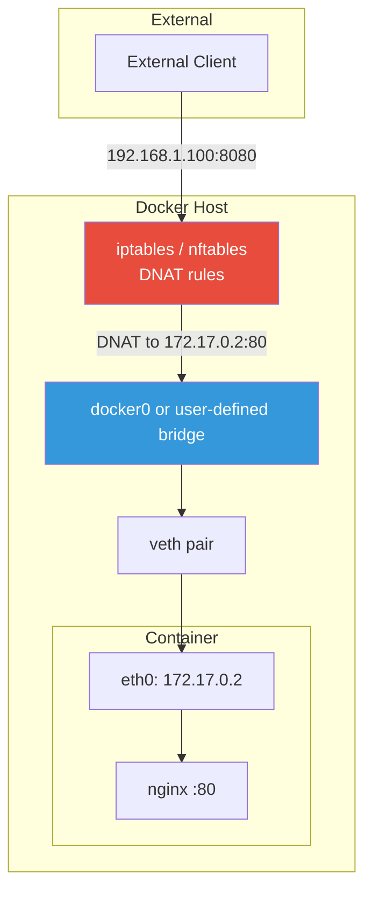
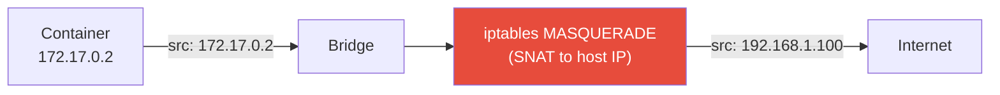
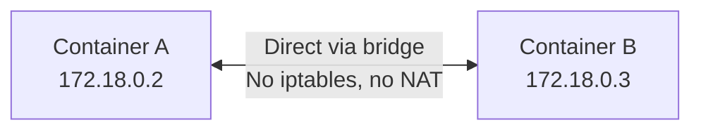
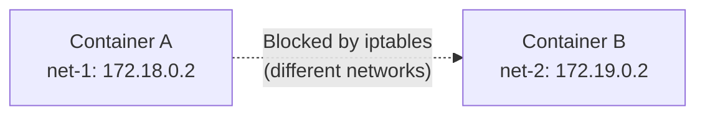

# Port Publishing & Traffic Flow

[← Back to Section Index](./README.md) · [← Main Index](../README.md) · [Previous: DNS & Service Discovery](./05-dns-and-service-discovery.md)

---

## Port Publishing

By default, container ports are only accessible from the same Docker network. To make them reachable from outside, you publish ports.

```bash
# Publish host:container
docker run -d -p 8080:80 nginx

# Bind to specific host interface
docker run -d -p 127.0.0.1:8080:80 nginx

# Random host port for all EXPOSE ports
docker run -d -P nginx

# UDP port
docker run -d -p 8080:80/udp myapp

# Multiple ports
docker run -d -p 8080:80 -p 8443:443 nginx

# Check published ports
docker port my-container
```

### `-p` Flag Syntax

| Syntax | Meaning |
|--------|---------|
| `-p 8080:80` | Host port 8080 → container port 80. Accessible on all host IPs. |
| `-p 127.0.0.1:8080:80` | Only accessible on localhost |
| `-p 8080:80/udp` | UDP port mapping |
| `-p 8080:80/tcp -p 8080:80/udp` | Both TCP and UDP |
| `-P` | Publish all EXPOSE'd ports to random host ports |

### Default Host Binding

When no host address is specified (e.g., `-p 8080:80`), the default is to bind on **all host addresses** (IPv4 and IPv6).

You can change this default per-network:

```bash
# Create bridge where published ports only bind to a specific IP
docker network create \
  --opt com.docker.network.bridge.host_binding_ipv4=192.168.1.100 \
  my-net
```

---

## Traffic Flow — Bridge Network



### Outbound Traffic (container to internet)



- Docker uses **IP masquerading** (SNAT) for outbound traffic
- External servers see the Docker host's IP, not the container's IP
- Enabled by default (`com.docker.network.bridge.enable_ip_masquerade=true`)

### Inbound Traffic (external to container)

1. Client sends request to `host-ip:published-port`
2. iptables **DNAT** rule rewrites destination to `container-ip:container-port`
3. Packet is forwarded to the bridge, then to the container via veth pair
4. Response follows the reverse path (masquerade handles return traffic)

---

## Container-to-Container Traffic

### Same Bridge Network



- Packets go directly through the bridge — no NAT, no iptables rules
- All ports are accessible (no need to publish)
- On user-defined bridges: DNS resolution by name works

### Different Bridge Networks



- Docker installs iptables rules to **block** cross-bridge traffic
- Containers must use published ports to communicate across networks
- Or: connect a container to both networks (`docker network connect`)

---

## Swarm Publishing Modes

| Mode | Flag | Behavior |
|------|------|----------|
| **Ingress** (default) | `-p 8080:80` or `--publish published=8080,target=80` | Port available on every Swarm node; routing mesh distributes to tasks |
| **Host** | `--publish mode=host,published=8080,target=80` | Port only available on nodes running a task; no load balancing |

```bash
# Ingress mode (default)
docker service create --name web -p 8080:80 nginx

# Host mode — bypass routing mesh
docker service create --name web \
  --publish mode=host,target=80,published=8080 \
  nginx
```

---

## Network Commands Reference

```bash
# List all networks
docker network ls

# Create networks
docker network create my-net
docker network create --driver bridge --subnet 172.20.0.0/16 --gateway 172.20.0.1 my-net
docker network create --driver overlay --attachable my-overlay
docker network create --internal backend-only

# Connect / disconnect running containers
docker network connect my-net my-container
docker network connect --ip 172.20.0.50 my-net my-container
docker network disconnect my-net my-container

# Inspect
docker network inspect my-net
docker network inspect my-net --format '{{range .Containers}}{{.Name}}: {{.IPv4Address}}{{"\n"}}{{end}}'

# Run on specific network
docker run -d --name web --network my-net nginx

# Run on multiple networks
docker run -d --name web --network frontend nginx
docker network connect backend web

# Clean up
docker network rm my-net
docker network prune
```

---

## Troubleshooting Network Issues

```bash
# Check container's network config
docker exec my-container ip addr
docker exec my-container cat /etc/resolv.conf
docker exec my-container ip route

# Test DNS resolution
docker exec my-container nslookup other-container

# Test connectivity
docker exec my-container ping other-container
docker exec my-container curl http://other-container:8080

# Inspect network — see connected containers and their IPs
docker network inspect my-net

# Check iptables rules (on host)
sudo iptables -t nat -L -n
sudo iptables -L DOCKER -n
```

---

[← Back to Section Index](./README.md) · [← Main Index](../README.md) · [Previous: DNS & Service Discovery](./05-dns-and-service-discovery.md)
