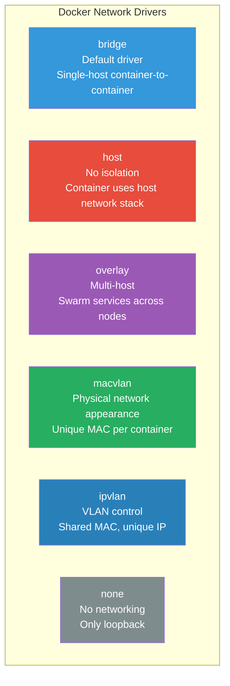

# Domain 4: Networking (15% of Exam)

[← Back to Main Index](../README.md) · [Previous: Installation & Configuration](../05-installation-configuration.md)

---

Container networking allows containers to communicate with each other, with the Docker host, and with external networks. Docker's networking subsystem is pluggable, using drivers that implement different network topologies.

## Network Drivers Overview



| Driver | Scope | Use Case |
|--------|-------|----------|
| **bridge** | Single host | Default; standalone containers communicating on the same host |
| **host** | Single host | Maximum performance; no NAT overhead; container binds directly to host ports |
| **overlay** | Multi-host | Swarm services communicating across nodes; uses VXLAN encapsulation |
| **macvlan** | Single host | Containers that need to appear as physical devices on the network (unique MAC) |
| **ipvlan** | Single host | Like macvlan but shares the host MAC; use when MAC address count is limited |
| **none** | Single host | Complete network isolation; only loopback interface |

## Pages in This Section

| # | Page | Description |
|---|------|-------------|
| 01 | [Container Network Model (CNM)](./01-container-network-model.md) | Sandbox, Endpoint, Network, libnetwork, CNM vs CNI, lifecycle |
| 02 | [Bridge Networks](./02-bridge-networks.md) | Default vs user-defined bridge, DNS resolution, isolation, inter-container communication |
| 03 | [Overlay Networks & Swarm Networking](./03-overlay-networks.md) | VXLAN, overlay creation, attachable, encrypted, routing mesh, Swarm ports |
| 04 | [Host, Macvlan, IPvlan & None](./04-host-macvlan-ipvlan-none.md) | Host driver, macvlan, ipvlan (L2/L3), none driver, use cases |
| 05 | [DNS & Service Discovery](./05-dns-and-service-discovery.md) | Embedded DNS, resolver behavior, --dns flags, Swarm service discovery, VIP vs DNSRR |
| 06 | [Port Publishing & Traffic Flow](./06-port-publishing-and-traffic-flow.md) | Port publishing modes, iptables, traffic flow, network commands |

---

## Quick Navigation


> Start with the CNM to understand the architecture, then bridge networks (the most common driver), then work through the other drivers, DNS, and port publishing.

## Quick Reference — Network Commands

```bash
# List networks
docker network ls

# Create a user-defined bridge
docker network create my-network

# Create with specific subnet
docker network create --driver bridge --subnet 172.20.0.0/16 my-network

# Connect / disconnect a running container
docker network connect my-network my-container
docker network disconnect my-network my-container

# Inspect a network
docker network inspect my-network

# Run container on a specific network
docker run -d --name web --network my-network nginx

# Remove / prune
docker network rm my-network
docker network prune
```

---

**Sources**: [Docker Networking Overview](https://docs.docker.com/engine/network/), [Network Drivers](https://docs.docker.com/engine/network/drivers/), [libnetwork CNM Design](https://github.com/moby/libnetwork/blob/master/docs/design.md). Content was rephrased for compliance with licensing restrictions.

---

[← Back to Main Index](../README.md) · [Next: Security →](../07-security.md)
