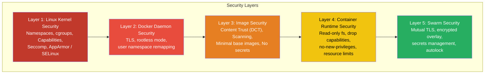
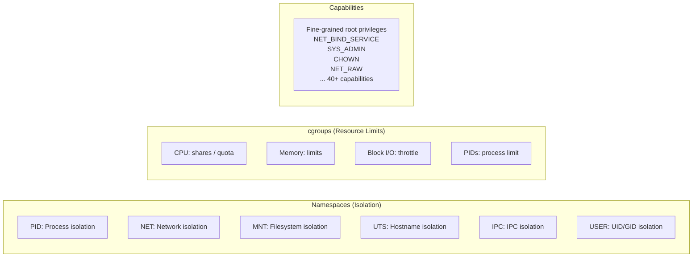
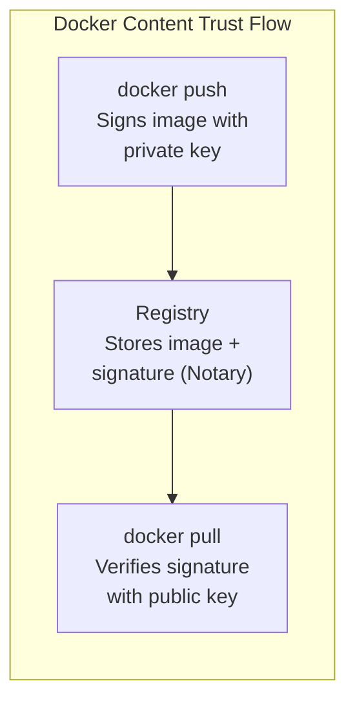
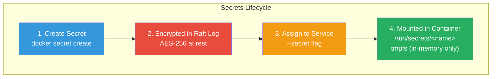
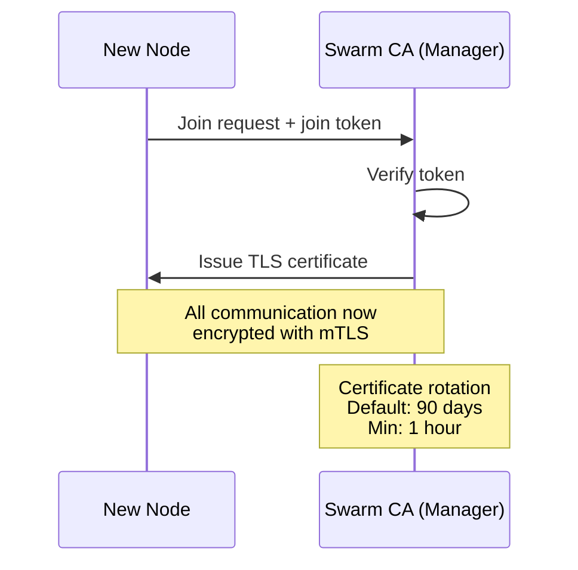

# Domain 5: Security (15% of Exam)

[← Back to Index](./README.md) · [Previous: Networking](./06-networking.md)

---

## Docker Security — Defense in Depth



---

## Linux Security Features



### Linux Capabilities

Docker drops many capabilities by default. Key ones:

| Capability | What It Allows |
|-----------|---------------|
| `NET_BIND_SERVICE` | Bind to ports < 1024 |
| `SYS_ADMIN` | Broad admin (mount, sethostname, etc.) — **dangerous** |
| `CHOWN` | Change file ownership |
| `NET_RAW` | Raw sockets (ping, etc.) |
| `SETUID` / `SETGID` | Change UID/GID |
| `MKNOD` | Create device files |

---

## Container Security Best Practices

```bash
# 1. Run as non-root user
docker run --user 1000:1000 nginx

# 2. Read-only filesystem
docker run --read-only nginx

# 3. Drop ALL capabilities, add only what's needed
docker run --cap-drop ALL --cap-add NET_BIND_SERVICE nginx

# 4. Prevent privilege escalation
docker run --security-opt no-new-privileges nginx

# 5. Limit resources (prevent DoS)
docker run --memory=512m --cpus=1.0 nginx

# 6. Use seccomp profile
docker run --security-opt seccomp=/path/to/profile.json nginx

# 7. Limit PIDs (prevent fork bombs)
docker run --pids-limit 100 nginx

# 8. Read-only with writable tmpfs for needed dirs
docker run --read-only --tmpfs /tmp --tmpfs /var/run nginx
```

---

## Docker Content Trust (DCT)



```bash
# Enable DCT
export DOCKER_CONTENT_TRUST=1

# Push signed image
docker push myregistry/myimage:1.0

# Pull (verifies signature when DCT enabled)
docker pull myregistry/myimage:1.0

# Disable for a single operation
DOCKER_CONTENT_TRUST=0 docker pull unsigned-image
```

- Uses **Notary** for signature management
- Root key + repository key model
- Prevents pulling tampered or unsigned images

---

## Docker Secrets (Swarm Only)



```bash
# Create secret from stdin
echo "my_password" | docker secret create db_password -

# Create from file
docker secret create ssl_cert ./server.crt

# List secrets
docker secret ls

# Use in a service
docker service create --name web --secret db_password nginx
# Inside container: cat /run/secrets/db_password

# Inspect metadata (value NOT shown)
docker secret inspect db_password

# Remove
docker secret rm db_password
```

### Secret Properties

- Encrypted at rest in Raft log (AES-256-GCM)
- Transmitted over mTLS connections
- Mounted as tmpfs (RAM-only) at `/run/secrets/<name>`
- Only accessible to services explicitly granted access
- Max size: 500 KB

---

## Docker Configs (Swarm Only)

```bash
# Create a config
docker config create nginx_conf ./nginx.conf

# Use in service
docker service create --name web \
  --config source=nginx_conf,target=/etc/nginx/nginx.conf \
  nginx

# List configs
docker config ls

# Remove
docker config rm nginx_conf
```

### Secrets vs Configs

| | Secrets | Configs |
|---|---------|---------|
| **Encrypted at rest** | ✅ Yes | ❌ No |
| **Mounted as** | tmpfs (in-memory) | Regular file |
| **Max size** | 500 KB | 500 KB |
| **Use for** | Passwords, keys, certificates | Config files, scripts |

---

## Swarm Mutual TLS (mTLS)



```bash
# View current certificate expiry
docker system info | grep "Expiry Duration"

# Change certificate rotation period
docker swarm update --cert-expiry 48h

# Use external CA
docker swarm init --external-ca protocol=cfssl,url=https://ca.example.com
```

### mTLS in Swarm

- **Automatic** — no manual certificate management
- Each node gets a TLS certificate signed by the Swarm CA
- Certificates identify the node's **role** (manager/worker) and **ID**
- All inter-node communication is encrypted
- Certificates rotate automatically (default: 90 days)

---

## Securing the Docker Daemon

```bash
# Protect the socket
# Default: unix:///var/run/docker.sock (local only)

# Remote access with TLS (daemon.json)
# {
#   "tls": true,
#   "tlscacert": "/etc/docker/ca.pem",
#   "tlscert": "/etc/docker/server-cert.pem",
#   "tlskey": "/etc/docker/server-key.pem",
#   "hosts": ["unix:///var/run/docker.sock", "tcp://0.0.0.0:2376"]
# }

# Client connects with:
docker --tlsverify \
  --tlscacert=ca.pem \
  --tlscert=cert.pem \
  --tlskey=key.pem \
  -H=tcp://host:2376 ps
```

> **Warning:** Never expose the Docker socket over TCP without TLS. Socket access = **root access** to the host.

---

## Image Security Scanning

```bash
# Docker Scout (built-in scanning)
docker scout cves myimage:1.0
docker scout quickview myimage:1.0
```

### Image Security Best Practices

1. Use **minimal base images** (alpine, distroless, scratch)
2. **Don't store secrets** in images (use build args or secrets)
3. Use **specific tags**, not `:latest`
4. Scan images for **vulnerabilities** before deploying
5. Use **multi-stage builds** to exclude build tools
6. Set `USER` to run as **non-root**
7. Enable **Docker Content Trust**

---

[← Back to Index](./README.md) · [Next: Storage & Volumes →](./08-storage-volumes.md)
