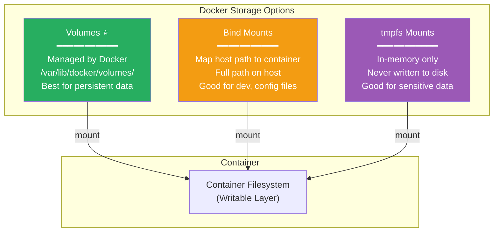
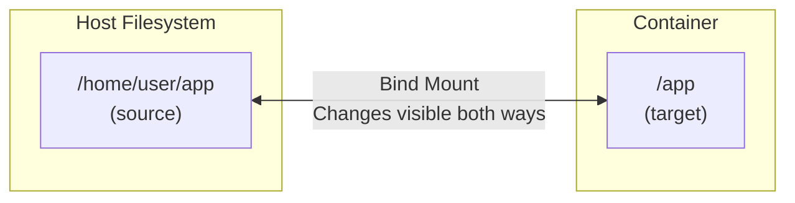
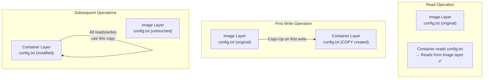
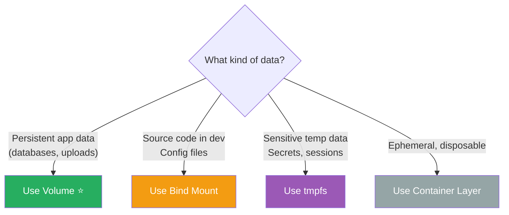

# Domain 6: Storage & Volumes (10% of Exam)

[← Back to Index](./README.md) · [Previous: Security](./07-security.md)

---

## Storage Types Overview



---

## Volumes vs Bind Mounts vs tmpfs

| Feature | Volume | Bind Mount | tmpfs |
|---------|--------|-----------|-------|
| **Location** | `/var/lib/docker/volumes/` | Anywhere on host | Memory (RAM) |
| **Managed by Docker** | ✅ Yes | ❌ No | N/A |
| **Pre-populate from image** | ✅ Yes | ❌ No | ❌ No |
| **Volume drivers** | ✅ (NFS, cloud, etc.) | ❌ No | N/A |
| **Cross-platform** | ✅ Linux + Mac + Win | ✅ Yes | ❌ Linux only |
| **Share between containers** | ✅ Yes | ✅ Yes | ❌ No |
| **Persists after container removed** | ✅ Yes | ✅ Yes | ❌ No |
| **Performance** | Good | Host-native | Fastest |

> **Best practice:** Use **volumes** for persistent data. Use **bind mounts** for development and config files. Use **tmpfs** for sensitive temporary data.

---

## Volume Commands

```bash
# Create a named volume
docker volume create my-data

# List volumes
docker volume ls

# Inspect a volume
docker volume inspect my-data

# Remove a volume
docker volume rm my-data

# Prune all unused volumes
docker volume prune
```

---

## Using Volumes

### `-v` syntax (short form)

```bash
# Named volume
docker run -d --name db -v my-data:/var/lib/mysql mysql:8

# Anonymous volume
docker run -d -v /var/lib/mysql mysql:8
```

### `--mount` syntax (explicit, preferred)

```bash
# Named volume
docker run -d --name db \
  --mount type=volume,source=my-data,target=/var/lib/mysql \
  mysql:8

# Read-only volume
docker run -d \
  --mount type=volume,source=my-data,target=/data,readonly \
  nginx
```

### `-v` vs `--mount`

| | `-v` / `--volume` | `--mount` |
|---|-------------------|-----------|
| **Syntax** | Compact | Verbose, explicit |
| **Missing host dir** | Auto-creates | **Error** (bind mount) |
| **Recommended** | Quick use | Production, clarity |

> **Exam tip:** `--mount` is preferred for its explicit syntax and because it **errors on missing source** for bind mounts instead of silently creating a directory.

---

## Bind Mounts

```bash
# Bind mount with -v
docker run -d -v /host/path:/container/path nginx

# Bind mount with --mount (preferred)
docker run -d \
  --mount type=bind,source=/host/path,target=/container/path \
  nginx

# Read-only bind mount
docker run -d \
  --mount type=bind,source=/host/path,target=/container/path,readonly \
  nginx
```

### Bind Mount Behavior



- Changes on host are **immediately visible** in container and vice versa
- If target dir in container has existing content, it gets **obscured** (not deleted) by the bind mount
- Host path must be an **absolute path**

---

## tmpfs Mounts

```bash
# tmpfs mount
docker run -d \
  --mount type=tmpfs,target=/app/temp,tmpfs-size=100m \
  myapp

# Short form
docker run -d --tmpfs /app/temp myapp
```

- Stored in **host memory only** — never written to disk
- Removed when container stops
- Good for secrets, session data, temporary files
- **Linux only**

---

## Copy-on-Write (CoW) Strategy



1. Container **reads** from image layers (no copy)
2. On **first write**, the file is **copied up** to the writable layer
3. All subsequent reads/writes use the **container's copy**
4. Original image layer stays **unchanged**

> CoW is why container writes are slower than volume writes. For write-heavy workloads, always use **volumes**.

---

## Volumes in Swarm

```bash
# Service with named volume
docker service create --name db \
  --mount type=volume,source=db-data,target=/var/lib/mysql \
  mysql:8
```

### Volume Drivers for Shared Storage

```bash
# NFS volume
docker volume create --driver local \
  --opt type=nfs \
  --opt o=addr=192.168.1.100,rw \
  --opt device=:/path/to/dir \
  nfs-volume

# Use third-party drivers: REX-Ray, Portworx, etc.
```

> **Swarm caveat:** Volumes are **local to each node**. If a task moves to a different node, the data won't follow unless you use a shared storage driver (NFS, cloud volumes, etc.).

---

## VOLUME Instruction in Dockerfile

```dockerfile
# Creates an anonymous volume at the specified path
VOLUME /var/lib/mysql
```

- Creates a mount point and marks it as externally mounted
- If no volume is explicitly provided at `docker run`, Docker creates an **anonymous volume**
- Cannot specify the source (host path or named volume) in Dockerfile — that's done at runtime

---

## Storage Summary



---

[← Back to Index](./README.md) · [Next: Docker Compose →](./09-docker-compose.md)
