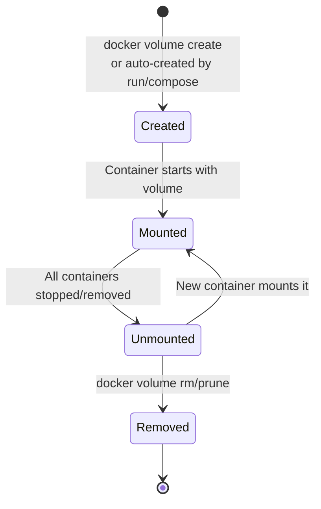
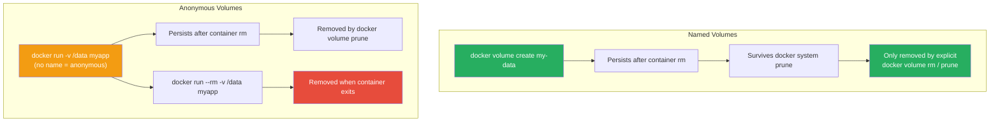
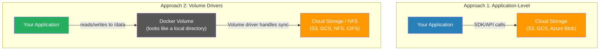
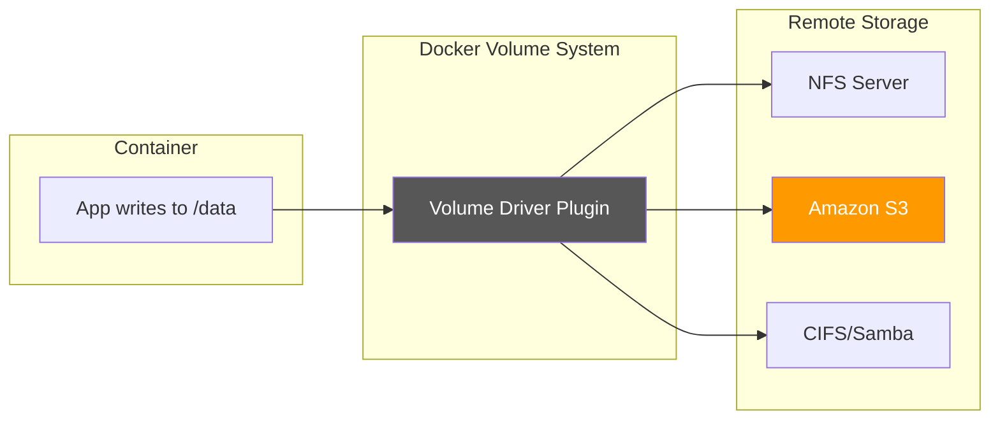

# Volumes

[← Back to Section Index](./README.md) · [← Main Index](../README.md)

---

## Volume Commands

```bash
# Create a named volume
docker volume create my-data

# List volumes
docker volume ls

# Inspect a volume
docker volume inspect my-data

# Remove a volume
docker volume rm my-data

# Prune all unused volumes (not mounted by any container)
docker volume prune
```

---

## Volume Lifecycle

A volume exists **independently** of any container. Understanding this lifecycle is key to managing persistent data.



| State | Description | Data persists? |
|-------|-------------|---------------|
| **Created** | Volume exists on disk at `/var/lib/docker/volumes/<name>/_data`. No container is using it. | ✅ Yes |
| **Mounted** | One or more running containers have the volume mounted. Reads and writes are active. | ✅ Yes |
| **Unmounted** | All containers using it have stopped or been removed. Volume and its data still exist. | ✅ Yes |
| **Removed** | Volume has been explicitly deleted. Data is gone permanently. | ❌ No |

### Key Lifecycle Rules



- **Volumes outlive containers** — removing a container does NOT remove its volumes (unless `--rm` + anonymous)
- **Named volumes** are never auto-removed — you must explicitly `docker volume rm` or `docker volume prune`
- **Anonymous volumes** persist after `docker rm` but are cleaned up by `docker volume prune`
- **Anonymous volumes with `--rm`** are the exception — they are deleted when the container exits
- **Volume removal requires unmounting first** — you cannot remove a volume that is currently mounted by a running container
- **`docker system prune` does NOT remove volumes** — you need `docker volume prune` separately, or `docker system prune --volumes`
- **Multiple containers can mount the same volume simultaneously** — useful for sharing data, but you must manage concurrent writes yourself

```bash
# Lifecycle in action
docker volume create app-data                     # Created
docker run -d -v app-data:/data --name c1 myapp   # Mounted by c1
docker run -d -v app-data:/data --name c2 myapp   # Mounted by c1 AND c2
docker rm -f c1                                    # Still mounted by c2, data safe
docker rm -f c2                                    # Unmounted, data still on disk
docker volume ls                                   # app-data still listed
docker volume rm app-data                          # Removed, data gone
```

---

## Using Volumes

### `-v` syntax (short form)

```bash
# Named volume
docker run -d --name db -v my-data:/var/lib/mysql mysql:8

# Anonymous volume
docker run -d -v /var/lib/mysql mysql:8
```

### `--mount` syntax (explicit, preferred)

```bash
# Named volume
docker run -d --name db \
  --mount type=volume,source=my-data,target=/var/lib/mysql \
  mysql:8

# Read-only volume
docker run -d \
  --mount type=volume,source=my-data,target=/data,readonly \
  nginx
```

### `-v` vs `--mount`

| | `-v` / `--volume` | `--mount` |
|---|-------------------|-----------|
| **Syntax** | Compact, colon-separated | Verbose, key=value pairs |
| **Non-existent volume** | Auto-creates | Auto-creates (same behavior) |
| **Volume driver options** | ❌ Not supported | ✅ `volume-opt` key |
| **Volume subpath** | ❌ Not supported | ✅ `volume-subpath` key |
| **Swarm services** | ❌ Not for all options | ✅ Required for Swarm services |
| **Recommended** | Quick use, scripts | Production, clarity |

> **Exam tip:** `--mount` is preferred for its explicit syntax. It is **required** for volume driver options, volume subpaths, and mounting volumes into Swarm services. For **bind mounts**, `--mount` also has the advantage of erroring on a missing source directory instead of silently creating it (see [Bind Mounts](./02-bind-mounts.md)).

---

## Volume Pre-Population (Copy Behavior)

When you mount an **empty volume** into a container directory that already contains files, Docker copies those files into the volume. This is useful for pre-populating data:

```bash
# nginx image has files in /usr/share/nginx/html
# Mounting an empty volume here copies the default HTML into the volume
docker run -d \
  --mount type=volume,source=nginx-content,target=/usr/share/nginx/html \
  nginx
```

To prevent this copy behavior, use `volume-nocopy`:

```bash
docker run -d \
  --mount type=volume,source=my-vol,target=/data,volume-nocopy \
  myapp
```

> If you mount a **non-empty volume** into a container directory that has existing files, the container's files are **obscured** (not deleted) by the volume content.

---

## Volume Subpath

Mount a subdirectory within a volume instead of the entire volume. The subdirectory must exist in the volume before mounting:

```bash
# Create volume and initialize subdirectories
docker volume create logs

# Create subdirectories (via a helper container)
docker run --rm -v logs:/logs busybox mkdir -p /logs/app1 /logs/app2

# Mount only app1's subdirectory
docker run -d \
  --mount type=volume,source=logs,target=/var/log/app,volume-subpath=app1 \
  myapp1

# Mount only app2's subdirectory
docker run -d \
  --mount type=volume,source=logs,target=/var/log/app,volume-subpath=app2 \
  myapp2
```

---

## Anonymous Volumes and Cleanup

```bash
# Anonymous volume — Docker generates a random name
docker run -d -v /data myapp

# Anonymous volume removed automatically when container exits (--rm flag)
docker run --rm -v /data myapp

# Named volumes are NOT removed by --rm
docker run --rm -v my-data:/data myapp
# → my-data volume persists
```

> Without `--rm`, anonymous volumes persist after `docker rm` and accumulate. Use `docker volume prune` to clean them up.

---

## Volumes in Swarm

```bash
# Service with named volume — each replica gets its own local volume
docker service create --name db \
  --mount type=volume,source=db-data,target=/var/lib/mysql \
  mysql:8
```

> **Important:** With the default `local` volume driver, each service replica uses its own volume on its node. The data is **not shared** between replicas. To share data, use a volume driver that supports shared storage.

---

## Sharing Data Between Machines

By default, Docker volumes are **local to a single host** — they live at `/var/lib/docker/volumes/` on the machine where Docker runs. For fault-tolerant applications where multiple replicas on different nodes need access to the same files, the official docs describe two approaches:



| Approach | How It Works | Pros | Cons |
|----------|-------------|------|------|
| **Application-level** | App uses AWS SDK, GCS client, etc. to read/write cloud storage directly | Full control, no extra dependencies | Requires code changes, app is cloud-aware |
| **Volume driver** | Docker mounts cloud/remote storage as a local volume via a plugin. App just reads/writes files. | No code changes, transparent to app | Extra plugin dependency, performance varies by driver |

### How Volume Drivers Work

Volume drivers let you **abstract the underlying storage** from your application logic. Your app writes to `/data` as if it were a local directory, and the driver handles syncing to NFS, S3, or other backends.



This means you can switch storage backends (e.g., from NFS to S3) by changing the volume driver — without modifying your application code.

### NFS Volumes (using the built-in `local` driver)

NFS doesn't require any third-party plugin — the built-in `local` driver supports it natively by forwarding mount options to the Linux `mount` syscall:

```bash
# NFSv3
docker volume create --driver local \
  --opt type=nfs \
  --opt o=addr=192.168.1.100,rw \
  --opt device=:/path/to/dir \
  nfs-volume

# NFSv4
docker volume create --driver local \
  --opt type=nfs \
  --opt o=addr=192.168.1.100,rw,nfsvers=4 \
  --opt device=:/path/to/dir \
  nfs4-volume

# Create NFS volume inline when creating a Swarm service
docker service create --name web \
  --mount 'type=volume,source=nfs-data,target=/data,volume-driver=local,volume-opt=type=nfs,volume-opt=o=addr=10.0.0.10,volume-opt=device=:/var/docker-nfs' \
  nginx
```

### CIFS/Samba Volumes (using the built-in `local` driver)

```bash
# Mount a Samba share directly — no host mount point needed
docker volume create --driver local \
  --opt type=cifs \
  --opt device=//192.168.1.100/share \
  --opt o=addr=192.168.1.100,username=user,password=pass \
  cifs-volume
```

> The `addr` option is required if you specify a hostname instead of an IP — it lets Docker perform the hostname lookup.

### Cloud Storage Volumes (S3, GCS, etc. via rclone)

For cloud object storage like **Amazon S3**, you need a third-party volume driver. The official Docker docs use [rclone/docker-volume-rclone](https://rclone.org/docker/) as the example. rclone supports 70+ storage backends including S3, Google Cloud Storage, Azure Blob, Backblaze B2, and more.

```bash
# 1. Install the rclone volume plugin on the Docker host
docker plugin install rclone/docker-volume-rclone args="-v" --alias rclone --grant-all-permissions

# 2. Create a volume backed by S3
#    (rclone must be configured with your S3 credentials — see below)
docker volume create --driver rclone \
  --opt remote=my-s3-remote:my-bucket/path \
  s3-volume

# 3. Use it like any other volume
docker run -d \
  --mount type=volume,source=s3-volume,target=/data,volume-driver=rclone \
  myapp

# 4. Or create the volume inline when starting a container
docker run -d \
  --mount type=volume,volume-driver=rclone,source=s3-vol,target=/data,volume-opt=remote=my-s3-remote:my-bucket \
  myapp
```

#### Setting up rclone with S3 credentials

The rclone plugin reads its configuration from `/var/lib/docker-plugins/rclone/config/rclone.conf` (or plugin-specific paths). You need to configure a "remote" that points to your S3 bucket:

```ini
# /var/lib/docker-plugins/rclone/config/rclone.conf
[my-s3-remote]
type = s3
provider = AWS
access_key_id = YOUR_ACCESS_KEY
secret_access_key = YOUR_SECRET_KEY
region = us-east-1
```

> You can also use IAM roles on EC2 instances instead of hardcoding credentials — rclone picks up the instance profile automatically when no keys are set.

### Volume Driver Comparison

| Driver | Backend | Built-in? | Use Case |
|--------|---------|-----------|----------|
| **local** (default) | Host filesystem | ✅ Yes | Single-host volumes |
| **local** + NFS opts | NFS server | ✅ Yes | Shared storage across Swarm nodes |
| **local** + CIFS opts | Samba/CIFS share | ✅ Yes | Windows file shares |
| **rclone** | S3, GCS, Azure, B2, 70+ backends | ❌ Plugin | Cloud-backed volumes |
| **Portworx** | Distributed block storage | ❌ Plugin | Production Kubernetes/Swarm storage |

> **Key rule from the official docs**: If the volume driver requires options, you **must use `--mount`**, not `-v`. The `-v` syntax doesn't support `volume-opt`.

> **Swarm caveat:** With the default `local` driver, each service replica creates its own independent volume on its node. If a task moves to a different node, the data won't follow. Use NFS, CIFS, or a cloud-backed driver to share data across nodes.

---

## Volume Backup, Restore, and Migration

### Back Up a Volume

```bash
# Create a helper container that mounts the volume and tars it
docker run --rm \
  -v my-data:/source:ro \
  -v $(pwd):/backup \
  busybox tar czf /backup/my-data-backup.tar.gz -C /source .
```

### Restore a Volume

```bash
# Create a new volume and restore from backup
docker volume create my-data-restored

docker run --rm \
  -v my-data-restored:/target \
  -v $(pwd):/backup:ro \
  busybox tar xzf /backup/my-data-backup.tar.gz -C /target
```

---

## VOLUME Instruction in Dockerfile

```dockerfile
# Creates an anonymous volume at the specified path
VOLUME /var/lib/mysql

# Multiple volumes
VOLUME ["/var/lib/mysql", "/var/log/mysql"]
```

- Creates a mount point and marks it as externally mounted
- If no volume is explicitly provided at `docker run`, Docker creates an **anonymous volume**
- Cannot specify the source (host path or named volume) in Dockerfile — that's done at runtime
- With `--rm`, the anonymous volume created by VOLUME is **automatically removed** when the container exits

---

[← Back to Section Index](./README.md) · [← Main Index](../README.md) · [Next: Bind Mounts →](./02-bind-mounts.md)
