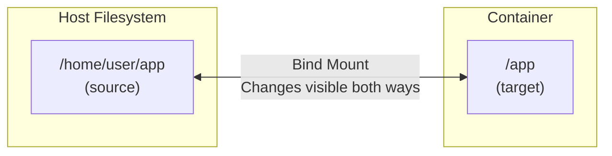

# Bind Mounts

[← Back to Section Index](./README.md) · [← Main Index](../README.md) · [Previous: Volumes](./01-volumes.md)

---

## Usage

```bash
# Bind mount with -v
docker run -d -v /host/path:/container/path nginx

# Bind mount with --mount (preferred)
docker run -d \
  --mount type=bind,source=/host/path,target=/container/path \
  nginx

# Read-only bind mount
docker run -d \
  --mount type=bind,source=/host/path,target=/container/path,readonly \
  nginx

# Auto-create source directory on host if it doesn't exist
docker run -d \
  --mount type=bind,source=/host/path,target=/container/path,bind-create-src \
  nginx
```

---

## Bind Mount Behavior



- Changes on host are **immediately visible** in container and vice versa
- If target dir in container has existing content, it gets **obscured** (not deleted) by the bind mount
- Source can be an **absolute or relative path** with `--mount`
- With `-v`, Docker auto-creates a missing host directory; with `--mount`, it **errors** (unless `bind-create-src` is set)
- Bind mounts are created on the **Docker daemon host**, not the client — relevant when using a remote Docker daemon

> **Security warning:** Bind mounts give the container write access to host files by default. A container process can modify or delete important system files. Use `readonly` to limit this.

---

## Bind Propagation

Bind propagation controls whether mounts created within a bind mount are visible to replicas of that mount. This is an advanced Linux-only feature.

| Propagation | Behavior |
|-------------|----------|
| **`rprivate`** (default) | No propagation — sub-mounts are private in both directions |
| **`private`** | Same as rprivate but non-recursive |
| **`rshared`** | Sub-mounts propagate in both directions (original ↔ replica), recursively |
| **`shared`** | Same as rshared but non-recursive |
| **`rslave`** | Sub-mounts propagate one direction only (original → replica), recursively |
| **`slave`** | Same as rslave but non-recursive |

```bash
# Set bind propagation
docker run -d \
  --mount type=bind,source=/host/path,target=/container/path,bind-propagation=rslave \
  myapp

# With -v syntax (third field)
docker run -d -v /host/path:/container/path:rslave myapp
```

> Bind propagation **does not work with Docker Desktop**. It only works on native Linux hosts where the host filesystem supports it.

---

## SELinux Labeling (`:z` and `:Z`)

On SELinux-enabled systems (RHEL, Fedora, CentOS), bind mounts require relabeling so the container can access the files:

```bash
# :z — shared label (multiple containers can access)
docker run -d -v /host/data:/data:z myapp

# :Z — private label (only this container can access)
docker run -d -v /host/data:/data:Z myapp
```

> ⚠️ **Warning:** Using `:Z` on system directories like `/home` or `/usr` can render the host inoperable. SELinux labels `:z` and `:Z` are **ignored** when used with Swarm services.

---

[← Back to Section Index](./README.md) · [← Main Index](../README.md) · [Previous: Volumes](./01-volumes.md) · [Next: Volumes vs Bind Mounts →](./03-volumes-vs-bind-mounts.md)
