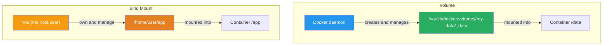
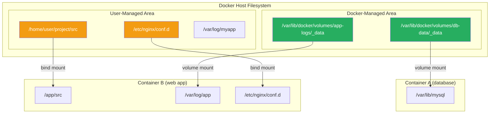
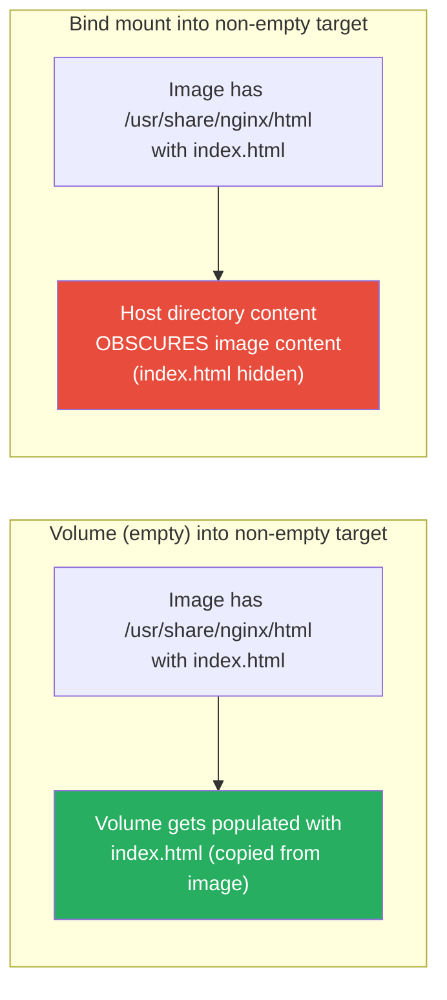
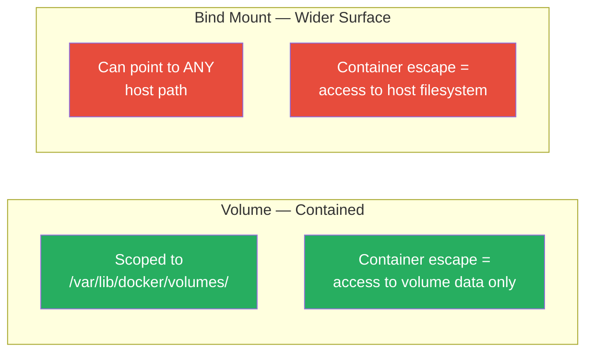
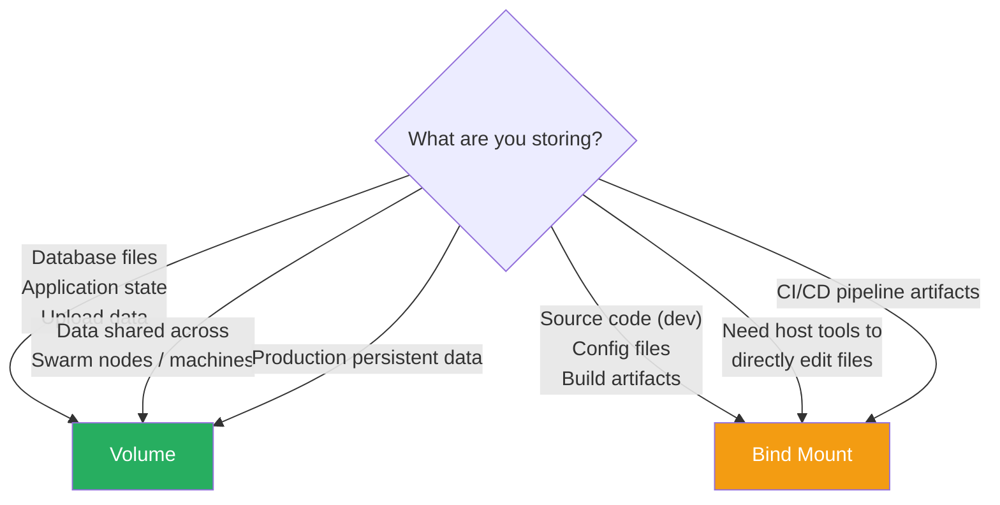

# Volumes vs Bind Mounts — Detailed Comparison

[← Back to Section Index](./README.md) · [← Main Index](../README.md) · [Volumes](./01-volumes.md) · [Bind Mounts](./02-bind-mounts.md)

---

## The Core Difference

The fundamental distinction is **who manages the storage location**.



- **Volume** = "Docker, give me a place to store data. I don't care where it lives on the host."
- **Bind mount** = "Docker, take **this specific folder** from my host and make it visible inside the container."

---

## Side-by-Side Comparison

| Aspect | Volume | Bind Mount |
|--------|--------|-----------|
| **Storage location** | `/var/lib/docker/volumes/<name>/_data` | Anywhere on the host you choose |
| **Who manages it** | Docker daemon | You (the host user / admin) |
| **Created by** | `docker volume create` or auto-created at `docker run` | Must exist on host (or auto-created by `-v`) |
| **Host access** | Not meant to be accessed directly from host | Full direct access from host |
| **Container access** | Via mount at a target path | Via mount at a target path |
| **Portable** | ✅ Yes — same Docker commands work everywhere | ❌ No — tied to specific host directory structure |
| **Pre-populate from image** | ✅ Yes — copies image content into empty volume | ❌ No — host content obscures image content |
| **Volume drivers** | ✅ NFS, S3, cloud backends via plugins | ❌ Not supported |
| **Backup via Docker** | ✅ `docker run --rm -v vol:/src busybox tar ...` | Just use host tools (`cp`, `tar`, `rsync`) |
| **Cleanup** | `docker volume rm` / `docker volume prune` | You delete it yourself on the host |
| **Lifecycle** | Independent of containers — persists until explicitly removed | Independent of Docker — it's just a host path |
| **Works on all platforms** | ✅ Linux, macOS, Windows | ✅ Yes, but path formats differ per OS |
| **Swarm services** | ✅ Fully supported | ✅ Supported but data is host-local |
| **Compose** | ✅ `volumes:` top-level key | ✅ Inline path mapping |
| **Performance** | Host-native filesystem speed | Host-native filesystem speed |
| **Bind propagation** | ❌ rprivate only, not configurable | ✅ Configurable (shared, slave, etc.) |
| **SELinux labeling** | Managed by Docker | Requires `:z` or `:Z` flags |

---

## Architecture — Where Data Lives



---

## Behavior Differences

### 1. What Happens When the Target Directory Has Existing Content

This is one of the most important behavioral differences:



| Scenario | Volume | Bind Mount |
|----------|--------|-----------|
| Empty mount → non-empty container dir | ✅ Container files **copied into** volume | ❌ Empty host dir **obscures** container files |
| Non-empty mount → non-empty container dir | Mount content **obscures** container files | Host content **obscures** container files |
| Non-empty mount → empty container dir | Mount content visible in container | Host content visible in container |

### 2. What Happens When the Source Doesn't Exist

| Flag | Volume behavior | Bind mount behavior |
|------|----------------|-------------------|
| `-v` | Auto-creates the volume | Auto-creates the host directory |
| `--mount` | Auto-creates the volume | **Errors** (unless `bind-create-src` is set) |

> This is one reason `--mount` is preferred — it catches typos in bind mount paths instead of silently creating empty directories.

### 3. Permissions and Ownership

```bash
# Volume: Docker creates the storage, so the daemon (root) owns it
# The container process sets permissions inside the volume
docker run -v my-data:/data myapp
# /data is owned by whatever user the container process runs as

# Bind mount: permissions come from the host
# If host dir is owned by uid 1000, container sees uid 1000
docker run -v /home/user/data:/data myapp
# /data has the same uid/gid as /home/user/data on host
```

| Aspect | Volume | Bind Mount |
|--------|--------|-----------|
| Initial owner | Root (Docker daemon) | Inherits from host path |
| Container changes ownership | ✅ Persisted in volume | ✅ Changes host path permissions |
| Rootless Docker | Docker manages uid mapping | Can cause permission mismatches |

---

## Security Comparison



| Security Aspect | Volume | Bind Mount |
|----------------|--------|-----------|
| **Attack surface** | Limited to Docker's storage area | Any mounted host path is exposed |
| **Accidental host damage** | Unlikely — volume is isolated | Possible — container can modify/delete host files |
| **Docker socket mount** | N/A | Common anti-pattern: `-v /var/run/docker.sock:/var/run/docker.sock` gives root-equivalent access |
| **Read-only** | ✅ `readonly` option | ✅ `readonly` option |
| **SELinux** | Managed by Docker | Requires manual labeling (`:z` / `:Z`) |

> **Best practice:** Don't bind mount sensitive host directories. If a container only needs to read a file, always use `readonly`.

---

## Compose Syntax

```yaml
services:
  web:
    image: nginx
    volumes:
      # Named volume (Docker-managed)
      - app-data:/usr/share/nginx/html

      # Bind mount (host path)
      - ./src:/app/src

      # Bind mount (explicit long syntax)
      - type: bind
        source: ./config/nginx.conf
        target: /etc/nginx/nginx.conf
        read_only: true

      # Volume (explicit long syntax)
      - type: volume
        source: db-data
        target: /var/lib/mysql

# Top-level volumes declaration (required for named volumes)
volumes:
  app-data:
  db-data:
```

Key Compose differences:
- Named volumes **must be declared** under the top-level `volumes:` key
- Bind mounts use **relative or absolute host paths** — no top-level declaration needed
- Short syntax: if it starts with `.` or `/`, it's a bind mount. Otherwise, it's a named volume.

---

## When to Choose Which



| Use Case | Choose | Why |
|----------|--------|-----|
| Database storage (MySQL, PostgreSQL) | **Volume** | Docker manages lifecycle, supports backup/restore, works with volume drivers for replication |
| Application uploads, user files | **Volume** | Persists independently, portable across hosts with shared drivers |
| Source code during development | **Bind mount** | Hot-reload needs instant file sync between host editor and container |
| Config files (`nginx.conf`, `.env`) | **Bind mount** | You want to edit on the host and have changes reflected immediately |
| CI build artifacts | **Bind mount** | CI pipeline needs to read outputs from the host after the container exits |
| Shared data across Swarm nodes | **Volume** (with NFS/cloud driver) | Local bind mounts don't follow tasks across nodes |
| Secrets / credentials (production) | **Neither** — use Docker secrets or tmpfs | Volumes persist to disk; bind mounts expose host paths |
| Log files | **Volume** (or logging driver) | Keeps logs independent of container lifecycle |
| Scratch / temp data | **Neither** — use tmpfs | In-memory, no disk writes, auto-cleaned |

---

## Common Patterns

### Pattern 1: Development — Bind mount source code + volume for dependencies

```bash
docker run -d \
  -v $(pwd)/src:/app/src \
  -v node_modules:/app/node_modules \
  myapp-dev
```

Bind mount `src` for hot-reload. Use a named volume for `node_modules` so the container's installed dependencies aren't overwritten by the host's (possibly empty or different) `node_modules`.

### Pattern 2: Production — Volumes for everything

```bash
docker run -d \
  --mount type=volume,source=db-data,target=/var/lib/mysql \
  --mount type=volume,source=db-logs,target=/var/log/mysql \
  mysql:8
```

No bind mounts in production. Volumes are portable, backed-up via Docker, and can use shared storage drivers.

### Pattern 3: Config injection — Bind mount single files

```bash
docker run -d \
  --mount type=bind,source=$(pwd)/nginx.conf,target=/etc/nginx/nginx.conf,readonly \
  nginx
```

Mount a single config file, not an entire directory. Use `readonly` since the container shouldn't modify the config.

---

## Summary Cheat Sheet

```
Volume                          │ Bind Mount
━━━━━━━━━━━━━━━━━━━━━━━━━━━━━━━━│━━━━━━━━━━━━━━━━━━━━━━━━━━━━━━━━
Docker manages storage          │ You manage storage
/var/lib/docker/volumes/...     │ Any host path you choose
Don't access from host directly │ Full host access (that's the point)
Pre-populates from image        │ Obscures image content
Supports volume drivers         │ No drivers (it's just a host path)
docker volume rm to clean up    │ You delete it yourself
Best for: production data       │ Best for: dev, config, build artifacts
Portable across hosts           │ Tied to host directory structure
```

---

[← Back to Section Index](./README.md) · [← Main Index](../README.md) · [Volumes](./01-volumes.md) · [Bind Mounts](./02-bind-mounts.md) · [Next: tmpfs Mounts →](./04-tmpfs-mounts.md)
