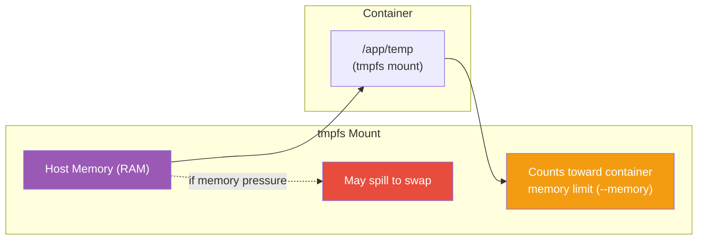

# tmpfs Mounts

[← Back to Section Index](./README.md) · [← Main Index](../README.md) · [Previous: Volumes vs Bind Mounts](./03-volumes-vs-bind-mounts.md)

---

## Usage

```bash
# tmpfs mount with --mount (preferred)
docker run -d \
  --mount type=tmpfs,target=/app/temp,tmpfs-size=100m,tmpfs-mode=1770 \
  myapp

# Short form with --tmpfs
docker run -d --tmpfs /app/temp:rw,noexec,nosuid,size=100m myapp
```

---

## Key Facts



- Stored in **host memory** — data is lost when the container stops
- **May be written to swap** — tmpfs maps to Linux kernel tmpfs, which can spill to swap if memory is under pressure. Data is not guaranteed to stay purely in RAM.
- **Counts toward the container's memory cgroup limit** (`--memory`). A large `tmpfs-size` does **not** give the container extra RAM — filling the mount can OOM-kill the container.
- **Cannot be shared** between containers
- **Linux only**
- `--tmpfs` flag **cannot be used with Swarm services** — you must use `--mount`
- If mounted into a directory with existing files, those files are **obscured**

---

## Mount Options

### With `--mount`

| Option | Description | Default |
|--------|-------------|---------|
| `tmpfs-size` | Max size in bytes | 50% of host's total RAM |
| `tmpfs-mode` | File mode in octal | `1777` (world-writable) |

### With `--tmpfs` (more options available)

| Option | Description |
|--------|-------------|
| `ro` / `rw` | Read-only or read-write (default: `rw`) |
| `nosuid` / `suid` | Honor setuid/setgid bits or not |
| `nodev` / `dev` | Allow or disallow device files |
| `noexec` / `exec` | Allow or disallow executing binaries |
| `size` | Max size (e.g., `size=64m`) |
| `mode` | File permissions (e.g., `mode=1770`) |
| `uid` / `gid` | Owner user/group ID |
| `nr_inodes` | Max number of inodes |

```bash
# Restrictive tmpfs for secrets — no exec, no suid, limited size
docker run -d --tmpfs /run/secrets:rw,noexec,nosuid,size=1m myapp
```

> **Caveat:** Setting permissions (`uid`, `gid`, `mode`) on tmpfs may **reset after container restart** in some cases.

---

[← Back to Section Index](./README.md) · [← Main Index](../README.md) · [Previous: Volumes vs Bind Mounts](./03-volumes-vs-bind-mounts.md) · [Next: Image Mounts & Named Pipes →](./05-image-mounts-and-named-pipes.md)
