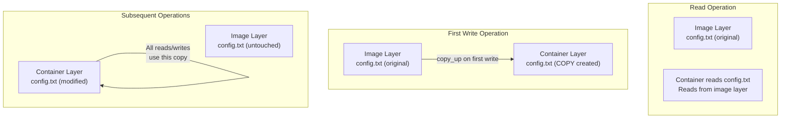
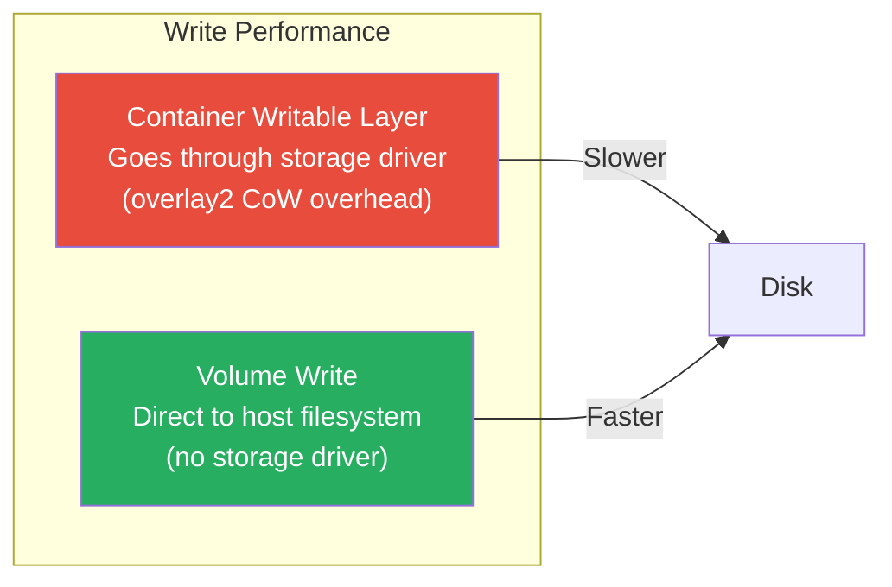
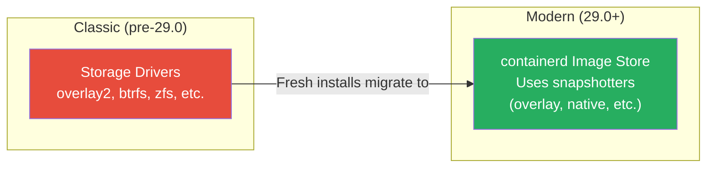
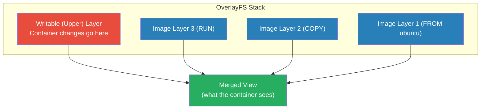

# Storage Drivers & Copy-on-Write

[← Back to Section Index](./README.md) · [← Main Index](../README.md) · [Previous: Image Mounts & Named Pipes](./05-image-mounts-and-named-pipes.md)

---

## Copy-on-Write (CoW) Strategy

Docker uses a **copy-on-write** strategy to manage image layers and the container's writable layer. This makes containers space-efficient and fast to create.



### How CoW Works (overlay2)

1. Container **reads** a file — reads directly from image layers (no copy)
2. Container **writes** to a file for the first time — `copy_up` operation:
   - Search through image layers from newest to oldest
   - Copy the first found version of the file to the writable container layer
   - Modify the copy in the writable layer
3. Subsequent reads/writes use the **container's copy**
4. Original image layer stays **unchanged**

---

## What Triggers a `copy_up`

| Action | Triggers copy_up? |
|--------|-------------------|
| Reading a file | ❌ No |
| First write to a file | ✅ Yes |
| Modifying file content | ✅ Yes (if first modification) |
| Changing file **permissions** (`chmod`) | ✅ Yes — metadata changes also trigger copy_up |
| Changing file **ownership** (`chown`) | ✅ Yes — metadata changes also trigger copy_up |
| Deleting a file | Creates a whiteout file in the writable layer |

---

## Performance Implications



- **Container writes** go through the storage driver (union filesystem abstraction) — extra overhead, especially on first write (copy_up)
- **Volume writes** bypass the storage driver entirely — write directly to the host filesystem, providing native performance
- Large files, deep directory trees, and many layers increase copy_up cost
- Each copy_up only happens **once per file** — subsequent writes to the same file are fast

> **Rule of thumb:** For write-heavy workloads (databases, logs, build artifacts), **always use volumes**. Don't store write-heavy data in the container's writable layer.

---

## Container Size

```bash
# View container size vs image size
docker ps -s

# size    = data in the container's writable layer
# virtual = size + read-only image data shared with other containers
```

Multiple containers from the same image **share all read-only layers**. The total disk used is: `SUM(writable layers) + ONE copy of the image layers`.

---

## Storage Drivers (Image Layer Management)

Storage drivers handle how image layers and the container writable layer are stored on disk. This is separate from volumes/bind mounts — storage drivers manage the **internal layer storage**.

### containerd Image Store (Default Since Engine 29.0)

Docker Engine 29.0+ uses the **containerd image store** by default for fresh installations. It replaces classic storage drivers with **snapshotters**:



> The underlying concepts (layered images, copy-on-write) are the same. The implementation changed from Docker-managed storage drivers to containerd-managed snapshotters.

### overlay2 (Most Common Classic Driver)

overlay2 is the most widely used storage driver. It uses the Linux kernel's **OverlayFS** to layer image files:



| Driver | Filesystem | Notes |
|--------|-----------|-------|
| **overlay2** | OverlayFS | Default classic driver, recommended for most Linux distros |
| **btrfs** | Btrfs | For hosts with Btrfs filesystem |
| **zfs** | ZFS | For hosts with ZFS filesystem |
| **vfs** | None (full copy) | No CoW — copies entire image per container. Slow, used for testing only |

---

[← Back to Section Index](./README.md) · [← Main Index](../README.md) · [Previous: Image Mounts & Named Pipes](./05-image-mounts-and-named-pipes.md)
