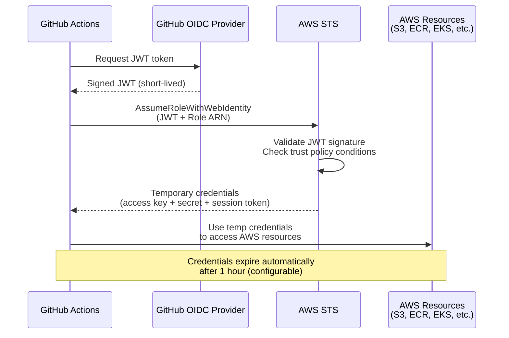
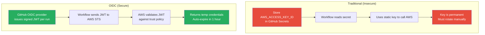
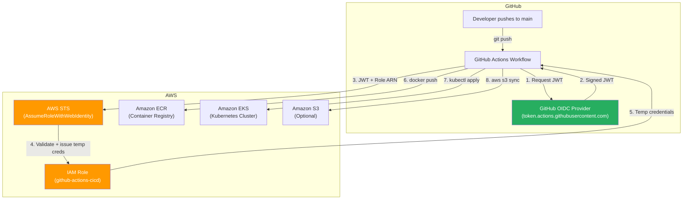

# Guide: GitHub Actions OIDC Federation with AWS

[← Back to Section Index](./README.md) · [← Main Index](../README.md) · [S3 Volumes Guide](./07-guide-s3-volumes-with-rclone.md)

---

## Why OIDC?

Storing AWS access keys as GitHub Secrets works, but it's a security liability:
- Keys are **long-lived** — they don't expire unless you manually rotate them
- Keys can be **leaked** through logs, forks, or compromised workflows
- **Rotating keys** requires manual updates across all workflows

OIDC eliminates all of this. GitHub Actions gets a short-lived JWT token, exchanges it for temporary AWS credentials via STS, and those credentials expire automatically. **Zero secrets stored in GitHub.**



---

## How It Works



| | Static Keys | OIDC |
|---|---|---|
| **Secrets in GitHub** | Yes — access key + secret key | None |
| **Credential lifetime** | Permanent until rotated | 1 hour (configurable) |
| **Rotation** | Manual | Automatic (every workflow run) |
| **Blast radius if leaked** | Full access until key is revoked | Expires in minutes/hours |
| **Scope** | Whatever the IAM user can do | Scoped to specific repo, branch, environment |

---

## Setup Steps

### Step 1: Add GitHub as an OIDC Identity Provider in AWS

Go to AWS Console → IAM → Identity Providers → Add Provider.

| Field | Value |
|-------|-------|
| Provider type | OpenID Connect |
| Provider URL | `https://token.actions.githubusercontent.com` |
| Audience | `sts.amazonaws.com` |

```bash
# Or via AWS CLI
aws iam create-open-id-connect-provider \
  --url https://token.actions.githubusercontent.com \
  --client-id-list sts.amazonaws.com \
  --thumbprint-list 6938fd4d98bab03faadb97b34396831e3780aea1
```

> You only do this **once per AWS account**. All repositories in your GitHub org can share this provider.

---

### Step 2: Create an IAM Role with a Trust Policy

The trust policy controls **which GitHub repos/branches/environments** can assume this role. This is your security boundary.

#### Trust Policy — Scoped to a specific repo and branch

```json
{
  "Version": "2012-10-17",
  "Statement": [
    {
      "Effect": "Allow",
      "Principal": {
        "Federated": "arn:aws:iam::123456789012:oidc-provider/token.actions.githubusercontent.com"
      },
      "Action": "sts:AssumeRoleWithWebIdentity",
      "Condition": {
        "StringEquals": {
          "token.actions.githubusercontent.com:aud": "sts.amazonaws.com",
          "token.actions.githubusercontent.com:sub": "repo:my-org/my-repo:ref:refs/heads/main"
        }
      }
    }
  ]
}
```

#### Trust Policy — Scoped to a specific environment

```json
{
  "Condition": {
    "StringEquals": {
      "token.actions.githubusercontent.com:aud": "sts.amazonaws.com",
      "token.actions.githubusercontent.com:sub": "repo:my-org/my-repo:environment:production"
    }
  }
}
```

#### Trust Policy — Any branch in a repo (less restrictive)

```json
{
  "Condition": {
    "StringLike": {
      "token.actions.githubusercontent.com:sub": "repo:my-org/my-repo:*"
    },
    "StringEquals": {
      "token.actions.githubusercontent.com:aud": "sts.amazonaws.com"
    }
  }
}
```

### Trust Policy — Sub Claim Formats

| Trigger | `sub` claim format |
|---------|-------------------|
| Branch push | `repo:ORG/REPO:ref:refs/heads/BRANCH` |
| Tag push | `repo:ORG/REPO:ref:refs/tags/TAG` |
| Pull request | `repo:ORG/REPO:pull_request` |
| Environment | `repo:ORG/REPO:environment:ENV_NAME` |
| Any trigger | `repo:ORG/REPO:*` (use `StringLike`) |

> **Security tip:** Always scope the `sub` condition as tightly as possible. A wildcard `repo:my-org/*:*` lets any repo in your org assume the role — avoid this in production.

---

### Step 3: Attach Permissions to the Role

Attach a policy defining what the role can actually do. For example, to push images to ECR and access S3:

```json
{
  "Version": "2012-10-17",
  "Statement": [
    {
      "Sid": "ECRPushPull",
      "Effect": "Allow",
      "Action": [
        "ecr:GetAuthorizationToken",
        "ecr:BatchCheckLayerAvailability",
        "ecr:GetDownloadUrlForLayer",
        "ecr:BatchGetImage",
        "ecr:PutImage",
        "ecr:InitiateLayerUpload",
        "ecr:UploadLayerPart",
        "ecr:CompleteLayerUpload"
      ],
      "Resource": "arn:aws:ecr:us-east-1:123456789012:repository/my-app"
    },
    {
      "Sid": "ECRAuth",
      "Effect": "Allow",
      "Action": "ecr:GetAuthorizationToken",
      "Resource": "*"
    },
    {
      "Sid": "S3Access",
      "Effect": "Allow",
      "Action": ["s3:GetObject", "s3:PutObject", "s3:ListBucket"],
      "Resource": [
        "arn:aws:s3:::my-bucket",
        "arn:aws:s3:::my-bucket/*"
      ]
    }
  ]
}
```

---

### Step 4: Configure the GitHub Actions Workflow

```yaml
name: Build and Deploy

on:
  push:
    branches: [main]

# These permissions are REQUIRED for OIDC
permissions:
  id-token: write    # Allows requesting the JWT from GitHub's OIDC provider
  contents: read     # Allows actions/checkout

jobs:
  deploy:
    runs-on: ubuntu-latest
    steps:
      - name: Checkout code
        uses: actions/checkout@v4

      # This step exchanges the GitHub JWT for AWS temporary credentials
      - name: Configure AWS credentials via OIDC
        uses: aws-actions/configure-aws-credentials@v4
        with:
          role-to-assume: arn:aws:iam::123456789012:role/github-actions-role
          role-session-name: github-actions-session
          aws-region: us-east-1

      # Now all subsequent steps have AWS credentials in env
      - name: Verify identity
        run: aws sts get-caller-identity

      # Example: Push Docker image to ECR
      - name: Login to ECR
        run: |
          aws ecr get-login-password --region us-east-1 \
            | docker login --username AWS --password-stdin \
              123456789012.dkr.ecr.us-east-1.amazonaws.com

      - name: Build and push image
        run: |
          docker build -t my-app .
          docker tag my-app:latest 123456789012.dkr.ecr.us-east-1.amazonaws.com/my-app:latest
          docker push 123456789012.dkr.ecr.us-east-1.amazonaws.com/my-app:latest

      # Example: Upload to S3
      - name: Deploy to S3
        run: aws s3 sync ./dist s3://my-bucket/
```

### Workflow Permissions Explained

```yaml
permissions:
  id-token: write    # REQUIRED — lets the workflow request a JWT from GitHub's OIDC endpoint
  contents: read     # REQUIRED — lets actions/checkout read the repo
```

> `id-token: write` does NOT give the workflow permission to modify anything. It only allows requesting and using an OIDC token. The actual permissions come from the IAM role's policy.

---

## Complete Example: Docker Build → ECR Push → EKS Deploy

This is a realistic pipeline for your EKS + ECR setup:

```yaml
name: CI/CD Pipeline

on:
  push:
    branches: [main]

permissions:
  id-token: write
  contents: read

env:
  AWS_REGION: us-east-1
  ECR_REGISTRY: 123456789012.dkr.ecr.us-east-1.amazonaws.com
  ECR_REPOSITORY: my-app
  EKS_CLUSTER: my-cluster

jobs:
  build-and-deploy:
    runs-on: ubuntu-latest
    steps:
      - uses: actions/checkout@v4

      - name: Configure AWS credentials (OIDC)
        uses: aws-actions/configure-aws-credentials@v4
        with:
          role-to-assume: arn:aws:iam::123456789012:role/github-actions-cicd
          aws-region: ${{ env.AWS_REGION }}

      - name: Login to ECR
        id: ecr-login
        uses: aws-actions/amazon-ecr-login@v2

      - name: Build, tag, push Docker image
        env:
          IMAGE_TAG: ${{ github.sha }}
        run: |
          docker build -t $ECR_REGISTRY/$ECR_REPOSITORY:$IMAGE_TAG .
          docker push $ECR_REGISTRY/$ECR_REPOSITORY:$IMAGE_TAG

      - name: Update kubeconfig
        run: aws eks update-kubeconfig --name $EKS_CLUSTER --region $AWS_REGION

      - name: Deploy to EKS
        env:
          IMAGE_TAG: ${{ github.sha }}
        run: |
          kubectl set image deployment/my-app \
            my-app=$ECR_REGISTRY/$ECR_REPOSITORY:$IMAGE_TAG
          kubectl rollout status deployment/my-app
```

---

## Architecture Overview



---

## Security Best Practices

| Practice | Why |
|----------|-----|
| **Scope trust policy to specific repo + branch** | Prevents other repos or branches from assuming the role |
| **Use GitHub Environments with protection rules** | Require approvals before deploying to production |
| **Set short session duration** | `role-duration-seconds: 900` (15 min) instead of default 1 hour |
| **Use separate roles per environment** | Different roles for dev/staging/prod with different permissions |
| **Never use `repo:org/*:*` in trust policy** | Any repo in the org could assume the role |
| **Enable CloudTrail logging** | Audit which workflows assumed which roles |
| **Pin action versions to SHA** | `aws-actions/configure-aws-credentials@SHA` prevents supply chain attacks |

```yaml
# Pin to commit SHA instead of tag for security
- uses: aws-actions/configure-aws-credentials@e3dd6a429d7300a6a4c196c26e071d42e0343502
  with:
    role-to-assume: arn:aws:iam::123456789012:role/github-actions-role
    role-duration-seconds: 900    # 15 minutes — minimum needed
    aws-region: us-east-1
```

---

## Checklist

- [ ] GitHub OIDC provider added in AWS IAM (once per account)
- [ ] IAM role created with trust policy scoped to your repo/branch
- [ ] Permissions policy attached to the role (least privilege)
- [ ] Workflow has `permissions: id-token: write`
- [ ] Workflow uses `aws-actions/configure-aws-credentials@v4` with `role-to-assume`
- [ ] No AWS access keys stored in GitHub Secrets
- [ ] CloudTrail enabled for audit trail

---

**Sources**: [GitHub Docs — OIDC in AWS](https://docs.github.com/en/actions/deployment/security-hardening-your-deployments/configuring-openid-connect-in-amazon-web-services), [AWS — configure-aws-credentials action](https://github.com/marketplace/actions/configure-aws-credentials-action-for-github-actions), [AWS Blog — IAM roles for GitHub Actions](https://aws.amazon.com/blogs/security/use-iam-roles-to-connect-github-actions-to-actions-in-aws/). Content was rephrased for compliance with licensing restrictions.

---

[← Back to Section Index](./README.md) · [← Main Index](../README.md) · [S3 Volumes Guide](./07-guide-s3-volumes-with-rclone.md)
