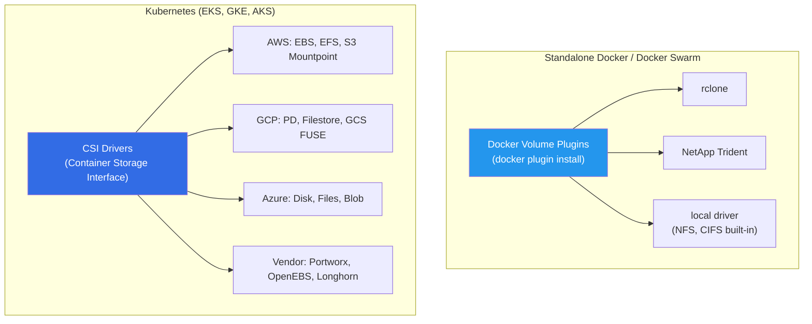
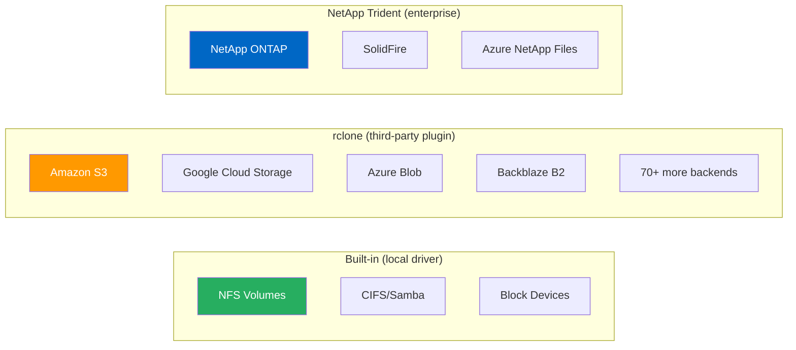
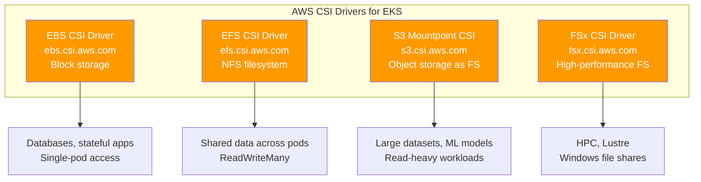
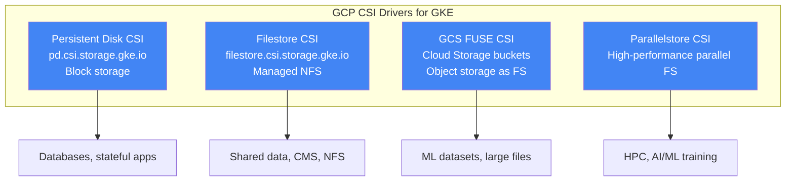
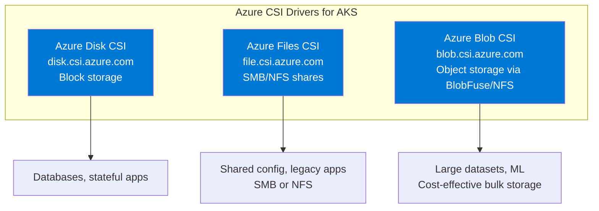
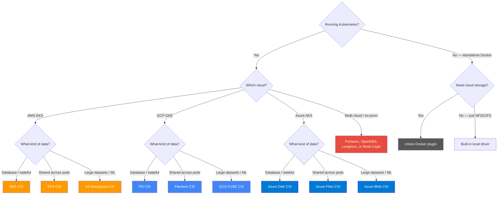

# Storage Plugins & Drivers Across Clouds

[← Back to Section Index](./README.md) · [← Main Index](../README.md)

---

## The Two Worlds: Docker Plugins vs Kubernetes CSI

Container storage has split into two ecosystems. Which one you use depends on your orchestrator:

| | Docker Volume Plugins | Kubernetes CSI Drivers |
|---|---|---|
| **Used by** | Standalone Docker, Docker Swarm | Kubernetes (EKS, GKE, AKS, etc.) |
| **Standard** | Docker Plugin API | Container Storage Interface (CSI) |
| **Ecosystem** | Mostly dead — few active plugins | Thriving — every cloud provider ships CSI drivers |
| **Enterprise adoption** | Declining | Standard for all enterprise container workloads |
| **Install** | `docker plugin install` | Helm chart / Kubernetes addon |

> **If you're going to Kubernetes (EKS):** Skip Docker volume plugins entirely. Use CSI drivers — they're the industry standard.

---

## Standalone Docker & Docker Swarm Plugins

### Active Plugins

| Plugin | Backend | License | Status | Notes |
|--------|---------|---------|--------|-------|
| **local** (built-in) | Host filesystem, NFS, CIFS | Open source | Active (built into Docker) | No install needed. Supports NFS/CIFS via mount options. |
| **rclone** | S3, GCS, Azure Blob, 70+ backends | MIT | Active | The only actively maintained cloud storage plugin. Official Docker docs reference it. |
| **NetApp Trident** | NetApp ONTAP, SolidFire, Azure NetApp Files | Apache 2.0 | Active | Enterprise — supports both Docker plugin and Kubernetes CSI. |

### Abandoned / Deprecated Plugins

| Plugin | Was Used For | Status | Replacement |
|--------|-------------|--------|-------------|
| **REX-Ray** (Dell EMC) | AWS EBS, S3, GCE PD, Azure, ScaleIO | Archived 2021 | Kubernetes CSI drivers |
| **Convoy** (Rancher) | EBS, NFS, device mapper | Abandoned | Longhorn (for K8s) |
| **Flocker** (ClusterHQ) | Multi-host volumes, AWS EBS, GCE PD | Company shut down 2017 | Kubernetes CSI drivers |
| **GlusterFS** | Distributed filesystem | Project in maintenance mode | OpenEBS, Longhorn |

### Standalone Plugin Comparison

| Feature | local (built-in) | rclone | NetApp Trident |
|---------|-----------------|--------|---------------|
| **Install required** | No | Yes (docker plugin) | Yes (binary or plugin) |
| **Cloud object storage** | ❌ | ✅ S3, GCS, Azure, 70+ | ❌ (block/file only) |
| **NFS** | ✅ Native | ✅ Via SFTP/NFS backend | ✅ Native |
| **CIFS/Samba** | ✅ Native | ✅ | ❌ |
| **Snapshots** | ❌ | ❌ | ✅ |
| **Cloning** | ❌ | ❌ | ✅ |
| **Encryption at rest** | Depends on host | ✅ (rclone crypt backend) | ✅ (storage-level) |
| **Enterprise support** | Docker Inc. | Community | NetApp |
| **Cost** | Free | Free | NetApp license required |
| **Swarm support** | ✅ | ✅ | ✅ |
| **Production readiness** | ✅ For NFS/CIFS | ⚠️ Adequate for many workloads | ✅ Enterprise-grade |

---

## AWS — Storage Options

### For EKS (Kubernetes)

| Driver | Storage Type | Access Mode | Use Case | Pros | Cons |
|--------|-------------|-------------|----------|------|------|
| **EBS CSI** | Block (SSD/HDD) | ReadWriteOnce (single pod) | Databases, stateful apps | Fast, low-latency, snapshots, encryption | Single-AZ, one pod at a time |
| **EFS CSI** | NFS filesystem | ReadWriteMany (multi-pod) | Shared config, CMS uploads, ML data | Multi-AZ, shared across pods and nodes, auto-scaling | Higher latency than EBS, more expensive per GB |
| **S3 Mountpoint** | Object storage as filesystem | ReadWriteMany (with caveats) | Large datasets, logs, ML models, read-heavy | Cheapest storage, unlimited size, no capacity planning | No random writes, eventual consistency, higher latency |
| **FSx for Lustre** | High-performance parallel FS | ReadWriteMany | HPC, ML training, genomics | Extreme throughput (GB/s), S3 integration | Expensive, complex, specific use cases |
| **FSx for NetApp ONTAP** | Multi-protocol (NFS, SMB, iSCSI) | ReadWriteMany | Enterprise workloads migrated from on-prem | Feature-rich, snapshots, replication | Expensive |

### For Standalone Docker on EC2

| Need | Recommended Approach |
|------|---------------------|
| Persistent block storage | Mount EBS volume to host, use local driver or bind mount |
| Shared storage across hosts | NFS via EFS (mount on host, use local driver with NFS opts) |
| Cloud object storage | rclone plugin with S3 backend |
| High-performance | EBS io2 Block Express or FSx, mounted to host |

---

## GCP — Storage Options

### For GKE (Kubernetes)

| Driver | Storage Type | Access Mode | Use Case | Pros | Cons |
|--------|-------------|-------------|----------|------|------|
| **Persistent Disk CSI** | Block (SSD/balanced/standard) | ReadWriteOnce, ReadOnlyMany | Databases, boot disks | Fast, snapshots, encryption, regional disks for HA | Single-writer only for RWO |
| **Filestore CSI** | Managed NFS | ReadWriteMany | Shared data across pods | Fully managed NFS, multi-pod access | Minimum 1 TiB for basic tier, can be expensive |
| **GCS FUSE CSI** | Object storage (Cloud Storage) as filesystem | ReadWriteMany | ML training data, large datasets, media | Cheapest storage, unlimited, auto-enabled on Autopilot | FUSE overhead, no POSIX locks, eventual consistency for writes |
| **Parallelstore CSI** | High-performance parallel FS | ReadWriteMany | HPC, AI/ML training | Extreme throughput | Expensive, specialized |

### For Standalone Docker on GCE

| Need | Recommended Approach |
|------|---------------------|
| Persistent block storage | Attach Persistent Disk, use local driver |
| Shared NFS | Filestore instance mounted on host |
| Cloud object storage | rclone plugin with GCS backend (`type = google cloud storage`) |

---

## Azure — Storage Options

### For AKS (Kubernetes)

| Driver | Storage Type | Access Mode | Use Case | Pros | Cons |
|--------|-------------|-------------|----------|------|------|
| **Azure Disk CSI** | Managed block (Premium SSD, Standard SSD/HDD, Ultra Disk) | ReadWriteOnce | Databases, stateful workloads | Low latency, snapshots, encryption, Ultra Disk for extreme IO | Single-pod only, AZ-pinned |
| **Azure Files CSI** | Managed SMB/NFS share | ReadWriteMany | Shared config, legacy apps, dev environments | Multi-pod, SMB + NFS support, easy to use | Higher latency than Disk, SMB overhead |
| **Azure Blob CSI** | Blob storage via BlobFuse2 or NFS v3 | ReadWriteMany | Large datasets, ML, media processing | Cheapest per-GB, massive scale, tiered storage | FUSE overhead (BlobFuse), limited POSIX for NFS |

### For Standalone Docker on Azure VMs

| Need | Recommended Approach |
|------|---------------------|
| Persistent block storage | Attach Managed Disk, use local driver |
| Shared SMB/NFS | Azure Files share, mount on host |
| Cloud object storage | rclone plugin with Azure Blob backend (`type = azureblob`) |

---

## Cross-Cloud Comparison

### Block Storage (Databases, Stateful Apps)

| | AWS EBS | GCP Persistent Disk | Azure Managed Disk |
|---|---|---|---|
| **K8s CSI Driver** | `ebs.csi.aws.com` | `pd.csi.storage.gke.io` | `disk.csi.azure.com` |
| **Access** | ReadWriteOnce | ReadWriteOnce / ReadOnlyMany | ReadWriteOnce |
| **Snapshots** | ✅ | ✅ | ✅ |
| **Encryption** | ✅ (KMS) | ✅ (CMEK) | ✅ (SSE) |
| **Multi-AZ** | ❌ (single AZ) | ✅ (regional disks) | ❌ (single AZ) |
| **Max IOPS** | 256,000 (io2 Block Express) | 120,000 (pd-extreme) | 160,000 (Ultra Disk) |
| **Docker plugin** | ❌ (REX-Ray was, now dead) | ❌ | ❌ |

### Shared Filesystem (Multi-Pod Access)

| | AWS EFS | GCP Filestore | Azure Files |
|---|---|---|---|
| **Protocol** | NFSv4 | NFS | SMB 3.0 + NFS 4.1 |
| **Access** | ReadWriteMany | ReadWriteMany | ReadWriteMany |
| **Auto-scaling** | ✅ (pay per use) | ❌ (fixed provisioned) | ✅ (up to share quota) |
| **Min size** | No minimum | 1 TiB (Basic) | 1 GiB |
| **Multi-AZ** | ✅ | ✅ (Enterprise) | ✅ |
| **Docker standalone** | Mount via NFS, local driver | Mount via NFS, local driver | Mount via SMB/NFS, local driver |

### Object Storage as Filesystem (ML, Large Datasets)

| | AWS S3 Mountpoint | GCP GCS FUSE | Azure Blob CSI |
|---|---|---|---|
| **K8s CSI** | `s3.csi.aws.com` | GCS FUSE CSI | `blob.csi.azure.com` |
| **Mount method** | FUSE (Mountpoint for S3) | FUSE (gcsfuse) | BlobFuse2 or NFS v3 |
| **Random writes** | ❌ | ❌ (append-only via FUSE) | ⚠️ (BlobFuse caching) |
| **Sequential writes** | ✅ (new files) | ✅ (new files) | ✅ |
| **Read performance** | High throughput | High throughput (with file caching) | High throughput |
| **Best for** | Read-heavy data lakes, ML | ML training datasets, media | Bulk data, tiered storage |
| **Docker standalone** | rclone plugin | rclone plugin | rclone plugin |

---

## Vendor-Neutral / Multi-Cloud Solutions (Kubernetes)

For enterprises that run across multiple clouds or want cloud-agnostic storage:

| Solution | Type | License | Clouds | Why Enterprises Use It | Cons |
|----------|------|---------|--------|----------------------|------|
| **Portworx** (Pure Storage) | Distributed block + file | Commercial | AWS, GCP, Azure, on-prem | Enterprise-grade: HA, DR, encryption, backup, multi-cloud, Autopilot for capacity management | Expensive, complex to operate |
| **OpenEBS** (CNCF Sandbox) | Container-attached storage | Apache 2.0 | Any | Open source, lightweight, pluggable engines (Mayastor for NVMe) | Less mature than Portworx, community support |
| **Longhorn** (CNCF incubating, Rancher/SUSE) | Distributed block storage | Apache 2.0 | Any | Simple, built-in UI, backup to S3, good for edge/small clusters | Lower performance than cloud-native options at scale |
| **Rook-Ceph** | Distributed storage (block, file, object) | Apache 2.0 | Any | Battle-tested (Ceph), flexible, supports all access modes | Complex to operate, heavy resource footprint |
| **Robin.io** | Application-aware storage | Commercial | AWS, GCP, Azure | Built for databases and stateful apps, snapshots, cloning | Niche, smaller community |
| **NetApp Trident** | CSI driver for NetApp backends | Apache 2.0 | AWS (FSx ONTAP), Azure (ANF), on-prem | Bridges on-prem NetApp to cloud K8s, snapshots, cloning | Requires NetApp storage backend |

---

## Decision Tree — What Should You Use?

---

## Summary

| Context | Block Storage | Shared Filesystem | Object-as-FS | Cloud-Agnostic |
|---------|--------------|-------------------|--------------|---------------|
| **AWS EKS** | EBS CSI | EFS CSI | S3 Mountpoint | Portworx / OpenEBS |
| **GCP GKE** | PD CSI | Filestore CSI | GCS FUSE | Portworx / OpenEBS |
| **Azure AKS** | Disk CSI | Files CSI | Blob CSI | Portworx / OpenEBS |
| **Standalone Docker** | Host disk (local) | NFS (local driver) | rclone | rclone |
| **Docker Swarm** | Host disk (local) | NFS (local driver) | rclone | rclone |

> **Enterprise reality:** Nearly all enterprise container workloads run on Kubernetes. The Docker volume plugin ecosystem has been largely replaced by Kubernetes CSI. If you're building for production, invest in learning CSI drivers for your cloud — not Docker volume plugins.

---

**Sources**: [AWS EKS Storage docs](https://docs.aws.amazon.com/eks/latest/userguide/storage.html), [GKE Storage docs](https://cloud.google.com/kubernetes-engine/docs/concepts/storage-overview), [AKS Storage docs](https://learn.microsoft.com/en-us/azure/aks/csi-storage-drivers), [rclone Docker plugin](https://rclone.org/docker/), [Portworx](https://portworx.com/), [OpenEBS](https://openebs.io/), [Longhorn](https://longhorn.io/). Content was rephrased for compliance with licensing restrictions.

---

[← Back to Section Index](./README.md) · [← Main Index](../README.md)
