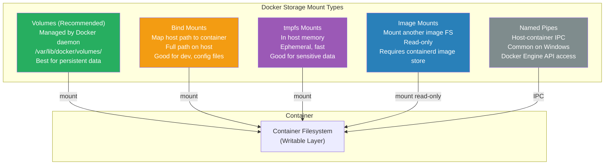
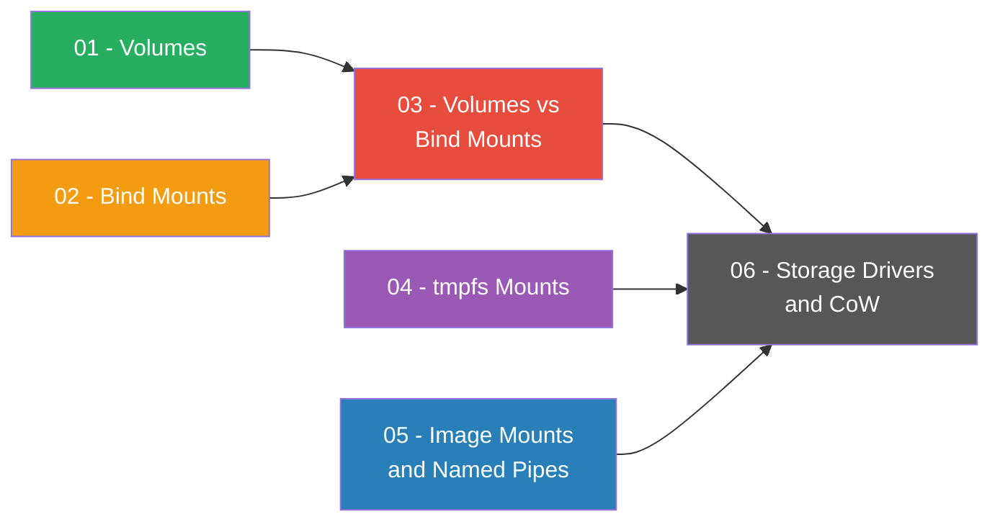
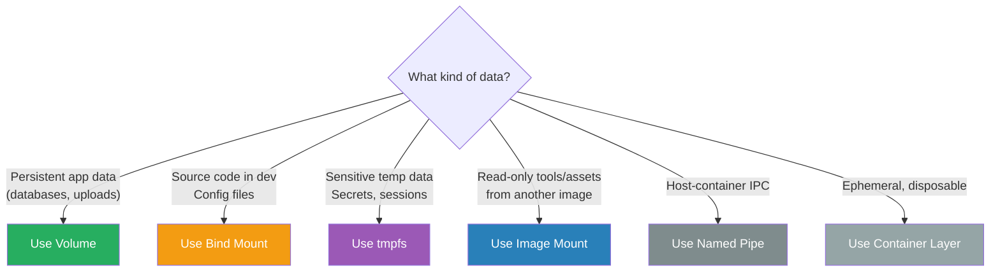

# Domain 6: Storage & Volumes (10% of Exam)

[← Back to Main Index](../README.md) · [Previous: Security](../07-security.md)

---

Docker supports multiple storage types for persisting data outside a container's writable layer. The official docs at [docs.docker.com/engine/storage](https://docs.docker.com/engine/storage/) list five types.

## Storage Types Overview

## Comparison Table

| Feature | Volume | Bind Mount | tmpfs | Image Mount |
|---------|--------|-----------|-------|-------------|
| **Location** | `/var/lib/docker/volumes/` | Anywhere on host | Host memory (RAM) | Another image's filesystem |
| **Managed by Docker** | ✅ Yes | ❌ No | N/A | ✅ Yes (read-only) |
| **Pre-populate from image** | ✅ Yes (if volume is empty) | ❌ No | ❌ No | N/A |
| **Volume drivers** | ✅ (NFS, cloud, etc.) | ❌ No | N/A | N/A |
| **Cross-platform** | ✅ Linux + Mac + Win | ✅ Yes | ❌ Linux only | ✅ Yes |
| **Share between containers** | ✅ Yes | ✅ Yes | ❌ No | ✅ Yes (read-only) |
| **Persists after container removed** | ✅ Yes | ✅ Yes (host files remain) | ❌ No | N/A (image stays) |
| **Writable** | ✅ Yes | ✅ Yes | ✅ Yes | ❌ Read-only only |
| **Performance** | Host-native filesystem speed | Host-native | Fastest (in memory) | Host-native (read-only) |
| **`-v` syntax** | ✅ Yes | ✅ Yes | ❌ No (`--tmpfs` instead) | ❌ No (`--mount` only) |
| **Requires containerd image store** | ❌ No | ❌ No | ❌ No | ✅ Yes |

> **Best practice:** Use **volumes** for persistent data (databases, uploads). Use **bind mounts** for development and config files. Use **tmpfs** for sensitive temporary data. Use **image mounts** for injecting tools or read-only assets from another image.

## Pages in This Section

| # | Page | Description |
|---|------|-------------|
| 01 | [Volumes](./01-volumes.md) | Volume commands, `-v` vs `--mount`, pre-population, subpath, anonymous volumes, Swarm, drivers, backup/restore, Dockerfile VOLUME |
| 02 | [Bind Mounts](./02-bind-mounts.md) | Bind mount usage, behavior, propagation, SELinux labeling |
| 03 | [Volumes vs Bind Mounts](./03-volumes-vs-bind-mounts.md) | Side-by-side comparison across architecture, behavior, security, Compose, and when to choose which |
| 04 | [tmpfs Mounts](./04-tmpfs-mounts.md) | In-memory storage, cgroup limits, swap behavior, mount options |
| 05 | [Image Mounts & Named Pipes](./05-image-mounts-and-named-pipes.md) | Image mounts (containerd image store), named pipes, IPC |
| 06 | [Storage Drivers & Copy-on-Write](./06-storage-drivers-and-cow.md) | CoW strategy, copy_up triggers, overlay2, containerd image store |
| 07 | [Guide: S3 Volumes with rclone](./07-guide-s3-volumes-with-rclone.md) | Step-by-step setup of S3-backed Docker volumes, IAM access, Compose, Swarm |
| 08 | [Guide: GitHub Actions OIDC with AWS](./08-guide-github-actions-oidc-aws.md) | Keyless CI/CD authentication — OIDC federation, trust policies, ECR push, EKS deploy |
| 09 | [Storage Plugins & Drivers Across Clouds](./09-storage-plugins-across-clouds.md) | AWS/GCP/Azure CSI drivers, standalone Docker plugins, vendor-neutral solutions, decision tree |

---

## Quick Navigation

> Read Volumes and Bind Mounts first, then the comparison page (03) for a consolidated reference. Pages 04–05 cover other mount types. Page 06 explains how Docker manages image layers internally.

## Quick Reference

| Mount Type | Persistent | Writable | Shared | Best For |
|-----------|-----------|----------|--------|----------|
| **Volume** | ✅ | ✅ | ✅ | Databases, uploads, persistent state |
| **Bind Mount** | ✅ | ✅ | ✅ | Dev source code, config files, DNS |
| **tmpfs** | ❌ | ✅ | ❌ | Secrets, session data, caches |
| **Image Mount** | N/A | ❌ | ✅ | Debug tools, read-only assets |
| **Named Pipe** | N/A | N/A | N/A | Host ↔ container communication |
| **Container Layer** | ❌ | ✅ | ❌ | Ephemeral scratch data |

---

**Sources**: [Docker Storage Overview](https://docs.docker.com/engine/storage/), [Volumes](https://docs.docker.com/engine/storage/volumes/), [Bind Mounts](https://docs.docker.com/engine/storage/bind-mounts/), [tmpfs](https://docs.docker.com/engine/storage/tmpfs/), [Image Mounts](https://docs.docker.com/engine/storage/image-mounts/), [Storage Drivers](https://docs.docker.com/engine/storage/drivers/). Content was rephrased for compliance with licensing restrictions.

---

[← Back to Main Index](../README.md) · [Next: Docker Compose →](../09-docker-compose.md)
