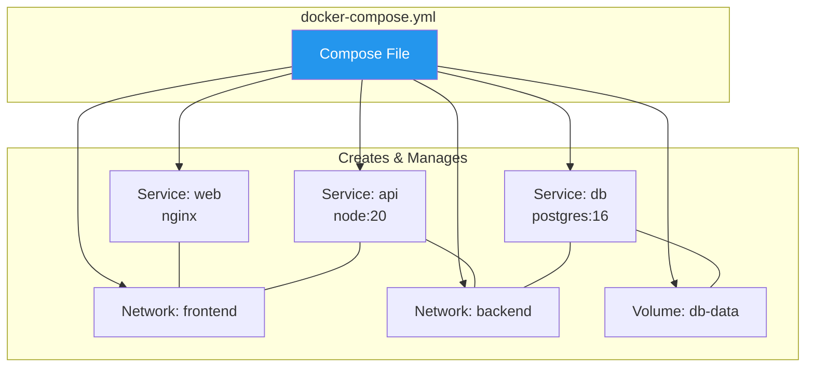
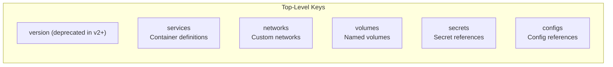
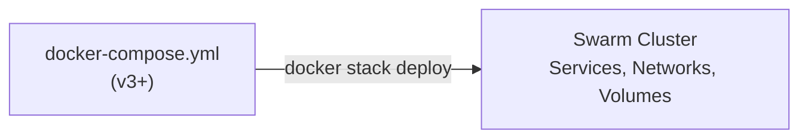

# Docker Compose

[← Back to Index](./README.md) · [Previous: Storage & Volumes](./08-storage-volumes.md)

---

## What Is Docker Compose?

Docker Compose lets you define and run **multi-container applications** using a single YAML file. It manages the complete lifecycle — build, start, stop, and teardown — of an entire application stack.



---

## Compose File Structure



---

## Sample docker-compose.yml

```yaml
version: "3.8"

services:
  web:
    image: nginx:1.25-alpine
    ports:
      - "80:80"
    volumes:
      - ./nginx.conf:/etc/nginx/nginx.conf:ro
    depends_on:
      - api
    networks:
      - frontend
    restart: unless-stopped

  api:
    build:
      context: ./api
      dockerfile: Dockerfile
    environment:
      - DATABASE_URL=postgres://user:pass@db:5432/mydb
    networks:
      - frontend
      - backend
    deploy:
      replicas: 3
      resources:
        limits:
          cpus: "0.5"
          memory: 512M
    healthcheck:
      test: ["CMD", "curl", "-f", "http://localhost:3000/health"]
      interval: 30s
      timeout: 10s
      retries: 3
      start_period: 10s

  db:
    image: postgres:16-alpine
    environment:
      POSTGRES_USER: user
      POSTGRES_PASSWORD: pass
      POSTGRES_DB: mydb
    volumes:
      - db-data:/var/lib/postgresql/data
    networks:
      - backend

volumes:
  db-data:
    driver: local

networks:
  frontend:
    driver: bridge
  backend:
    driver: bridge
```

---

## Key Service Options

| Option | Purpose | Example |
|--------|---------|---------|
| `image` | Use a pre-built image | `image: nginx:1.25` |
| `build` | Build from Dockerfile | `build: ./app` |
| `ports` | Publish ports | `"8080:80"` |
| `volumes` | Mount volumes or bind mounts | `- db-data:/var/lib/mysql` |
| `environment` | Set env variables | `- DB_HOST=db` |
| `env_file` | Load env from file | `env_file: .env` |
| `depends_on` | Start order (not readiness) | `depends_on: [db]` |
| `networks` | Attach to networks | `networks: [frontend]` |
| `restart` | Restart policy | `unless-stopped` |
| `healthcheck` | Container health monitoring | See example above |
| `deploy` | Swarm/resource settings | `replicas: 3` |
| `command` | Override CMD | `command: npm start` |
| `entrypoint` | Override ENTRYPOINT | `entrypoint: /app/start.sh` |

---

## depends_on — Start Order


```yaml
services:
  web:
    depends_on:
      - api
  api:
    depends_on:
      - db
  db:
    image: postgres:16
```

> **Important:** `depends_on` only controls **start order**, not **readiness**. The `api` container starts after `db` starts, but `db` might not be ready to accept connections yet. Use `healthcheck` + `depends_on` with `condition` for readiness:

```yaml
services:
  api:
    depends_on:
      db:
        condition: service_healthy
  db:
    healthcheck:
      test: ["CMD-SHELL", "pg_isready -U user"]
      interval: 5s
      retries: 5
```

---

## Compose Commands

```bash
# Start all services (detached)
docker compose up -d

# Start with build
docker compose up -d --build

# Stop all services
docker compose down

# Stop and remove volumes
docker compose down -v

# Stop and remove images
docker compose down --rmi all

# View logs
docker compose logs -f
docker compose logs api

# List running services
docker compose ps

# Scale a service
docker compose up -d --scale api=5

# Execute command in running service
docker compose exec api sh

# Run a one-off command
docker compose run --rm api npm test

# Rebuild images
docker compose build
docker compose build --no-cache

# View resource usage
docker compose top

# Validate compose file
docker compose config
```

---

## Docker Compose for Swarm — Stack Deploy



```bash
# Deploy a stack to swarm
docker stack deploy -c docker-compose.yml myapp

# List stacks
docker stack ls

# List services in a stack
docker stack services myapp

# List tasks in a stack
docker stack ps myapp

# Remove a stack
docker stack rm myapp
```

### Compose vs Stack Differences

| Feature | `docker compose up` | `docker stack deploy` |
|---------|--------------------|-----------------------|
| **Mode** | Single-host | Swarm cluster |
| **`build`** | ✅ Supported | ❌ Ignored (pre-built images only) |
| **`depends_on`** | ✅ Supported | ❌ Ignored |
| **`deploy`** | ❌ Ignored | ✅ Used (replicas, resources, placement) |
| **`restart`** | ✅ Used | ❌ Ignored (use `deploy.restart_policy`) |

---

## Environment Variables

```yaml
services:
  api:
    # Inline
    environment:
      - DB_HOST=db
      - DB_PORT=5432

    # From file
    env_file:
      - .env
      - .env.local
```

```bash
# .env file (auto-loaded by compose)
POSTGRES_USER=myuser
POSTGRES_PASSWORD=mypass

# Variable substitution in compose file
# image: "myapp:${APP_VERSION:-latest}"
```

---

## Networking in Compose

- Compose creates a **default network** for each project (`<project>_default`)
- All services can reach each other by **service name** (DNS)
- Custom networks isolate communication between service groups

```yaml
networks:
  frontend:
    driver: bridge
  backend:
    driver: bridge
    internal: true    # No external access
```

---

[← Back to Index](./README.md) · [Next: Commands Cheat Sheet →](./10-commands-cheatsheet.md)
