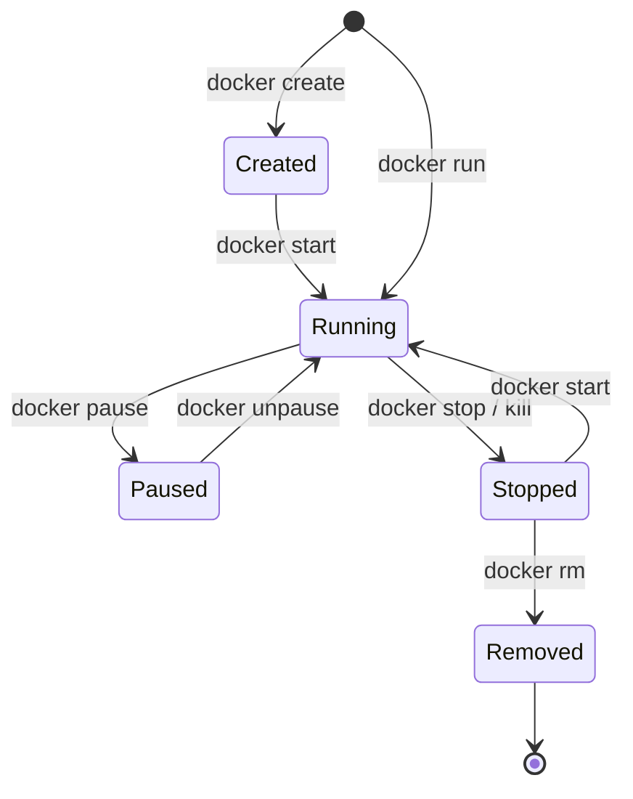

# Docker Commands Cheat Sheet

[← Back to Index](./README.md) · [Previous: Docker Compose](./09-docker-compose.md)

---

## Container Commands

```bash
# ──────────── RUN ────────────
docker run -d --name web -p 80:80 nginx          # Detached with port mapping
docker run -it --rm ubuntu bash                    # Interactive, auto-remove on exit
docker run -d --restart unless-stopped nginx        # Auto-restart
docker run --memory=512m --cpus=1.0 nginx          # Resource limits

# ──────────── LIST ────────────
docker ps                              # Running containers
docker ps -a                           # All containers (including stopped)
docker ps -q                           # Only IDs
docker ps --filter "status=exited"     # Filter by status

# ──────────── LIFECYCLE ────────────
docker start <container>               # Start stopped container
docker stop <container>                # Graceful stop (SIGTERM → 10s → SIGKILL)
docker kill <container>                # Force stop (SIGKILL)
docker restart <container>             # Restart
docker pause <container>               # Freeze (SIGSTOP via cgroup freezer)
docker unpause <container>             # Resume
docker rm <container>                  # Remove stopped container
docker rm -f <container>               # Force remove running container

# ──────────── EXEC & ATTACH ────────────
docker exec -it <container> bash       # Run command in running container
docker exec -it <container> sh         # For alpine / minimal images
docker attach <container>              # Attach to main process (Ctrl+P,Q to detach)

# ──────────── LOGS ────────────
docker logs <container>                # View all logs
docker logs -f <container>             # Follow logs
docker logs --tail 100 <container>     # Last 100 lines
docker logs --since 2h <container>     # Logs from last 2 hours
docker logs --timestamps <container>   # With timestamps

# ──────────── INSPECT ────────────
docker inspect <container>             # Full JSON details
docker inspect -f '{{.State.Status}}' <container>    # Specific field
docker inspect -f '{{.NetworkSettings.IPAddress}}' c  # IP address
docker top <container>                 # Running processes
docker stats                           # Live resource usage (all)
docker stats <container>               # Resource usage (specific)
docker diff <container>                # Filesystem changes

# ──────────── COPY ────────────
docker cp file.txt container:/path/    # Host → Container
docker cp container:/path/file.txt .   # Container → Host
```

---

## Container Lifecycle Diagram



---

## Image Commands

```bash
# ──────────── BUILD ────────────
docker build -t myapp:1.0 .                        # Build from Dockerfile
docker build -t myapp:1.0 -f Dockerfile.prod .     # Custom Dockerfile
docker build --no-cache -t myapp:1.0 .             # No cache
docker build --build-arg VERSION=1.0 -t myapp .    # Build argument

# ──────────── LIST & INSPECT ────────────
docker images                          # List images
docker image ls                        # Same as above
docker image ls --filter dangling=true # Dangling images
docker image history myapp:1.0         # Layer history
docker image inspect myapp:1.0         # Full details

# ──────────── TAG ────────────
docker image tag myapp:latest myapp:1.0
docker image tag myapp:1.0 registry.example.com/myapp:1.0

# ──────────── PUSH / PULL ────────────
docker login                           # Login to Docker Hub
docker login registry.example.com      # Login to private registry
docker push registry.example.com/myapp:1.0
docker pull nginx:1.25

# ──────────── REMOVE ────────────
docker image rm myapp:1.0              # Remove specific image
docker image prune                     # Remove dangling images
docker image prune -a                  # Remove all unused images

# ──────────── SAVE / LOAD (images) ────────────
docker image save myapp:1.0 -o myapp.tar
docker image load -i myapp.tar

# ──────────── EXPORT / IMPORT (containers) ────────────
docker export <container-id> -o container.tar
docker import container.tar myimage:latest
```

---

## Network Commands

```bash
docker network ls                                           # List
docker network create my-net                                # Create bridge
docker network create --driver overlay my-overlay           # Create overlay
docker network create --subnet 172.20.0.0/16 my-net        # With subnet
docker network connect my-net <container>                   # Connect
docker network disconnect my-net <container>                # Disconnect
docker network inspect my-net                               # Inspect
docker network rm my-net                                    # Remove
docker network prune                                        # Prune unused
```

---

## Volume Commands

```bash
docker volume create my-data           # Create
docker volume ls                       # List
docker volume inspect my-data          # Inspect
docker volume rm my-data               # Remove
docker volume prune                    # Prune unused
```

---

## Swarm Commands

```bash
# ──────────── SWARM ────────────
docker swarm init --advertise-addr <IP>     # Initialize
docker swarm join --token <TOKEN> <IP>:2377 # Join
docker swarm join-token manager             # Get manager token
docker swarm join-token worker              # Get worker token
docker swarm leave                          # Leave (worker)
docker swarm leave --force                  # Leave (manager)
docker swarm update --autolock=true         # Enable autolock
docker swarm unlock                         # Unlock after restart
docker swarm unlock-key --rotate            # Rotate key

# ──────────── NODE ────────────
docker node ls                              # List nodes
docker node inspect --pretty <node>         # Inspect
docker node promote <node>                  # Promote to manager
docker node demote <node>                   # Demote to worker
docker node update --availability drain <n> # Drain
docker node update --availability active <n># Activate
docker node update --label-add key=val <n>  # Add label
docker node rm <node>                       # Remove

# ──────────── SERVICE ────────────
docker service create --name web -p 80:80 --replicas 3 nginx
docker service ls                           # List services
docker service ps web                       # List tasks
docker service inspect --pretty web         # Inspect
docker service scale web=5                  # Scale
docker service update --image nginx:1.25 web # Update image
docker service rollback web                 # Rollback
docker service rm web                       # Remove
docker service logs web                     # View logs

# ──────────── STACK ────────────
docker stack deploy -c compose.yml myapp    # Deploy
docker stack ls                             # List stacks
docker stack services myapp                 # Services in stack
docker stack ps myapp                       # Tasks in stack
docker stack rm myapp                       # Remove

# ──────────── SECRET ────────────
echo "pass" | docker secret create db_pw -  # Create
docker secret ls                            # List
docker secret inspect db_pw                 # Inspect (no value)
docker secret rm db_pw                      # Remove

# ──────────── CONFIG ────────────
docker config create my_conf ./file.conf    # Create
docker config ls                            # List
docker config inspect my_conf               # Inspect
docker config rm my_conf                    # Remove
```

---

## System Commands

```bash
docker system df                    # Disk usage
docker system df -v                 # Verbose disk usage
docker system prune                 # Clean unused data
docker system prune -a --volumes    # Aggressive cleanup
docker system events                # Real-time events
docker system info                  # System-wide information
docker version                      # Client + Server versions
```

---

## Resource Constraints

```bash
# ──────────── MEMORY ────────────
--memory=512m                  # Hard memory limit
--memory-swap=1g               # Memory + swap total
--memory-reservation=256m      # Soft limit

# ──────────── CPU ────────────
--cpus=1.5                     # 1.5 CPU cores
--cpu-shares=512               # Relative weight (default: 1024)
--cpuset-cpus="0,1"            # Pin to specific CPUs

# ──────────── RESTART POLICY ────────────
--restart=no                   # Default — don't restart
--restart=always               # Always restart
--restart=unless-stopped       # Unless manually stopped
--restart=on-failure:5         # On failure, max 5 retries
```

---

## Formatting & Filtering

```bash
# Format output with Go templates
docker ps --format "table {{.Names}}\t{{.Status}}\t{{.Ports}}"
docker inspect -f '{{.State.Status}}' <container>
docker inspect -f '{{range .NetworkSettings.Networks}}{{.IPAddress}}{{end}}' c

# Filter
docker ps --filter "status=running"
docker images --filter "dangling=true"
docker network ls --filter "driver=bridge"
docker volume ls --filter "dangling=true"
```

---

[← Back to Index](./README.md) · [Next: Exam Tips →](./11-exam-tips.md)
