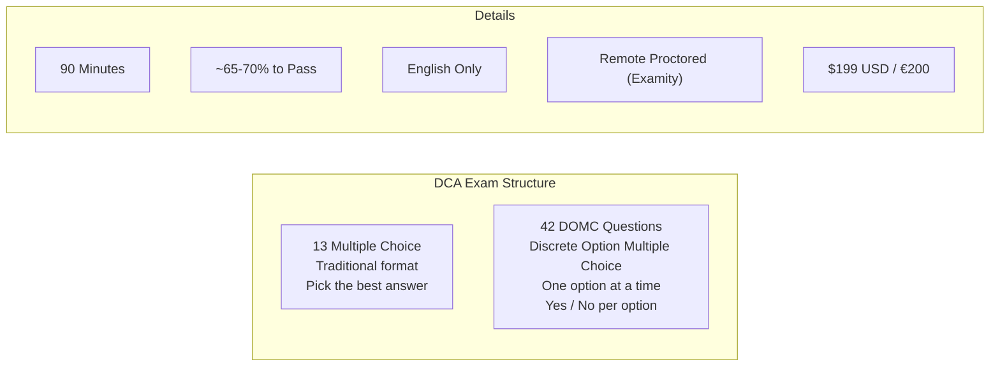
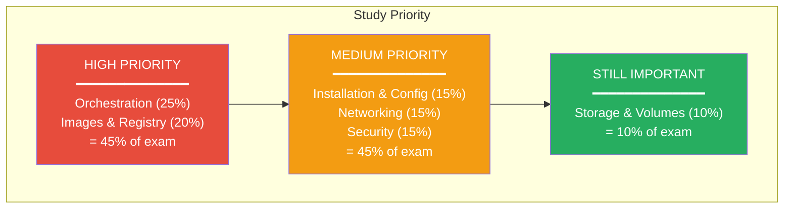

# DCA Exam Tips & Strategy

[← Back to Index](./README.md) · [Previous: Commands Cheat Sheet](./10-commands-cheatsheet.md)

---

## Exam Format

---

## DOMC Explained

DOMC (Discrete Option Multiple Choice) is the dominant format (42 of 55 questions):

1. You see **one option at a time**
2. You answer **Yes** or **No** (is this option correct?)
3. You **cannot go back** to previous options
4. Each option is evaluated independently

> This means you need **confident, decisive knowledge**. You can't compare options or use elimination strategy.

---

## Study Priority by Domain Weight

---

## Key Topics to Master per Domain

### Domain 1: Orchestration (25%)
- [ ] Swarm init, join, node management
- [ ] Service create, scale, update, rollback
- [ ] Raft consensus and quorum rules (odd managers, fault tolerance)
- [ ] Replicated vs global services
- [ ] Placement constraints vs preferences
- [ ] Stack deploy from compose files
- [ ] Locking a swarm (autolock)
- [ ] Swarm ports (2377, 7946, 4789)

### Domain 2: Images & Registry (20%)
- [ ] Dockerfile instructions and best practices
- [ ] Layer caching strategy
- [ ] Multi-stage builds
- [ ] CMD vs ENTRYPOINT
- [ ] COPY vs ADD
- [ ] Docker Content Trust (DCT)
- [ ] Registry operations (push, pull, tag, login)
- [ ] save/load vs export/import

### Domain 3: Installation & Config (15%)
- [ ] `daemon.json` configuration options
- [ ] Storage drivers (overlay2 as default)
- [ ] Logging drivers (json-file default, `docker logs` only works with json-file and journald)
- [ ] Docker EE vs CE (Mirantis rebranding)
- [ ] Managing daemon (systemctl, journalctl)
- [ ] Docker data directory (`/var/lib/docker`)

### Domain 4: Networking (15%)
- [ ] Bridge vs overlay vs host vs macvlan vs none
- [ ] Default bridge vs user-defined bridge (DNS!)
- [ ] Overlay for swarm multi-host networking
- [ ] Routing mesh (published ports on all nodes)
- [ ] Container Network Model (CNM)
- [ ] Port publishing (host:container, -p vs -P)

### Domain 5: Security (15%)
- [ ] Docker secrets and configs (Swarm)
- [ ] Docker Content Trust
- [ ] Namespaces, cgroups, capabilities, seccomp
- [ ] Running as non-root (USER, --user, --cap-drop)
- [ ] mTLS in Swarm (automatic cert rotation)
- [ ] Securing the daemon (TLS, socket access)

### Domain 6: Storage (10%)
- [ ] Volumes vs bind mounts vs tmpfs
- [ ] `--mount` vs `-v` syntax
- [ ] Named vs anonymous volumes
- [ ] Volume drivers (NFS, cloud)
- [ ] Copy-on-Write (CoW) concept

---

## Common Exam Gotchas

| Gotcha | Correct Answer |
|--------|---------------|
| `docker logs` doesn't work | Only works with `json-file` and `journald` log drivers |
| 2 managers = fault tolerant? | ❌ No. Need 3+ for any fault tolerance |
| `depends_on` waits for ready? | ❌ No. Only waits for **started**, not **healthy** |
| `EXPOSE` publishes a port? | ❌ No. It's documentation only. Use `-p` to publish |
| `--mount` vs `-v` for missing bind source? | `-v` auto-creates directory; `--mount` errors |
| Default bridge has DNS? | ❌ No. Only user-defined bridges have automatic DNS |
| Secrets work standalone? | ❌ No. Swarm mode only |
| `docker stack deploy` supports `build`? | ❌ No. Requires pre-built images |

---

## Exam Day Checklist

- [ ] Stable internet connection
- [ ] Webcam and microphone working
- [ ] Government-issued photo ID ready
- [ ] Clean desk / room (proctored exam)
- [ ] Close all unnecessary applications
- [ ] 90 minutes uninterrupted time

---

## Exam Day Strategy

1. **Read carefully** — DOMC answers are final once submitted
2. **Don't overthink** — ~1.6 minutes per question, keep moving
3. **Trust your preparation** — if unsure, go with your first instinct
4. **Flag and skip** (for multiple choice) — come back to hard ones
5. **Watch for absolutes** — "always", "never" options are often wrong
6. **Know the CLI** — many questions test exact command syntax

---

## Study Resources

| Resource | Link |
|----------|------|
| Docker Official Docs | [docs.docker.com](https://docs.docker.com) |
| DCA Prep Guide (GitHub) | [Evalle/DCA](https://github.com/Evalle/DCA) |
| Play with Docker | [labs.play-with-docker.com](https://labs.play-with-docker.com) |
| Official Study Guide v1.5 | [Docker Study Guide (PDF)](https://a.storyblok.com/f/146871/x/2001ce939c/docker-study-guide_v1-5-jan-2025.pdf) |
| KodeKloud DCA Course | [kodekloud.com](https://kodekloud.com/blog/docker-certified-associate-guide/) |
| Docker Collabnix Labs | [dockerlabs.collabnix.com](https://dockerlabs.collabnix.com/docker/dca) |

---

> **Good luck with your DCA exam!** Practice commands hands-on, understand concepts deeply, and you'll do great.

---

[← Back to Index](./README.md)
