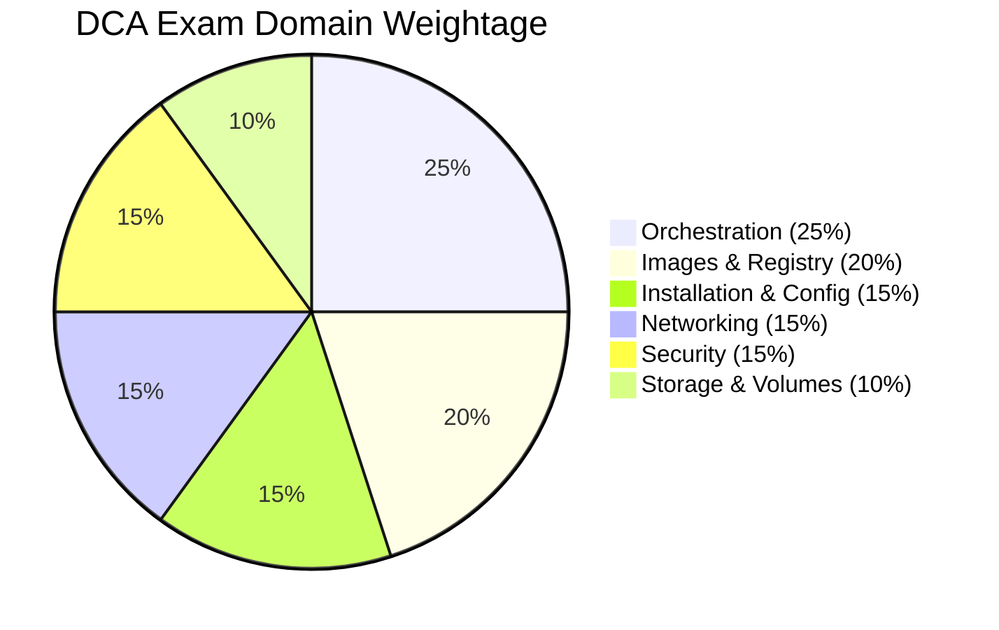

# Docker Certified Associate (DCA) - Study Notes

> **Exam:** 55 questions (13 multiple choice + 42 DOMC) | 90 minutes | Cost: $199 USD
>
> **Prerequisite:** 6–12 months hands-on Docker experience
>
> **Proctoring:** Remote via Examity | Results delivered immediately

---

## Exam Domain Weightage

---

## Study Notes Index

| # | Topic | Exam Domain | Weight |
|---|-------|-------------|--------|
| 📘 | [Containers Fundamentals & Evolution](./01-containers-fundamentals.md) | Background | — |
| 📘 | [Container Runtimes — Docker, Podman & Comparison](./02-container-runtimes/README.md) | Background | — |
| 🔴 | [Orchestration (Swarm)](./03-orchestration.md) | Domain 1 | **25%** |
| 🔴 | [Image Creation, Management & Registry](./04-image-creation-management.md) | Domain 2 | **20%** |
| 🟡 | [Installation & Configuration](./05-installation-configuration.md) | Domain 3 | **15%** |
| 🟡 | [Networking](./06-networking/README.md) | Domain 4 | **15%** |
| 🟡 | [Security](./07-security.md) | Domain 5 | **15%** |
| 🟢 | [Storage & Volumes](./08-storage-volumes/README.md) | Domain 6 | **10%** |
| 📎 | [Docker Compose](./09-docker-compose.md) | Supplementary | — |
| 📎 | [Commands Cheat Sheet](./10-commands-cheatsheet.md) | Quick Reference | — |
| 📎 | [Exam Tips & Strategy](./11-exam-tips.md) | Exam Prep | — |

> 🔴 High priority &nbsp;|&nbsp; 🟡 Medium priority &nbsp;|&nbsp; 🟢 Important &nbsp;|&nbsp; 📘 Foundation &nbsp;|&nbsp; 📎 Reference

---

## Study Path

```mermaid
graph LR
    A["1. Containers<br/>Fundamentals"] --> B["2. Container Runtimes<br/>Docker & Podman"]
    B --> C["3. Installation<br/>& Config"]
    C --> D["4. Images<br/>& Registry"]
    D --> E["5. Networking"]
    E --> F["6. Storage<br/>& Volumes"]
    F --> G["7. Orchestration<br/>(Swarm)"]
    G --> H["8. Security"]
    H --> I["9. Docker<br/>Compose"]
    I --> J["10. Practice<br/>& Exam Tips"]

    style A fill:#3498db,color:#fff
    style B fill:#3498db,color:#fff
    style C fill:#f39c12,color:#fff
    style D fill:#e74c3c,color:#fff
    style E fill:#f39c12,color:#fff
    style F fill:#27ae60,color:#fff
    style G fill:#e74c3c,color:#fff
    style H fill:#f39c12,color:#fff
    style I fill:#9b59b6,color:#fff
    style J fill:#95a5a6,color:#fff
```

---

## Quick Links

- [Docker Official Docs](https://docs.docker.com)
- [DCA Prep Guide — GitHub](https://github.com/Evalle/DCA)
- [Play with Docker](https://labs.play-with-docker.com)
- [Official Study Guide v1.5 (PDF)](https://a.storyblok.com/f/146871/x/2001ce939c/docker-study-guide_v1-5-jan-2025.pdf)
